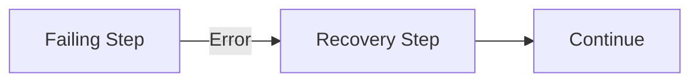
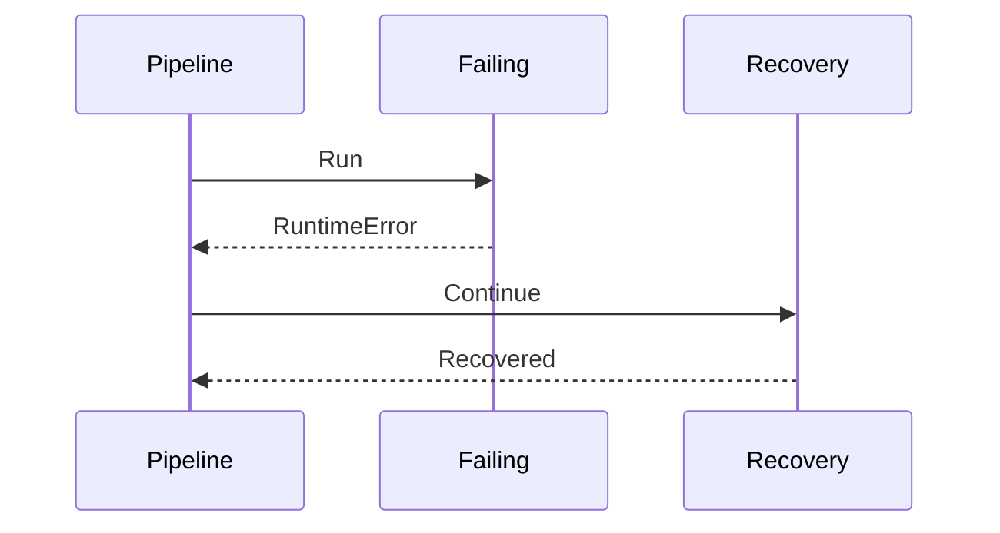
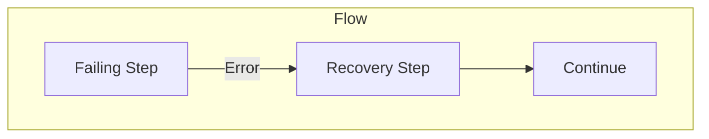
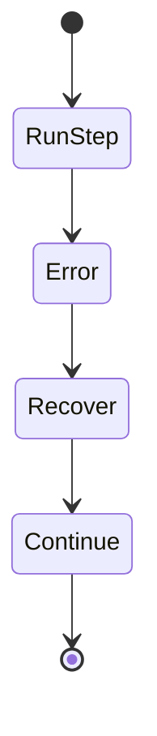

# Recovery After Error Example

Shows recovery mechanism after step failure.

## What It Does

Demonstrates how to recover from errors and access
error information in subsequent pipeline steps.

## Flow

