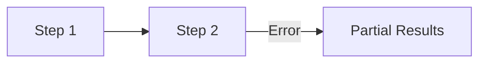
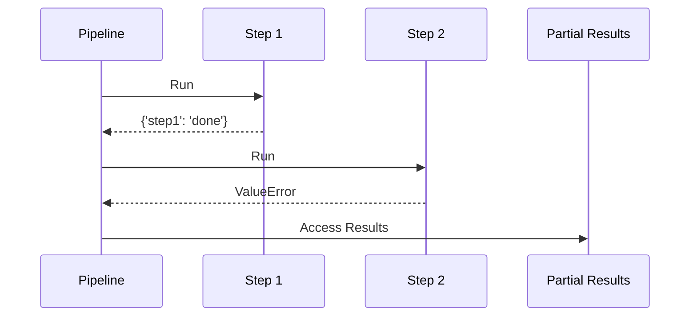
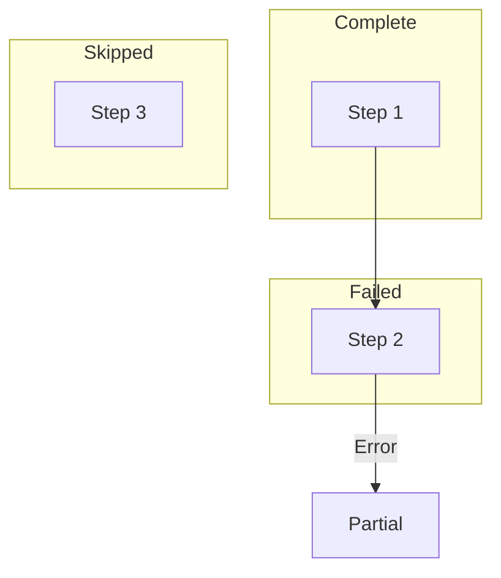
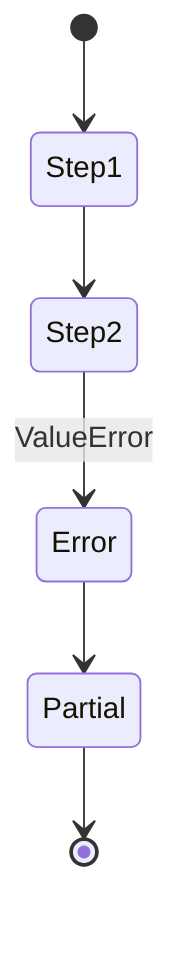
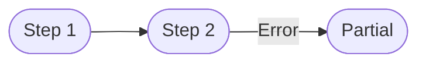

# Partial Results Example

Shows accessing partial results after error.

## What It Does

Demonstrates how to access results from completed steps
even when a later step fails in the pipeline.

## Flow

