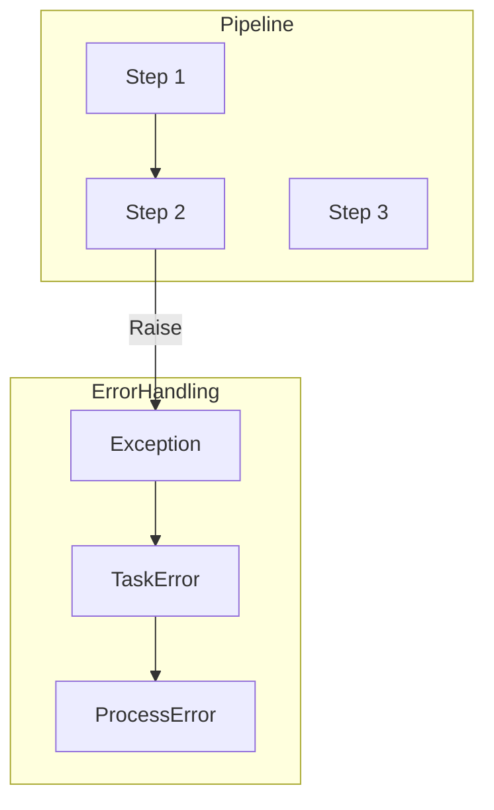
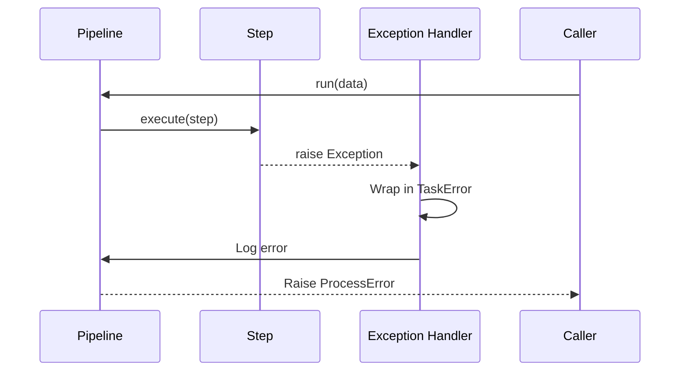
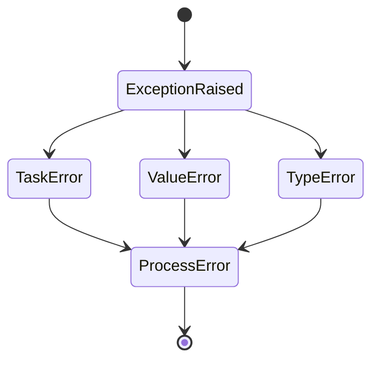
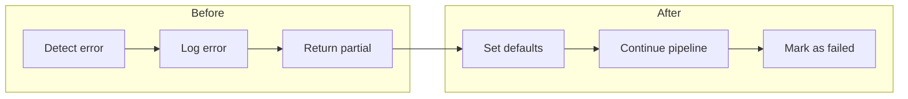

# Error Handling

This directory contains examples demonstrating error handling patterns in pipelines.

## Overview

The `error_handling` module shows how wpipe handles exceptions, provides error recovery, and maintains pipeline stability during failures.

## Important

**Errors in steps are caught and wrapped in TaskError or ProcessError.** The pipeline continues execution when configured to do so.

## Quick Start

```python
from wpipe import Pipeline
from wpipe.exception import TaskError, ProcessError

def failing_step(data):
    raise ValueError("Something went wrong")

pipeline = Pipeline(verbose=True)
pipeline.set_steps([
    (failing_step, "Failing Step", "v1.0"),
])

try:
    result = pipeline.run({"data": "value"})
except (TaskError, ProcessError) as e:
    print(f"Pipeline failed: {e}")
```

## Examples

| Example | Description |
|---------|-------------|
| [01_basic_error_example](01_basic_error_example/) | Basic error handling |
| [02_exception_types_example](02_exception_types_example/) | Different exception types |
| [03_task_error_example](03_task_error_example/) | TaskError specifics |
| [04_middle_error_example](04_middle_error_example/) | Error in middle of pipeline |
| [05_continue_after_error_example](05_continue_after_error_example/) | Continuing after errors |
| [06_exception_chaining_example](06_exception_chaining_example/) | Exception chaining |
| [07_custom_error_example](07_custom_error_example/) | Custom error handling |
| [08_error_in_recovery_example](08_error_in_recovery_example/) | Recovery patterns |
| [09_partial_results_example](09_partial_results_example/) | Accessing partial results |

## Architecture



## Error Flow



## Error Types



## Recovery Patterns



## Error Codes

| Code | Name | Description |
|------|------|-------------|
| 501 | API_ERROR | API communication error |
| 502 | TASK_FAILED | Task execution failed |
| 503 | UPDATE_PROCESS_OK | Process update succeeded |
| 504 | UPDATE_PROCESS_ERROR | Process update failed |
| 505 | UPDATE_TASK | Task update operation |

## Best Practices

1. Always wrap pipeline execution in try/except
2. Use specific exception types when possible
3. Log errors for debugging
4. Provide fallback values for critical operations
5. Test error paths explicitly

## See Also

- [Basic Pipeline](../01_basic_pipeline/) - Core pipeline concepts
- [Retry](../05_retry/) - Automatic retry patterns
- [API Pipeline](../02_api_pipeline/) - API error handling
