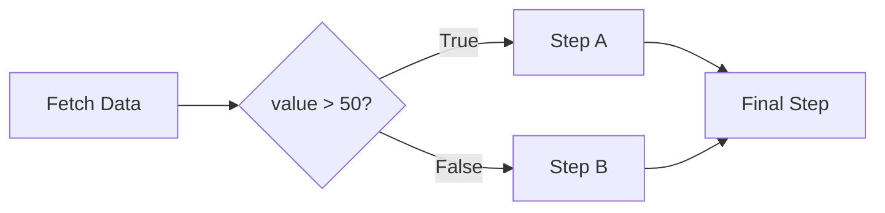
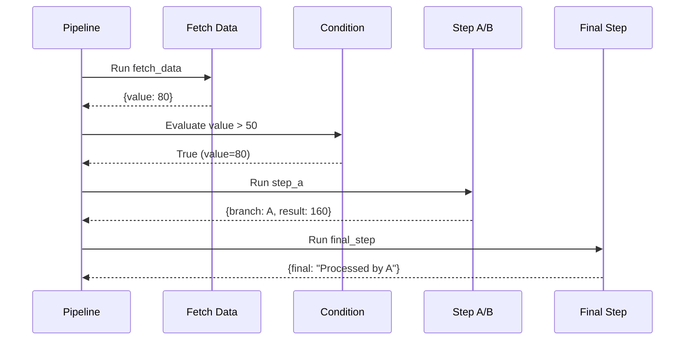
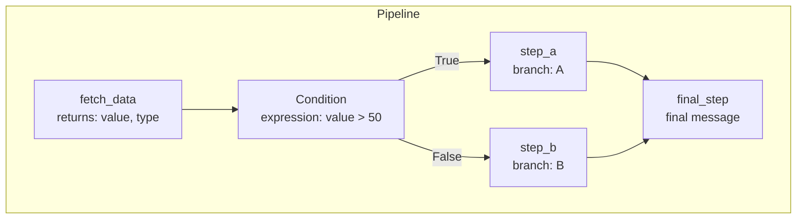
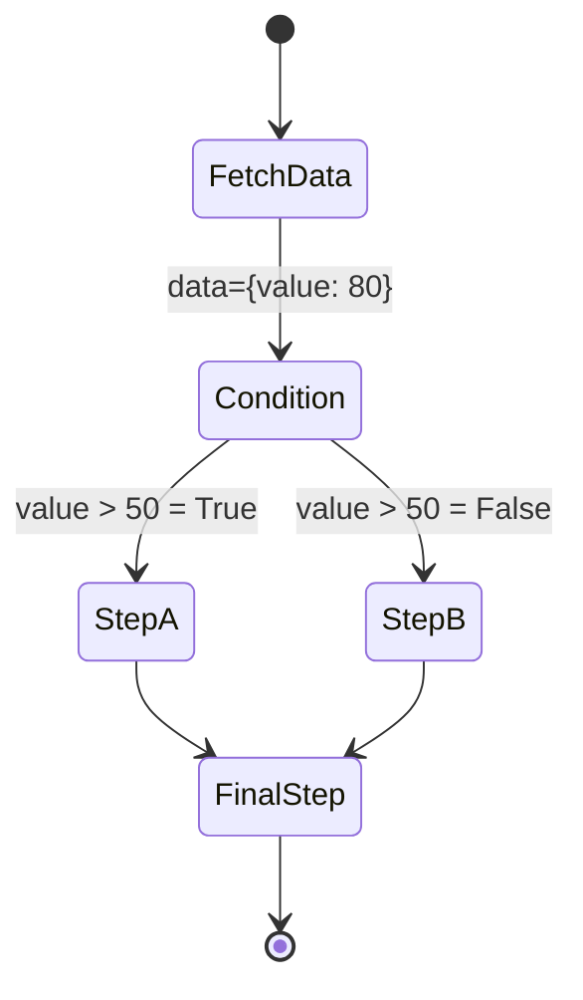
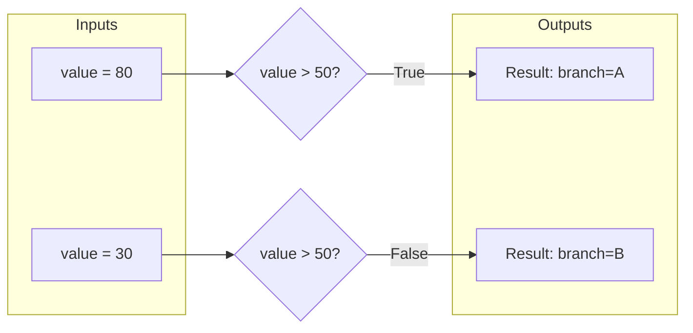

# Basic Conditional Branch

Demonstrates the simplest form of conditional branching in a pipeline using the `Condition` class.

## What It Does

This example shows how to create a pipeline that evaluates a condition expression and routes execution to different branches based on the result. The condition checks if `value > 50` and executes either `step_a` or `step_b` accordingly.

## Flow

