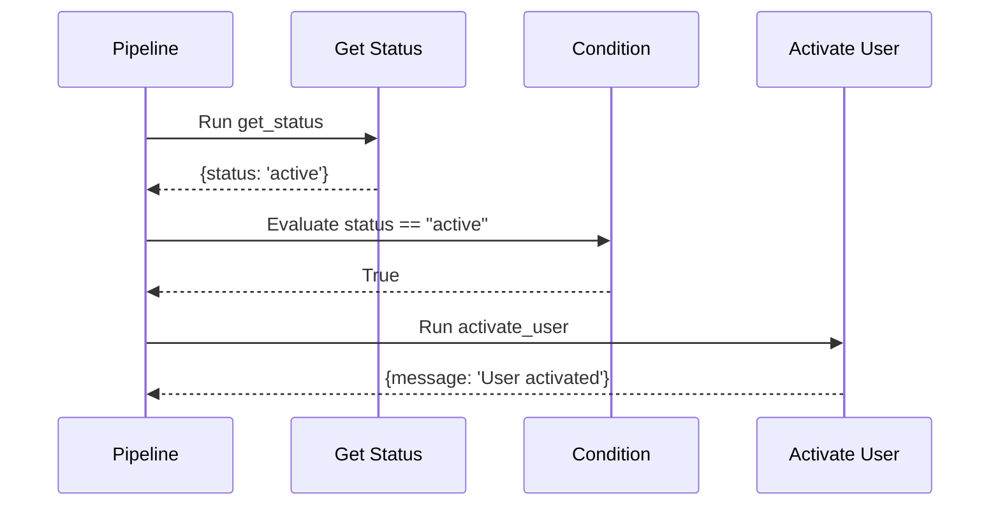
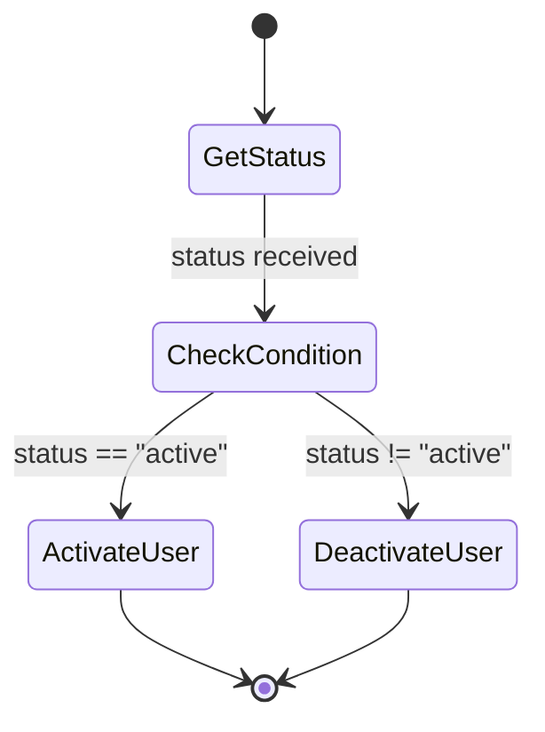

# String Based Condition

Demonstrates using string conditions in pipeline conditional branching.

## What It Does

This example shows how to create a pipeline that evaluates string conditions, specifically checking if `status == "active"`. Based on the evaluation, the pipeline routes to either an activation or deactivation step.

## Flow

```mermaid
graph LR
    A[Get Status] --> B{status == "active"?}
    B -->|True| C[Activate User]
    B -->|False| D[Deactivate User]
```



```mermaid
graph TB
    subgraph Pipeline
        A1[get_status<br/>returns: status, user]
        A2[Condition<br/>status == "active"]
        A3[activate_user<br/>message]
        A4[deactivate_user<br/>message]
    end
    A1 --> A2
    A2 -->|True| A3
    A2 -->|False| A4
```



```mermaid
flowchart LR
    subgraph Test Cases
        TC1["status = 'active'"]
        TC2["status = 'inactive'"]
    end
    subgraph Results
        R1["User activated"]
        R2["User deactivated"]
    end
    TC1 --> C{status == "active"?}
    TC2 --> C
    C -->|True| R1
    C -->|False| R2
```
