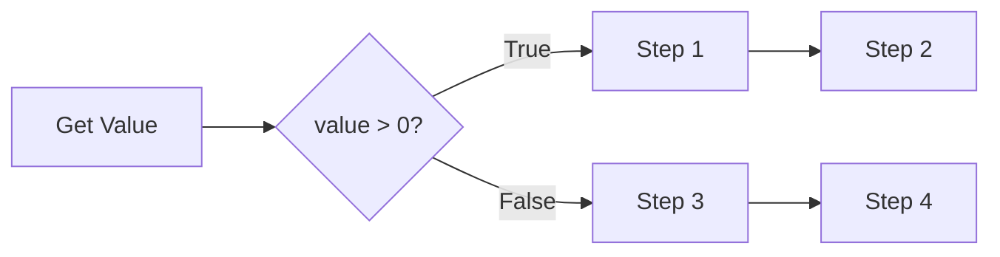
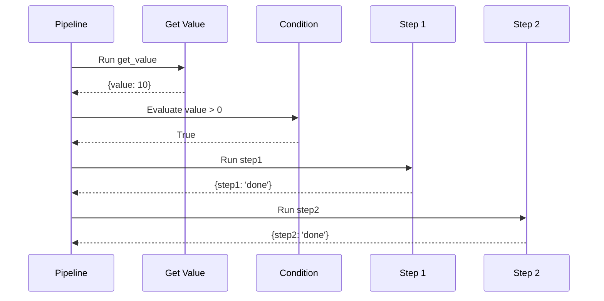
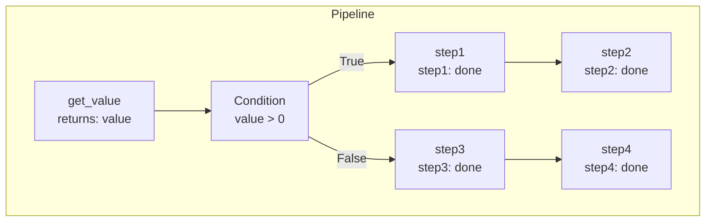
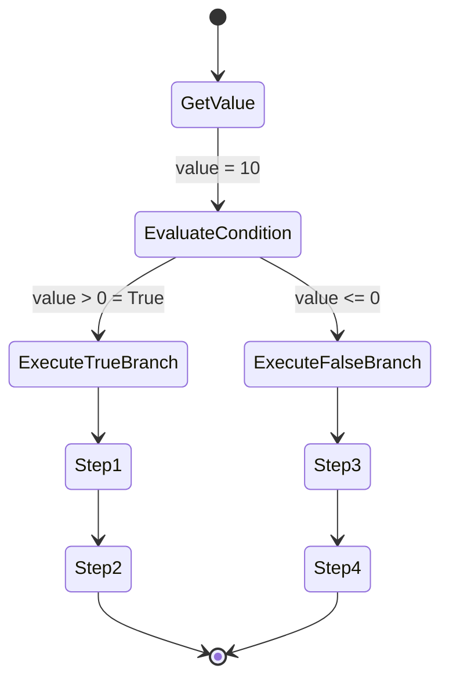
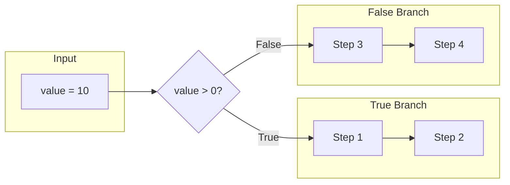

# Multiple Steps in Branch

Demonstrates running multiple steps within each conditional branch.

## What It Does

This example shows how to define multiple steps in both the true and false branches of a condition. When a branch is selected, all steps within that branch execute sequentially, accumulating their results in the pipeline state.

## Flow

