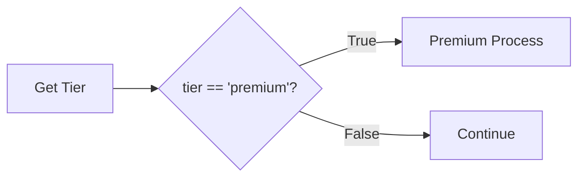
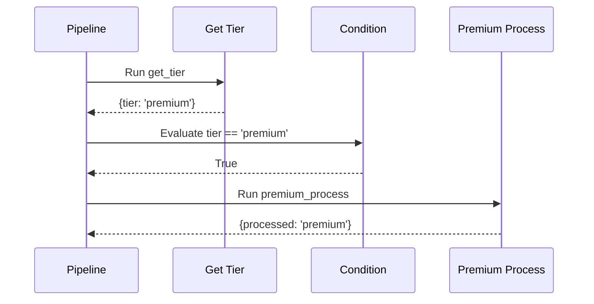
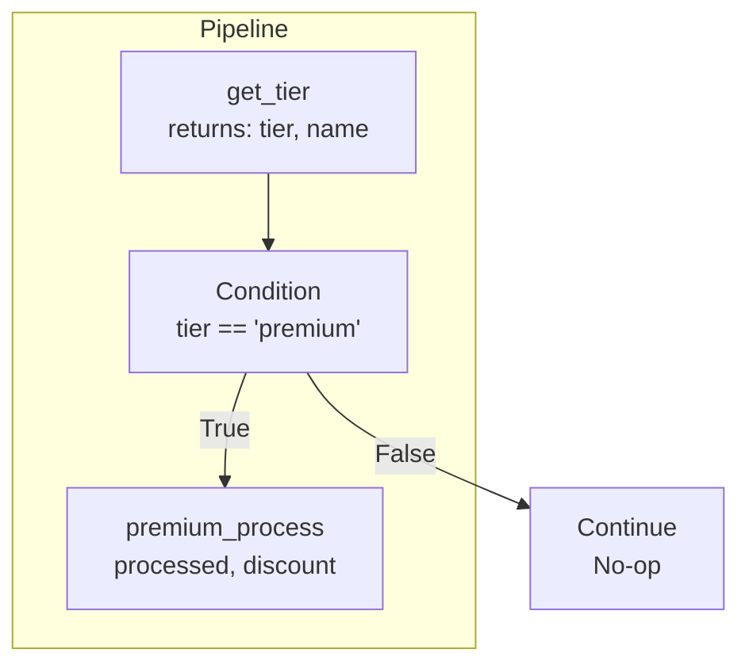
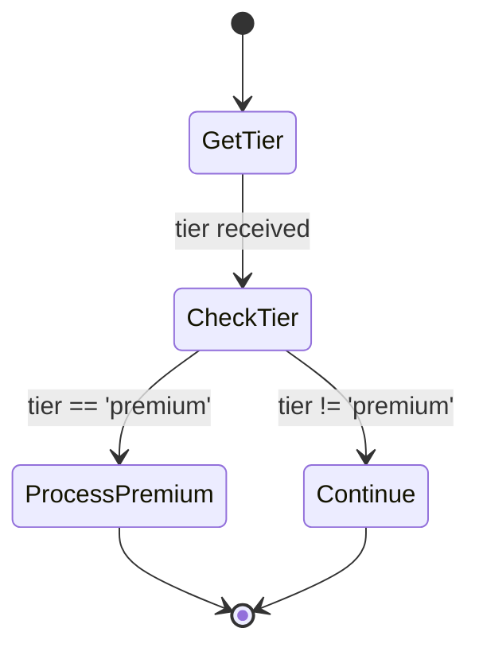
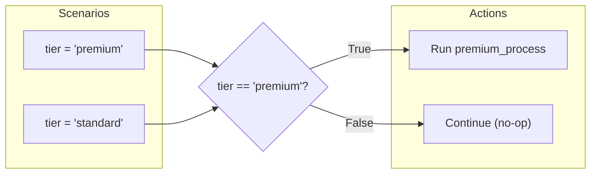

# No Else Branch

Demonstrates using a condition with only a true branch, no false branch.

## What It Does

This example shows how to create a condition with an empty `branch_false` list. When the condition evaluates to false, the pipeline simply continues without executing any additional steps. This is useful for optional processing that only applies when a certain condition is met.

## Flow

