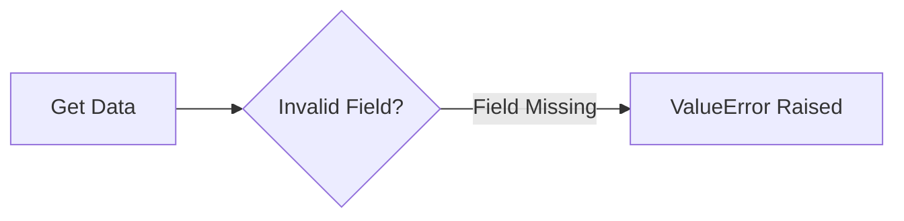
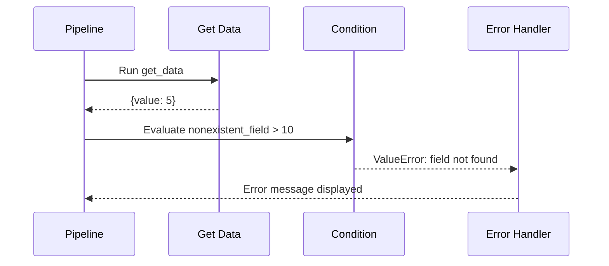
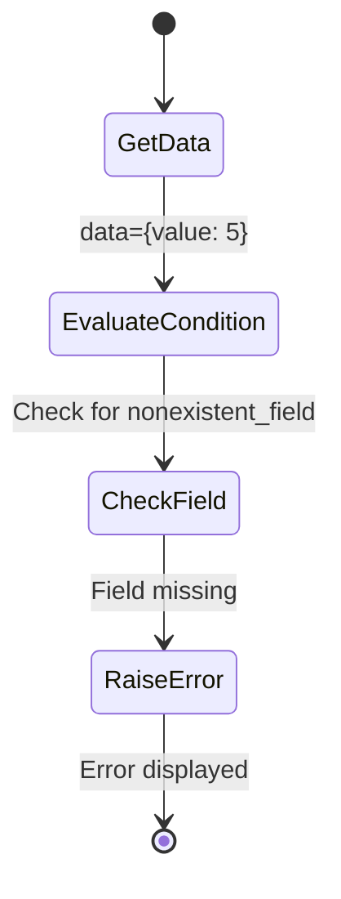
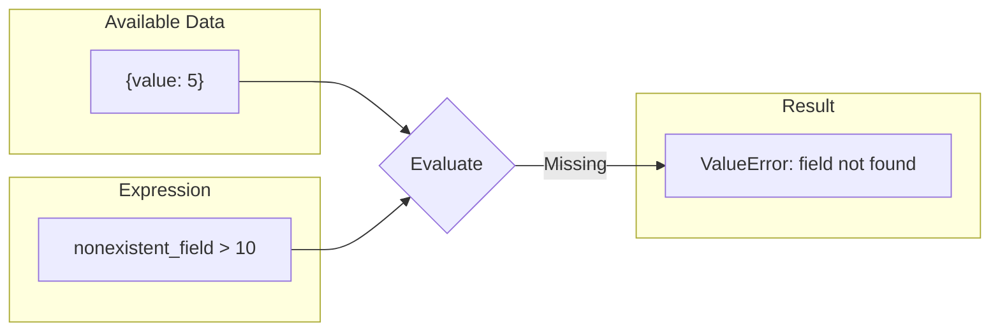

# Invalid Expression Handling

Demonstrates how the pipeline handles conditions with invalid/missing field references.

## What It Does

This example shows what happens when a condition expression references a field that does not exist in the pipeline data. The pipeline raises a `ValueError` with a descriptive message indicating which field is missing, helping developers quickly identify and fix configuration issues.

## Flow





```mermaid
graph TB
    subgraph Data
        A1[get_data<br/>returns: {value: 5}]
        A2[Missing Field<br/>nonexistent_field]
    end
    subgraph Condition
        C1[Condition Check<br/>expression: nonexistent_field > 10]
    end
    subgraph Error
        E1[ValueError<br/>field not in data]
    end
    A1 --> C1
    C1 -->|Field not found| E1
```




