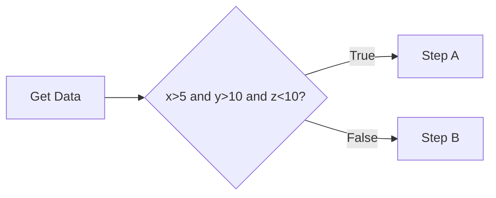
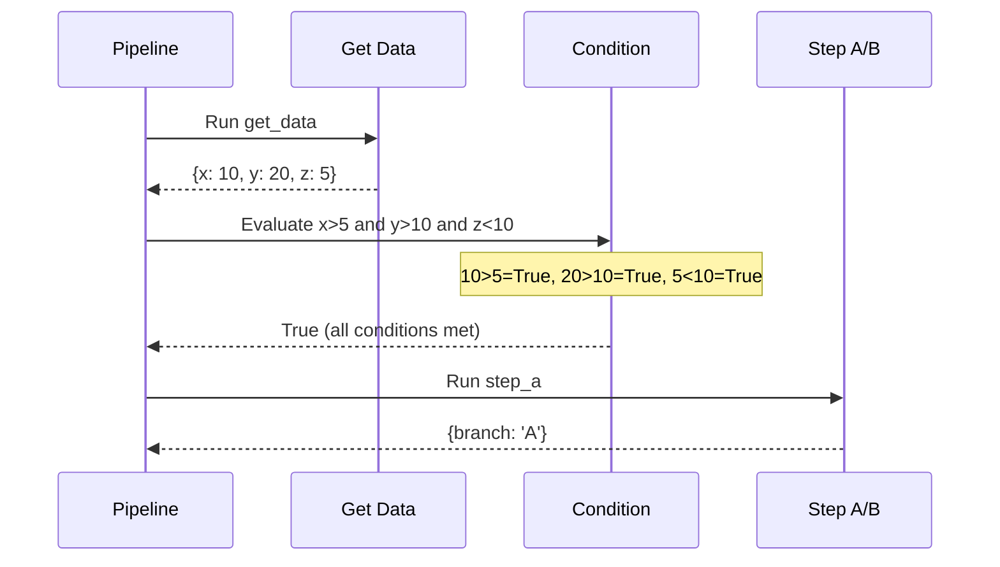
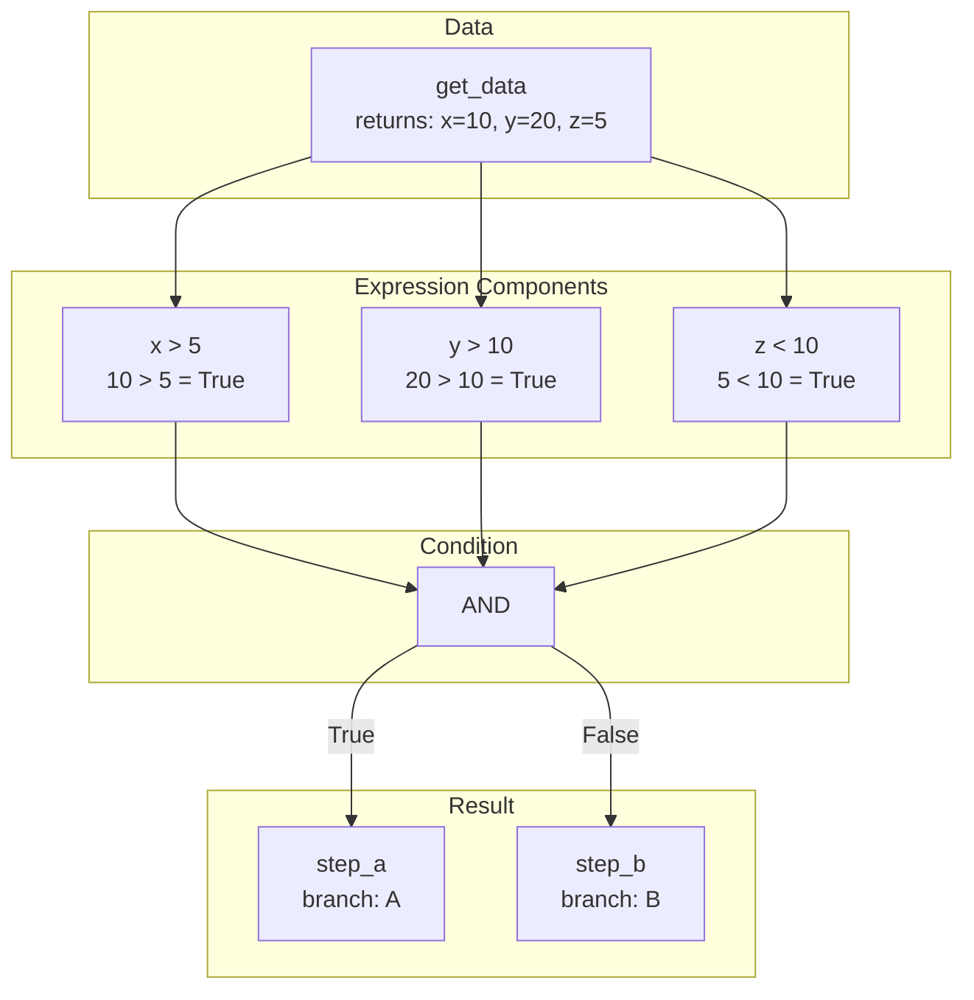
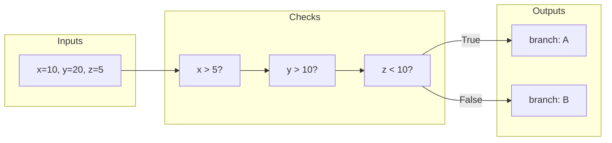

# Complex Expression

Demonstrates using complex boolean expressions with multiple conditions.

## What It Does

This example shows how to create conditions that combine multiple comparisons using boolean operators like `and`. The expression `x > 5 and y > 10 and z < 10` evaluates all three conditions and only returns true if all are satisfied.

## Flow







```Mermaid
stateDiagram-v2
    [*] --> GetData
    GetData --> EvaluateAll: data received
    EvaluateAll --> CheckX: x > 5?
    CheckX --> CheckY: True
    CheckX --> Fail: False
    CheckY --> CheckZ: y > 10?
    CheckY --> Fail: False
    CheckZ --> StepA: z < 10 = True
    CheckZ --> Fail: z < 10 = False
    StepA --> [*]
    Fail --> StepB
    StepB --> [*]
```


