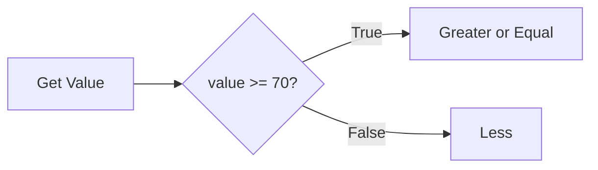
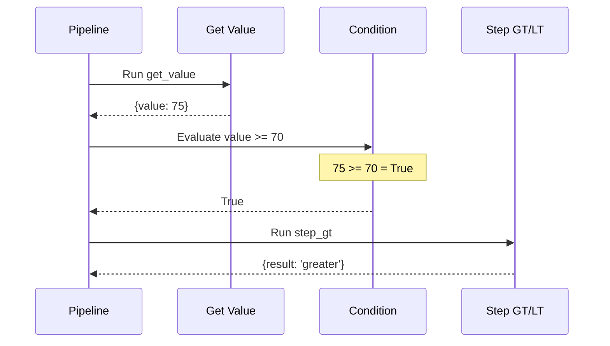
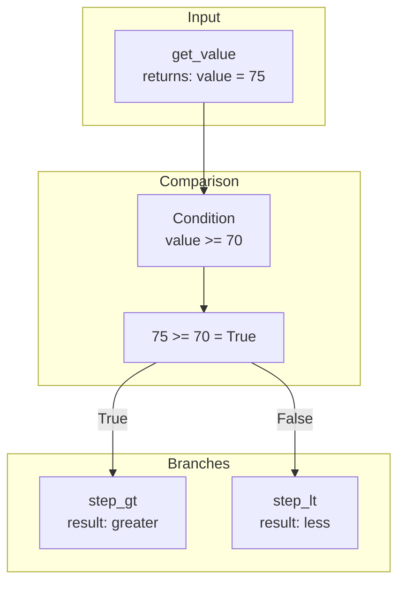
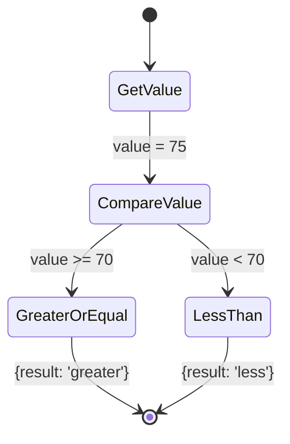
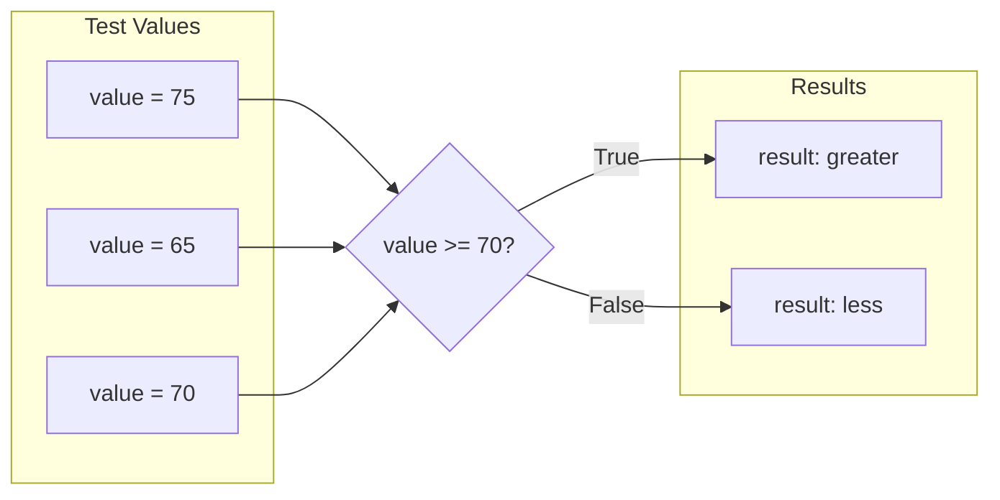

# Numeric Comparisons

Demonstrates various numeric comparison operators in conditions.

## What It Does

This example shows how to use numeric comparison operators like `>=`, `>`, `<`, `<=`, `==`, and `!=` in condition expressions. The pipeline evaluates `value >= 70` and routes to different steps based on whether the value meets the threshold.

## Flow

