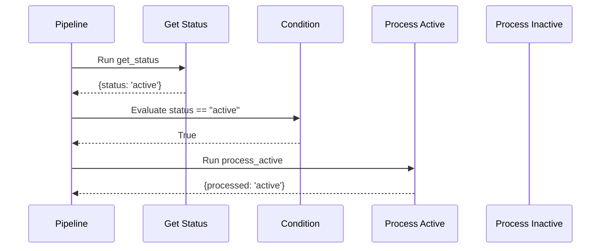
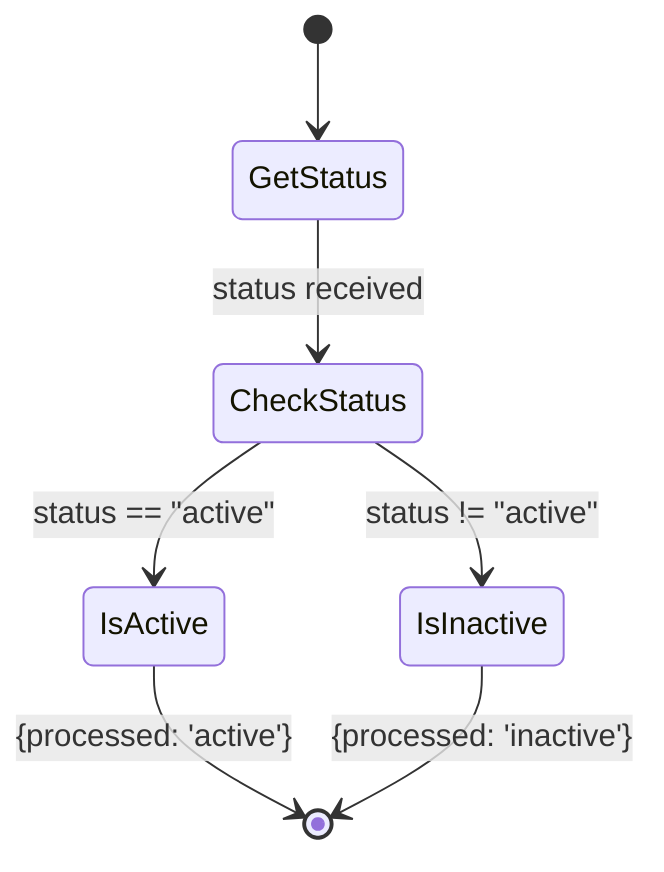

# Equality Checks

Demonstrates equality and inequality checks in pipeline conditions.

## What It Does

This example shows how to use equality (`==`) and inequality (`!=`) operators in conditions. The pipeline evaluates `status == "active"` and routes to different processing steps based on whether the status matches the expected value.

## Flow

```mermaid
graph LR
    A[Get Status] --> B{status == "active"?}
    B -->|True| C[Process Active]
    B -->|False| D[Process Inactive]
```



```mermaid
graph TB
    subgraph Input
        A1[get_status<br/>returns: status]
    end
    subgraph Equality Check
        C1[Condition<br/>status == "active"]
        E1["'active' == 'active'"]
    end
    subgraph Branches
        T1[process_active<br/>processed: active]
        F1[process_inactive<br/>processed: inactive]
    end
    A1 --> C1
    C1 --> E1
    E1 -->|True| T1
    E1 -->|False| F1
```



```mermaid
flowchart LR
    subgraph Status Values
        S1["status = 'active'"]
        S2["status = 'inactive'"]
        S3["status = 'pending'"]
    end
    subgraph Results
        R1["processed: active"]
        R2["processed: inactive"]
    end
    S1 --> C{status == "active"?}
    S2 --> C
    S3 --> C
    C -->|True| R1
    C -->|False| R2
```
