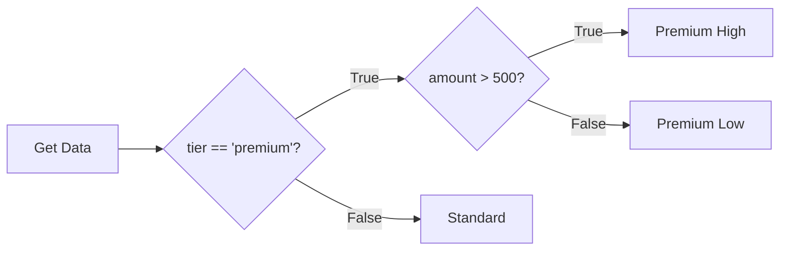
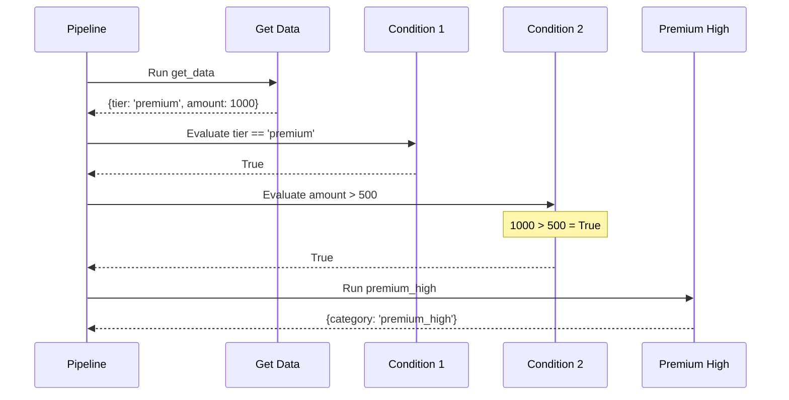
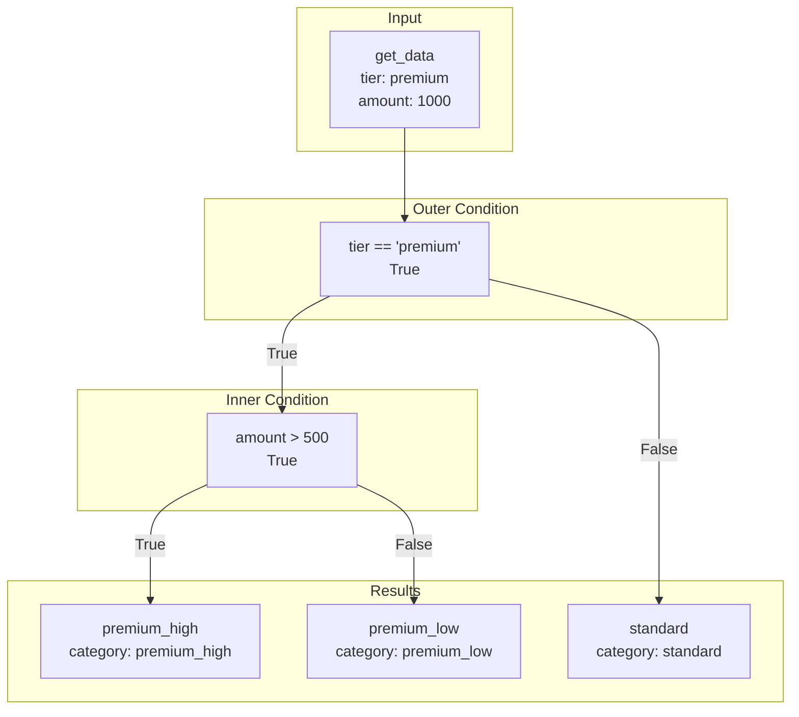
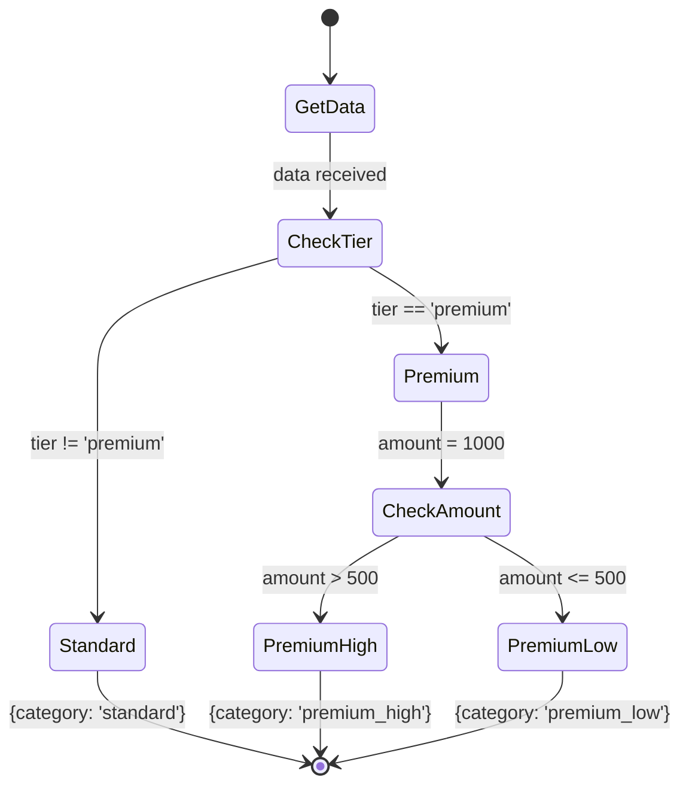
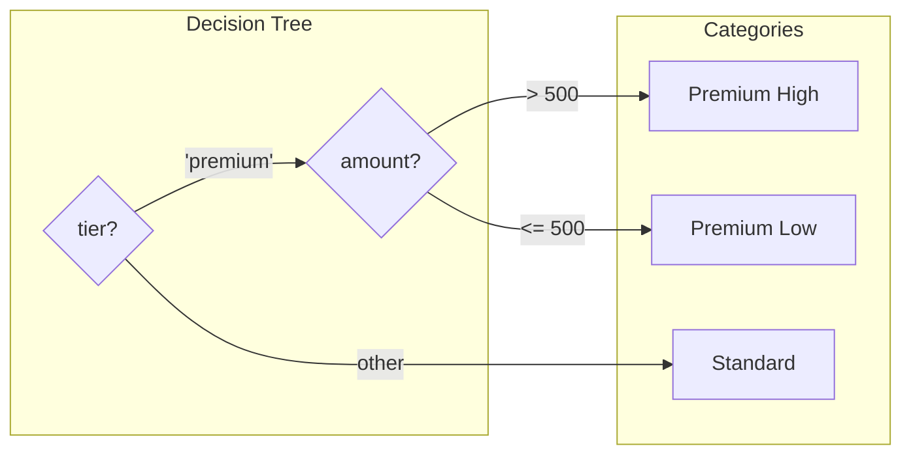

# Chained Conditions

Demonstrates chaining/nesting multiple conditions for hierarchical decision making.

## What It Does

This example shows how to nest conditions within other conditions to create hierarchical decision trees. The outer condition checks `tier == 'premium'`, and if true, an inner condition further categorizes based on `amount > 500`. This allows for complex routing logic without duplicating code.

## Flow

