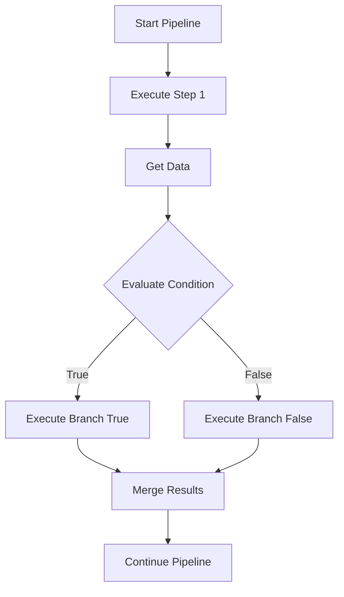
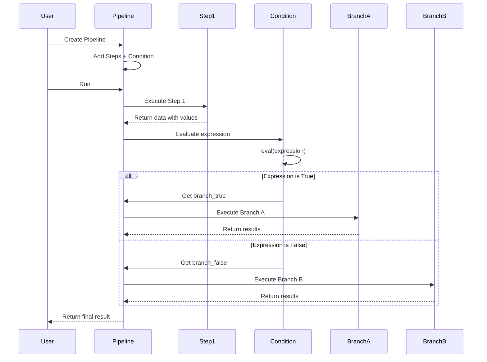
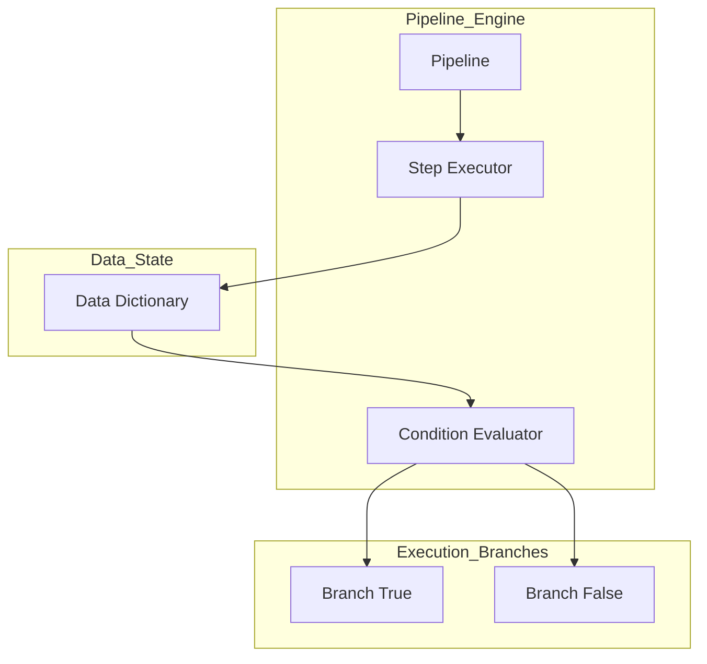
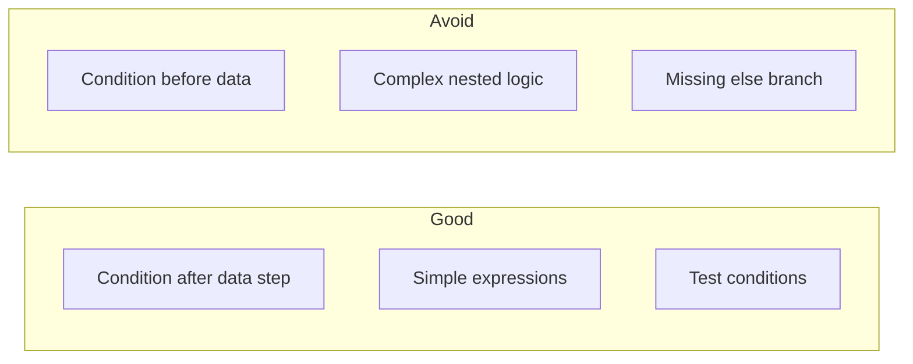

# Conditional Execution

This directory contains examples demonstrating conditional branching in pipelines.

## Project Overview

The `condition` module enables dynamic pipeline execution flow control based on data conditions. Steps are executed conditionally, allowing pipelines to make decisions at runtime based on the current data state.

**Key Capabilities:**
- Evaluate Python expressions against pipeline data
- Branch execution based on conditions (if/else logic)
- Support for complex expressions (AND, OR, comparisons)
- Chain multiple conditions for hierarchical decision making

---

## 1. 🚶 Diagram Walkthrough



---

## 2. 🗺️ System Workflow (Sequence)



---

## 3. 🏗️ Architecture Components



---

## 4. ⚙️ Container Lifecycle

### Build Process
No build required - conditions are evaluated at runtime.

### Runtime Process
1. **Data Collection**: Previous steps add data to pipeline state
2. **Expression Parsing**: Condition expression is parsed
3. **Evaluation**: Expression is evaluated against current data
4. **Branch Selection**: Based on evaluation result (True/False)
5. **Execution**: Selected branch steps are executed
6. **Result Merge**: Results are merged back into pipeline state

---

## 5. 📂 File-by-File Guide

| File | Description |
|------|-------------|
| `01_basic_condition_example/` | Basic conditional branch based on numeric value |
| `02_string_condition_example/` | String-based conditions (e.g., status == "active") |
| `03_multiple_steps_example/` | Multiple steps in each branch |
| `04_no_else_example/` | Condition without else branch |
| `05_invalid_expression_example/` | Handling invalid condition expressions |
| `06_complex_expression_example/` | Complex expressions with AND/OR logic |
| `07_numeric_comparison_example/` | Numeric comparisons (>=, <=, >, <) |
| `08_equality_check_example/` | Equality checks (==, !=) |
| `09_chained_conditions_example/` | Nested/chained conditions |
| `10_boolean_logic.py` | Boolean logic examples |
| `10_none_check.py` | None/Null checking |

---

## Important

**Condition must come AFTER a step that provides the data.** The condition evaluates data that was added by previous steps.

## Quick Start

```python
from wpipe import Pipeline
from wpipe.pipe import Condition

def fetch_data(data):
    return {"value": 50, "type": "A"}

def process_a(data):
    return {"processed": "A"}

condition = Condition(
    expression="value > 50",
    branch_true=[(process_a, "Process A", "v1.0")],
)

pipeline = Pipeline(verbose=True)
pipeline.set_steps([
    (fetch_data, "Fetch", "v1.0"),
    condition,
])
result = pipeline.run({})
```

## Expression Syntax

The condition expression is evaluated using Python's `eval()`. Available variables are the keys from the data (added by previous steps):

- **Numeric**: `value > 50`, `count >= 10`
- **String**: `status == "active"`, `name == "admin"`
- **Boolean**: `is_valid == True`, `enabled`
- **Complex**: `value > 5 and y > 10 and z < 10`

Safe globals: `True`, `False`, `None`

---

## Configuration Options

| Parameter | Type | Description |
|-----------|------|-------------|
| `expression` | str | Python expression to evaluate |
| `branch_true` | list | Steps to execute if condition is True |
| `branch_false` | list | Steps to execute if condition is False |

---

## Examples

### Basic Condition

```python
condition = Condition(
    expression="value > 50",
    branch_true=[(process_high, "High", "v1.0")],
    branch_false=[(process_low, "Low", "v1.0")],
)
```

### Complex Expression

```python
condition = Condition(
    expression="status == 'active' and amount > 100",
    branch_true=[(premium_process, "Premium", "v1.0")],
    branch_false=[(standard_process, "Standard", "v1.0")],
)
```

### Chained Conditions

```python
condition1 = Condition(
    expression="tier == 'premium'",
    branch_true=[
        Condition(
            expression="amount > 500",
            branch_true=[(premium_high, "Premium High", "v1.0")],
            branch_false=[(premium_low, "Premium Low", "v1.0")],
        )
    ],
    branch_false=[(standard, "Standard", "v1.0")],
)
```

---

## Best Practices



1. **Always provide data first** - Condition must come after steps that add data
2. **Keep expressions simple** - Complex expressions are hard to debug
3. **Test all branches** - Ensure both True and False paths work
4. **Use descriptive expressions** - Make conditions readable

---

## See Also

- [Basic Pipeline](../01_basic_pipeline/) - Core pipeline concepts
- [Error Handling](../03_error_handling/) - Error handling patterns
- [Retry](../05_retry/) - Automatic retry patterns
