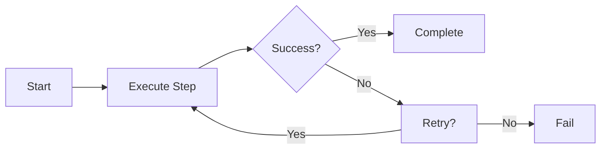
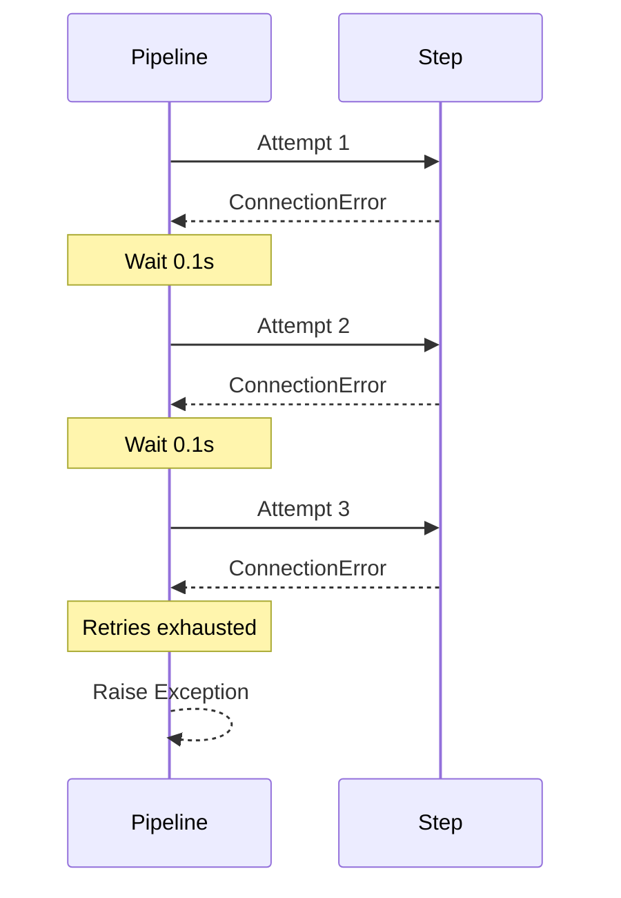
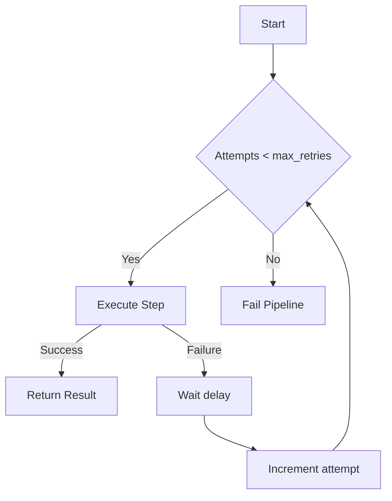
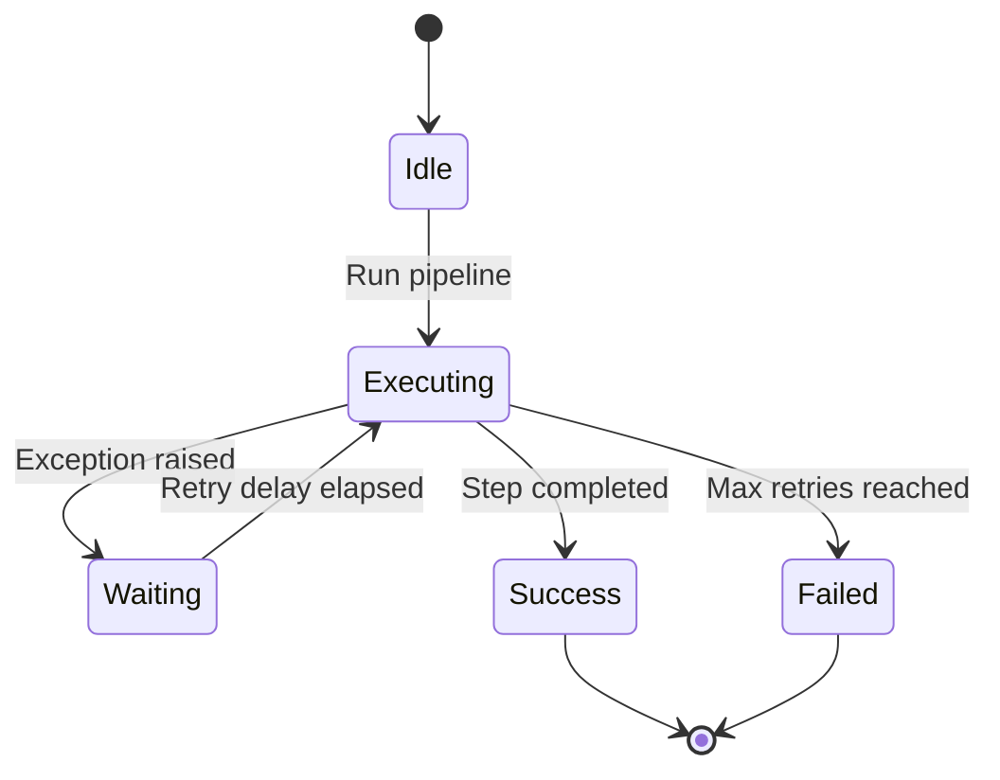
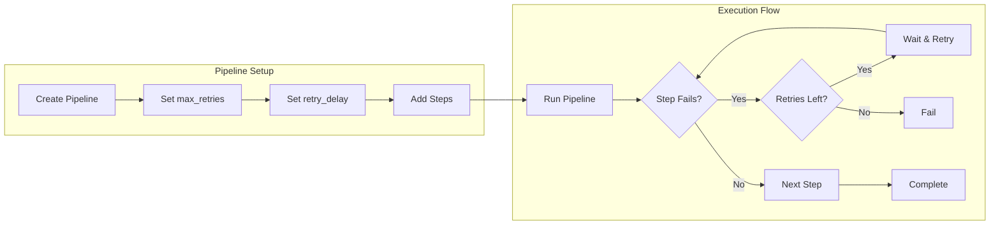

# Basic Retry Example

## What It Does

This example demonstrates the simplest retry behavior in wpipe. When a step fails, the pipeline automatically retries it up to a specified number of attempts with a configurable delay between retries.

## Key Concepts

- `max_retries`: Maximum number of retry attempts
- `retry_delay`: Time in seconds to wait between retries
- `verbose`: Enables detailed logging of retry attempts

## Example

```python
from wpipe import Pipeline

def unreliable_step(data):
    raise ConnectionError("Network error!")

pipeline = Pipeline(max_retries=3, retry_delay=0.1, verbose=True)
pipeline.set_steps([(unreliable_step, "Unreliable Step", "v1.0")])
result = pipeline.run({})
```

## Flow



## Attempt Sequence



## Retry Logic



## Retry States



## Process Overview


