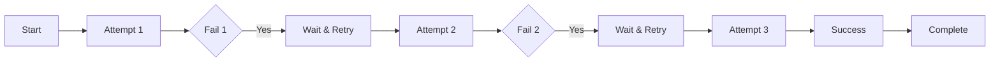
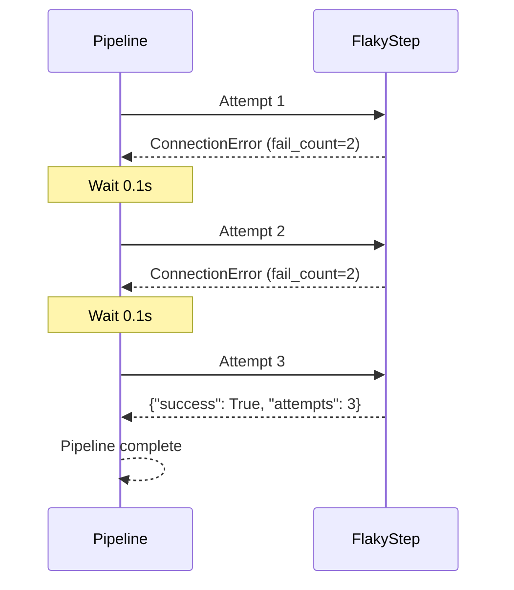
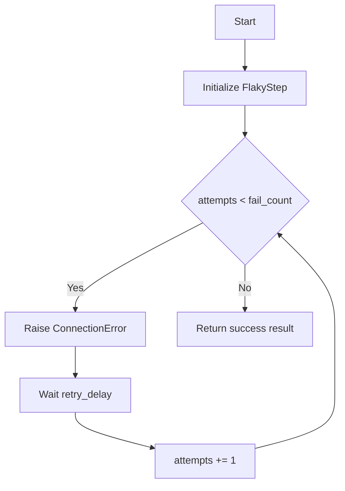
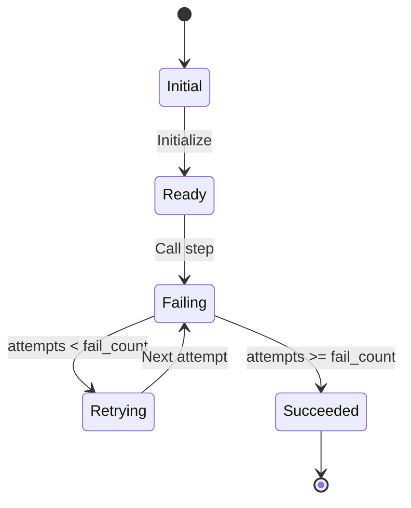
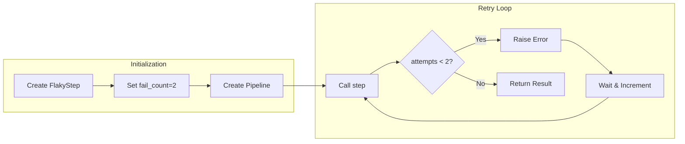

# Success After Retries Example

## What It Does

This example shows how a step can fail initially but succeed after several retry attempts. The `FlakyStep` class tracks the number of attempts and only succeeds after a configurable number of failures.

## Key Concepts

- Steps can be classes with state (callable objects)
- Retry mechanism allows transient failures to be recovered
- Successful completion returns the accumulated result

## Example

```python
from wpipe import Pipeline

class FlakyStep:
    def __init__(self, fail_count=2):
        self.attempts = 0
        self.fail_count = fail_count

    def __call__(self, data):
        self.attempts += 1
        if self.attempts <= self.fail_count:
            raise ConnectionError(f"Attempt {self.attempts} failed")
        return {"success": True, "attempts": self.attempts}

pipeline = Pipeline(max_retries=3, retry_delay=0.1, verbose=True)
pipeline.set_steps([(FlakyStep(fail_count=2), "Flaky Step", "v1.0")])
result = pipeline.run({})
```

## Flow



## Attempt Sequence



## Retry Logic



## Retry States



## Process Overview


