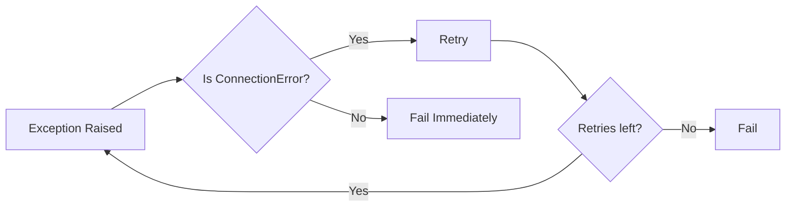
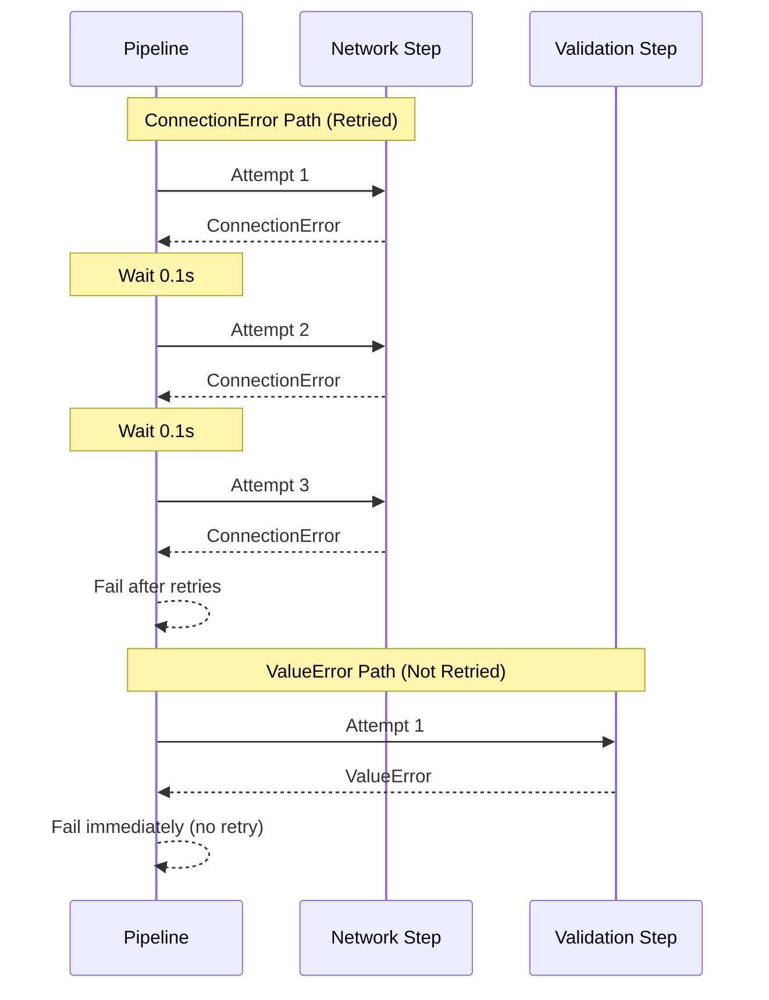
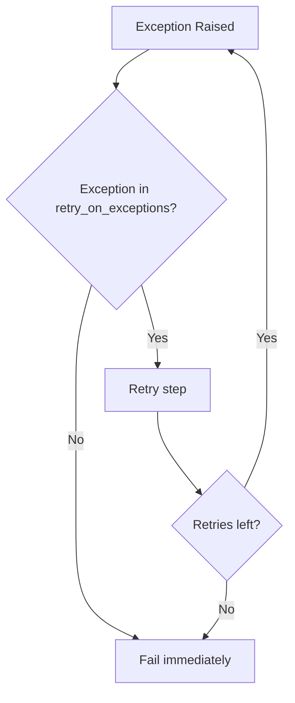
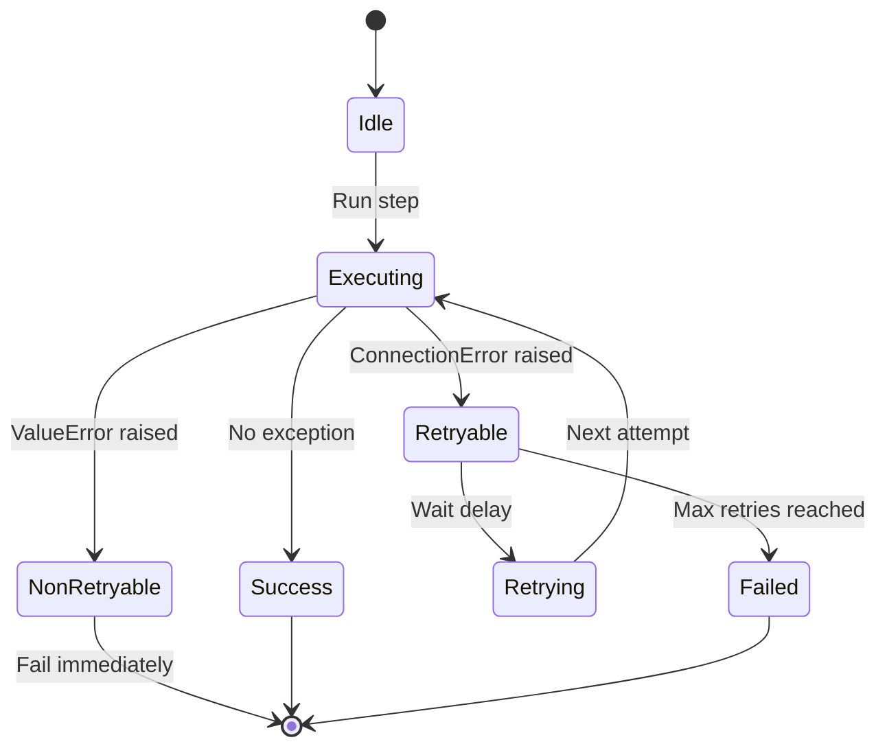
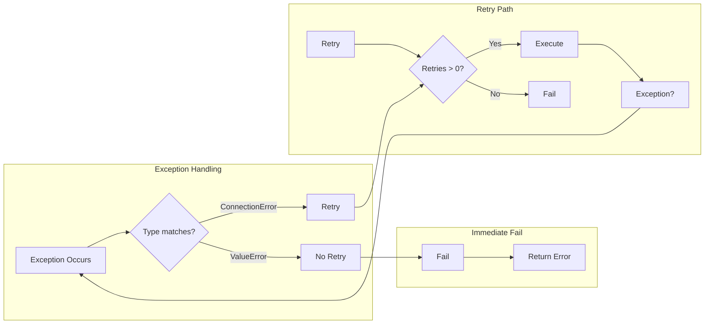

# Filter Exceptions Example

## What It Does

This example demonstrates selective retry behavior. The pipeline retries only specific exception types (e.g., `ConnectionError`) while immediately failing on other exception types (e.g., `ValueError`) without retrying.

## Key Concepts

- `retry_on_exceptions`: Tuple of exception types to retry on
- Only specified exceptions trigger retry logic
- Other exceptions propagate immediately

## Example

```python
from wpipe import Pipeline

def network_error_step(data):
    raise ConnectionError("Network timeout")

def validation_error_step(data):
    raise ValueError("Invalid input")

# ConnectionError will be retried
pipeline = Pipeline(
    max_retries=2,
    retry_delay=0.1,
    retry_on_exceptions=(ConnectionError,),
    verbose=True,
)
pipeline.set_steps([(network_error_step, "Network Step", "v1.0")])

# ValueError will NOT be retried (no retry_on_exceptions specified)
pipeline2 = Pipeline(
    max_retries=2,
    retry_delay=0.1,
    retry_on_exceptions=(ConnectionError,),
    verbose=True,
)
pipeline2.set_steps([(validation_error_step, "Validation Step", "v1.0")])
```

## Flow



## Attempt Sequence



## Retry Logic



## Exception States



## Process Overview


