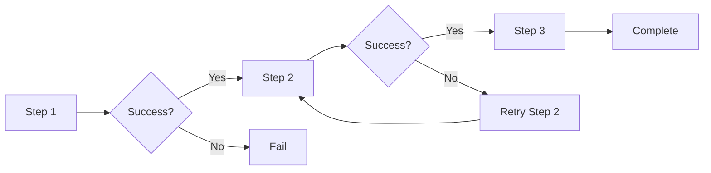
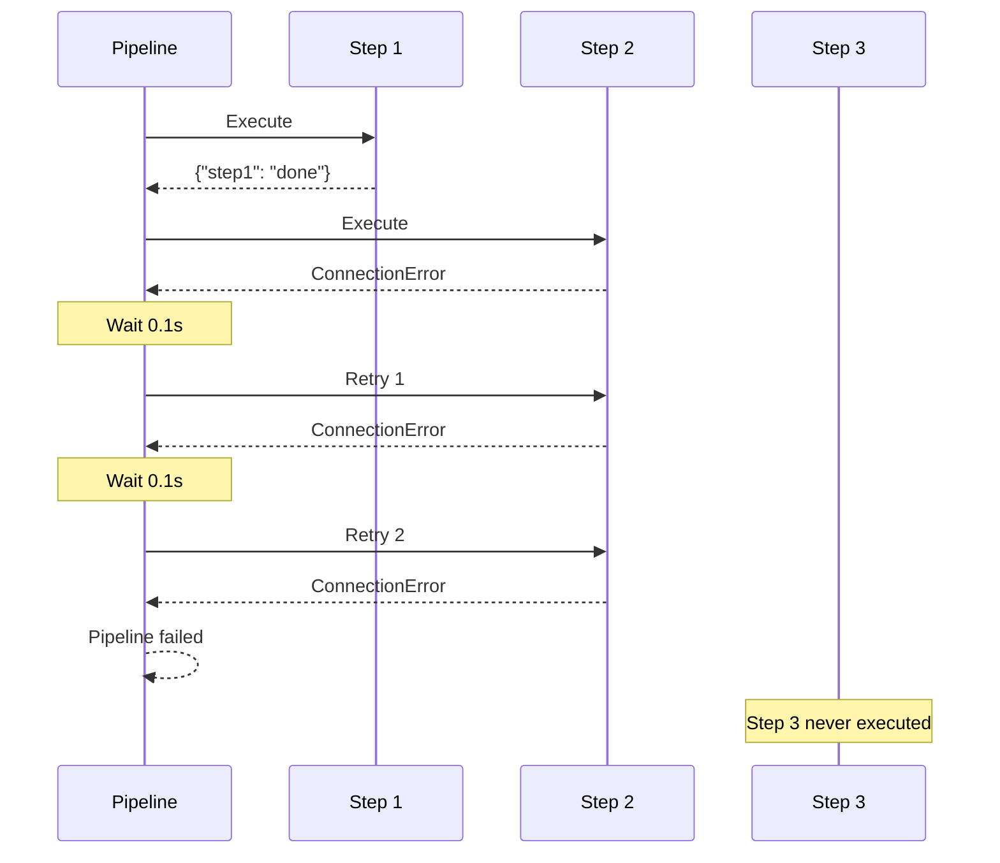
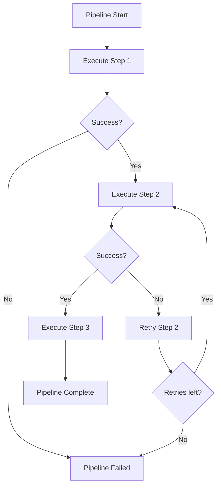
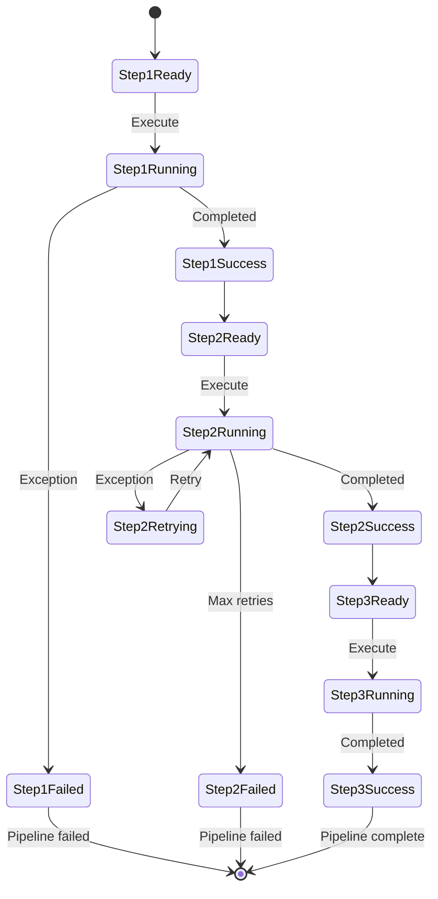
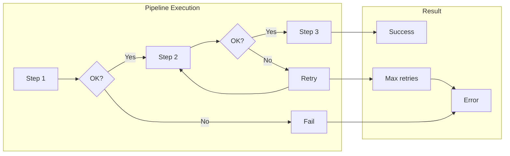

# Multiple Steps with Retry Example

## What It Does

This example demonstrates retry behavior in a multi-step pipeline. When a step in the middle fails, the pipeline retries that step. If retries are exhausted, the entire pipeline fails without executing subsequent steps.

## Key Concepts

- Steps execute sequentially
- A failed step triggers retries before moving on
- Subsequent steps are skipped if retries fail
- Each step can have independent retry behavior

## Example

```python
from wpipe import Pipeline

def step1(data):
    return {"step1": "done"}

def step2(data):
    raise ConnectionError("Step 2 failed")

def step3(data):
    return {"step3": "done"}

pipeline = Pipeline(max_retries=2, retry_delay=0.1, verbose=True)
pipeline.set_steps([
    (step1, "Step 1", "v1.0"),
    (step2, "Step 2", "v1.0"),
    (step3, "Step 3", "v1.0"),
])
result = pipeline.run({})
```

## Flow



## Attempt Sequence



## Retry Logic



## Step States



## Process Overview


