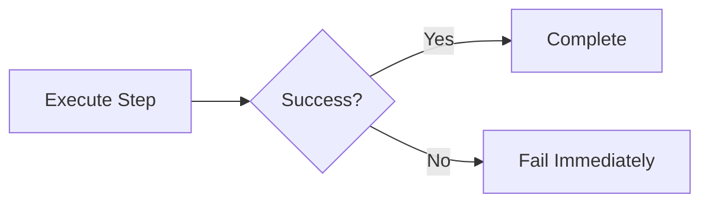
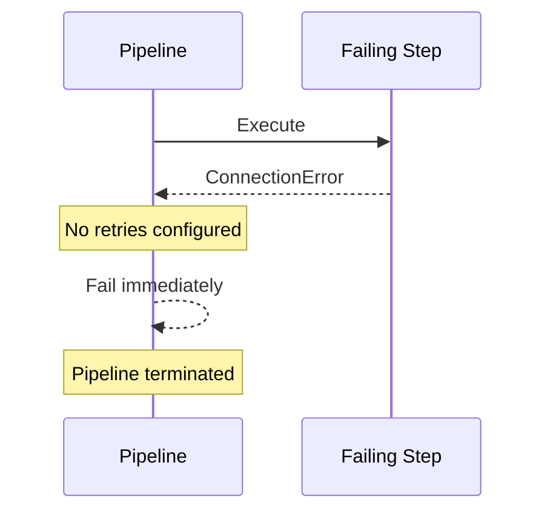
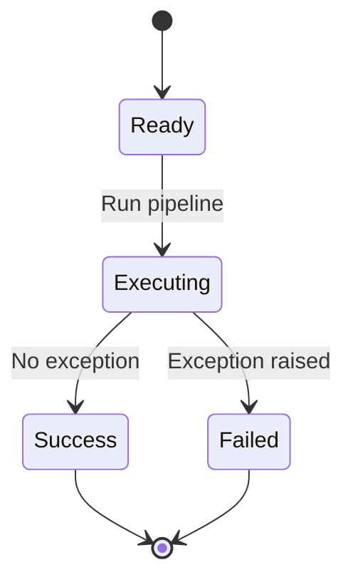
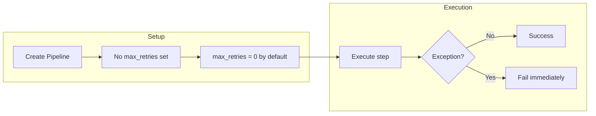

# No Retry Example

## What It Does

This example demonstrates the default behavior when `max_retries` is not configured. Without explicit retry settings, the pipeline fails immediately on the first exception without any retry attempts.

## Key Concepts

- Default `max_retries=0` means no retries
- Pipeline fails immediately on first exception
- `retry_delay` has no effect without retries
- Useful for testing or non-critical operations

## Example

```python
from wpipe import Pipeline

def failing_step(data):
    raise ConnectionError("Network error")

pipeline = Pipeline(verbose=True)
pipeline.set_steps([
    (failing_step, "Failing Step", "v1.0"),
])
try:
    result = pipeline.run({})
except Exception as e:
    print(f"Failed without retry: {type(e).__name__}")
```

## Flow



## Attempt Sequence



## Retry Logic

```mermaid
graph TB
    START[Execute Step] --> CHECK{Success?}
    CHECK -->|Yes| SUCCESS[Return Result]
    CHECK -->|No| FAIL[Fail Immediately]
    Note over FAIL: max_retries=0 by default
```

## States Without Retry



## Process Overview


