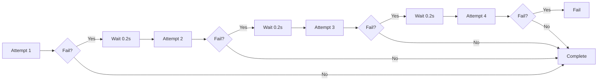
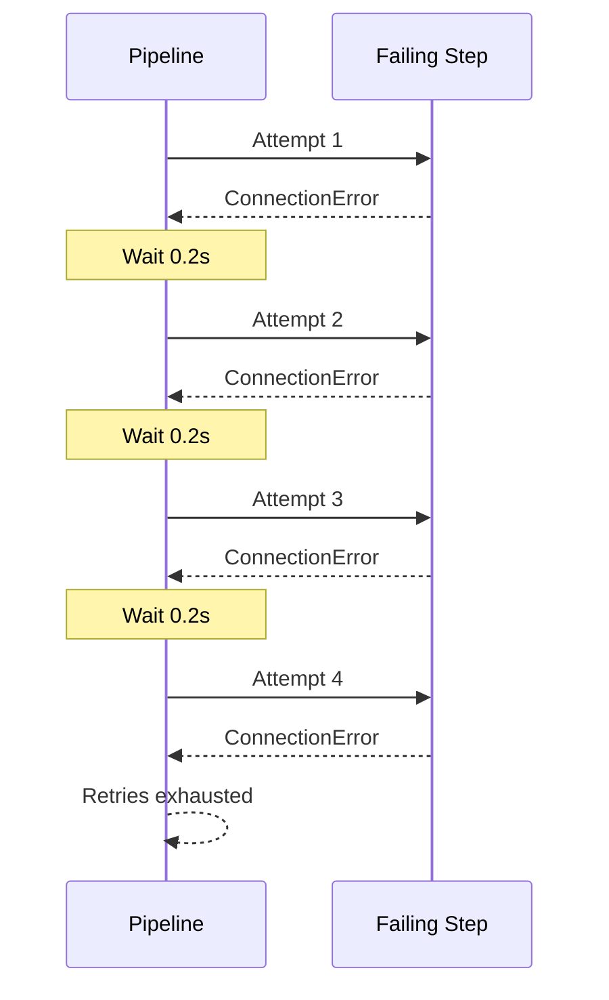
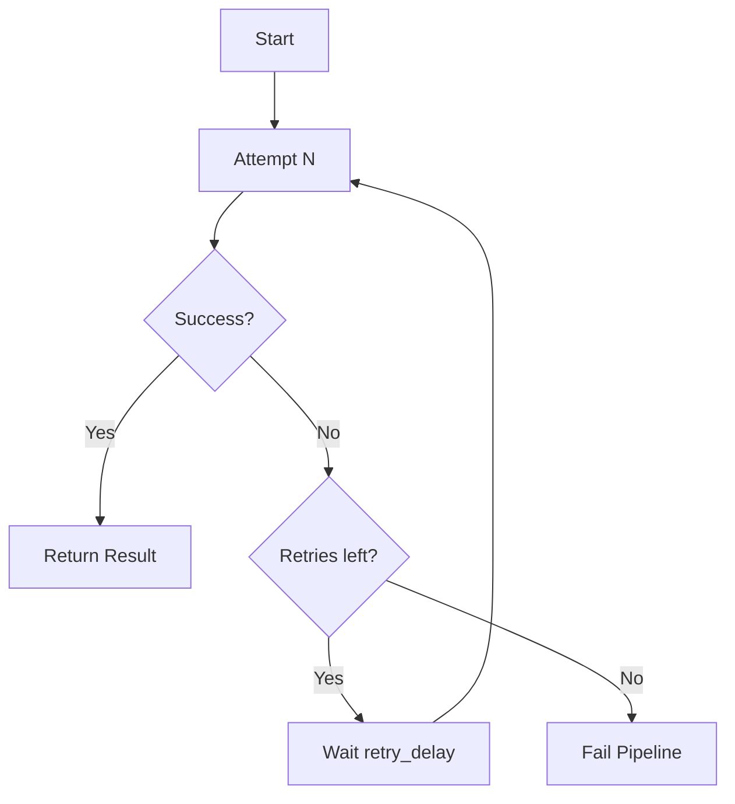
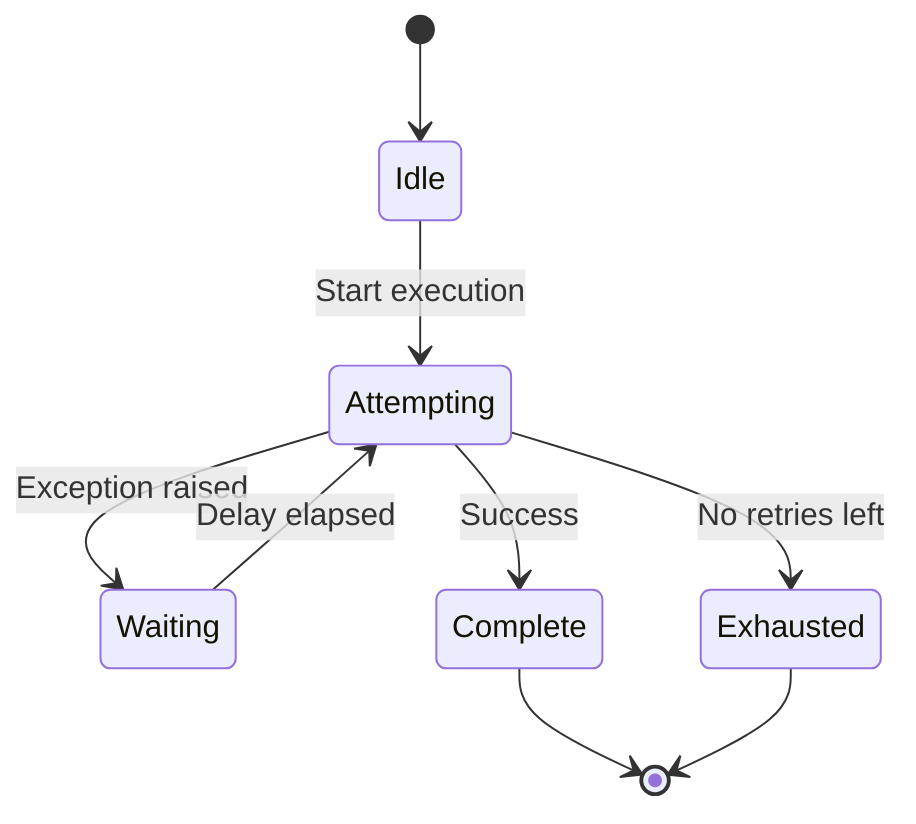
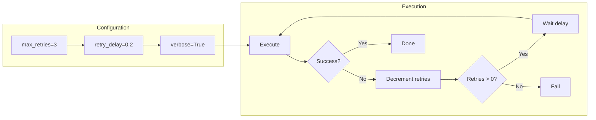

# Exponential Backoff Retry Example

## What It Does

This example demonstrates retry with exponential backoff. While the basic delay is fixed, the retry mechanism ensures a pause between attempts, simulating backoff behavior for transient failures.

## Key Concepts

- `retry_delay`: Fixed delay between retry attempts
- Exponential backoff pattern can be implemented with increasing delays
- Retry delays help prevent overwhelming failing services
- Verbose mode logs each retry attempt with timing

## Example

```python
from wpipe import Pipeline

def failing_step(data):
    raise ConnectionError("Network error")

pipeline = Pipeline(
    max_retries=3,
    retry_delay=0.2,
    verbose=True,
)
pipeline.set_steps([(failing_step, "Failing", "v1.0")])
try:
    result = pipeline.run({})
except Exception as e:
    print(f"Failed after retries: {type(e).__name__}")
```

## Flow



## Attempt Sequence



## Retry Logic



## Retry States



## Process Overview


