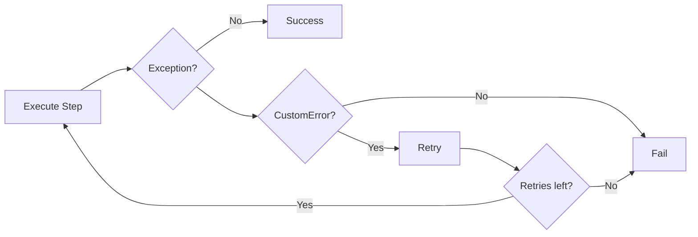
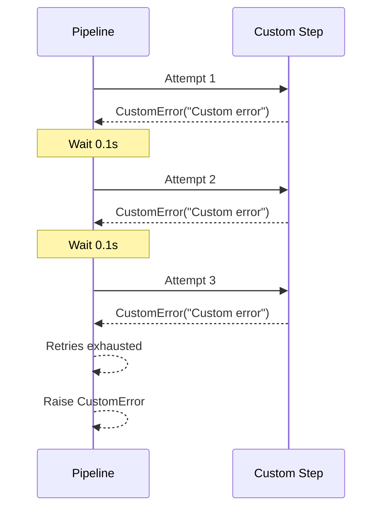
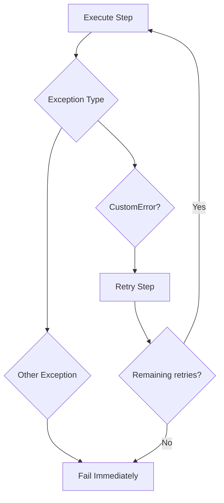
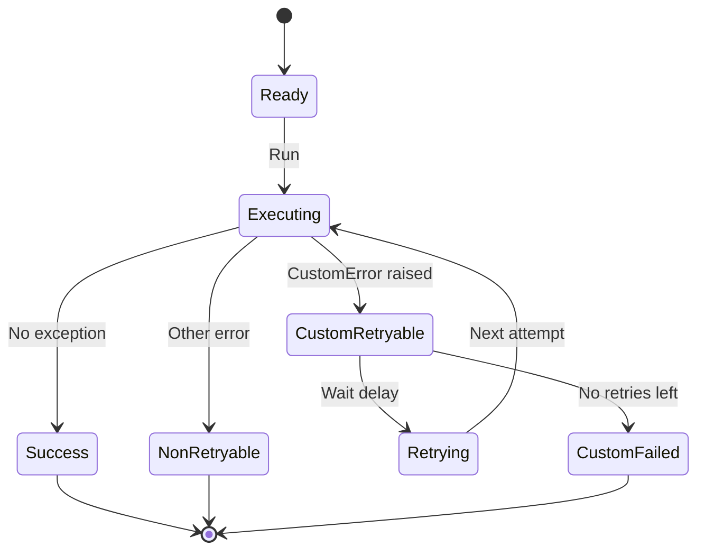
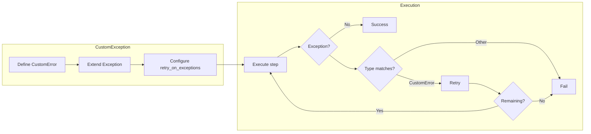

# Custom Exception Retry Example

## What It Does

This example demonstrates how to configure the pipeline to retry on custom exception types. Instead of built-in exceptions, you can define your own exception classes and specify them for retry behavior.

## Key Concepts

- Custom exception classes inherit from `Exception`
- `retry_on_exceptions` accepts any exception type tuple
- Custom exceptions can carry domain-specific error information
- Retry logic works identically to built-in exceptions

## Example

```python
from wpipe import Pipeline

class CustomError(Exception):
    pass

def failing_step(data):
    raise CustomError("Custom error")

pipeline = Pipeline(
    max_retries=2,
    retry_delay=0.1,
    retry_on_exceptions=(CustomError,),
    verbose=True,
)
pipeline.set_steps([(failing_step, "Failing", "v1.0")])
try:
    result = pipeline.run({})
except CustomError as e:
    print(f"Custom error caught: {e}")
```

## Flow



## Attempt Sequence



## Retry Logic



## Custom Exception States



## Process Overview


