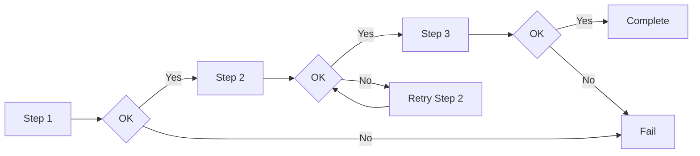
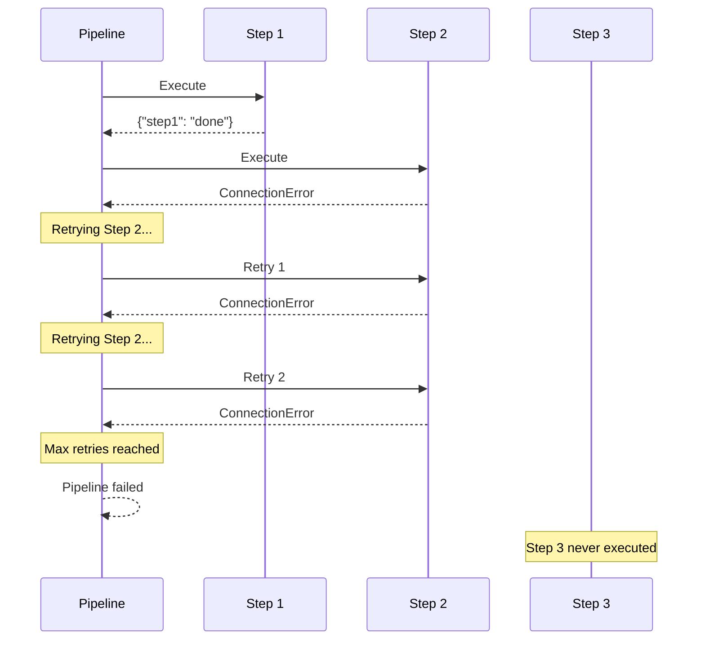
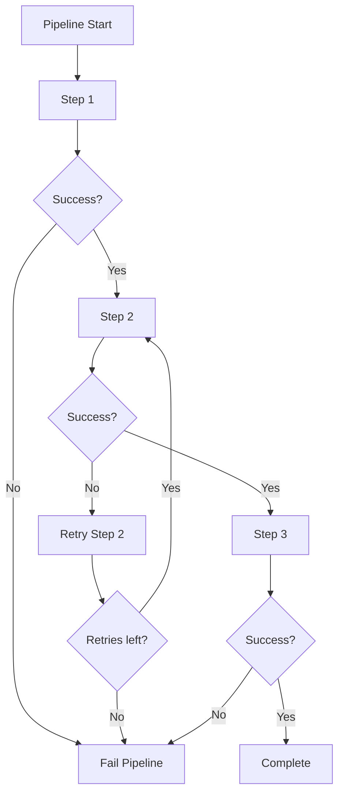
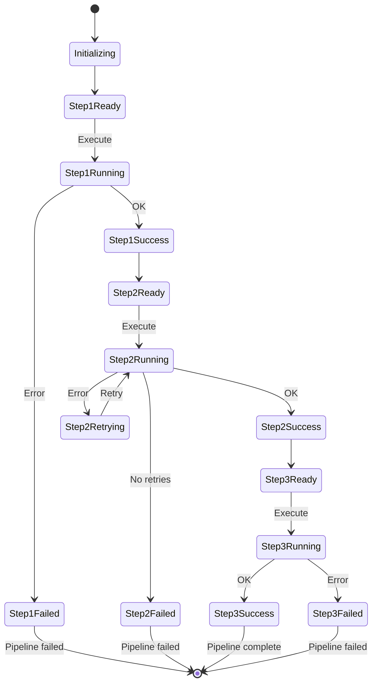
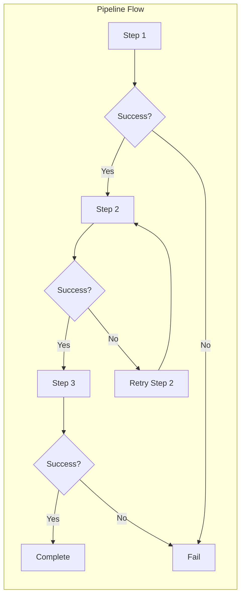

# Partial Pipeline Failure Example

## What It Does

This example shows retry behavior when some steps in a multi-step pipeline fail while others succeed. The pipeline stops execution at the first failing step and retries only that step.

## Key Concepts

- Steps execute sequentially
- A failure stops subsequent steps temporarily
- Only the failed step is retried
- Successful steps do not re-execute after retry

## Example

```python
from wpipe import Pipeline

def step1(data):
    return {"step1": "done"}

def step2(data):
    raise ConnectionError("Network error")

def step3(data):
    return {"step3": "done"}

pipeline = Pipeline(
    max_retries=2,
    retry_delay=0.1,
    verbose=True,
)
pipeline.set_steps([
    (step1, "Step 1", "v1.0"),
    (step2, "Step 2", "v1.0"),
    (step3, "Step 3", "v1.0"),
])
try:
    result = pipeline.run({})
except Exception as e:
    print(f"Pipeline failed: {type(e).__name__}")
```

## Flow



## Attempt Sequence



## Retry Logic



## Partial Failure States



## Process Overview


