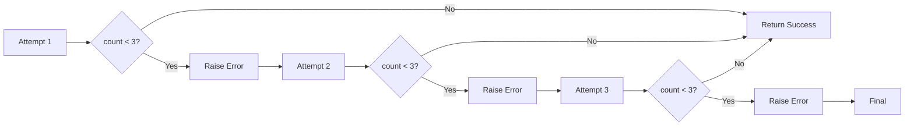
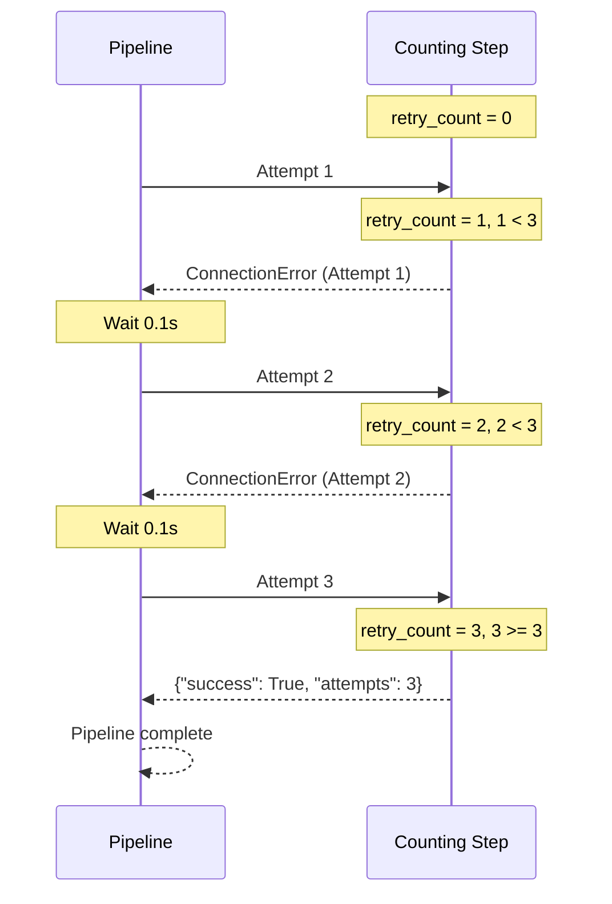
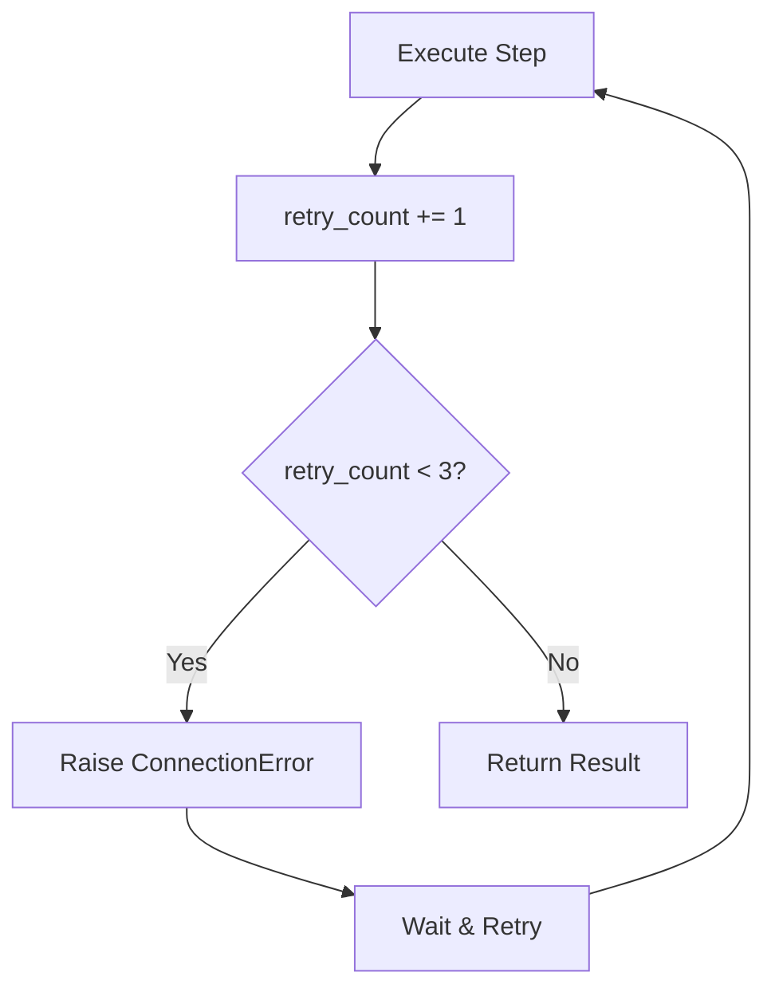
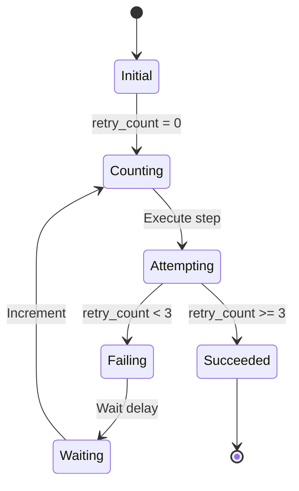
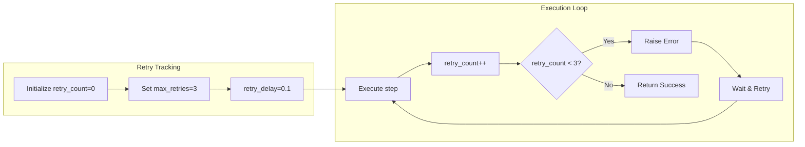

# Retry Counter Example

## What It Does

This example demonstrates how to track retry attempts within a step. The `counting_step` uses a global counter to track how many times it has been executed, succeeding only after a specified number of failures.

## Key Concepts

- Global variables can track state across retries
- `verbose=True` shows attempt numbers in logs
- Steps can make decisions based on attempt count
- Retry count includes the initial attempt

## Example

```python
from wpipe import Pipeline

retry_count = 0

def counting_step(data):
    global retry_count
    retry_count += 1
    if retry_count < 3:
        raise ConnectionError(f"Attempt {retry_count}")
    return {"success": True, "attempts": retry_count}

pipeline = Pipeline(
    max_retries=3,
    retry_delay=0.1,
    verbose=True,
)
pipeline.set_steps([(counting_step, "Counting Step", "v1.0")])
result = pipeline.run({})
print(f"Result: {result}")
```

## Flow



## Attempt Sequence



## Retry Logic



## Counter States



## Process Overview


