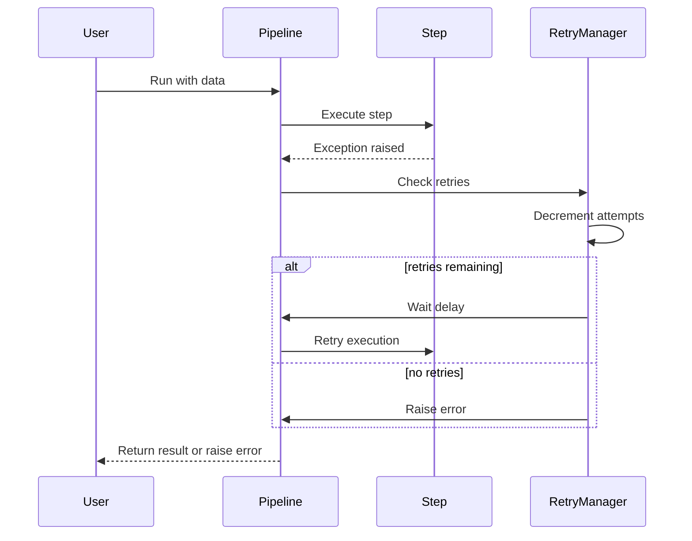
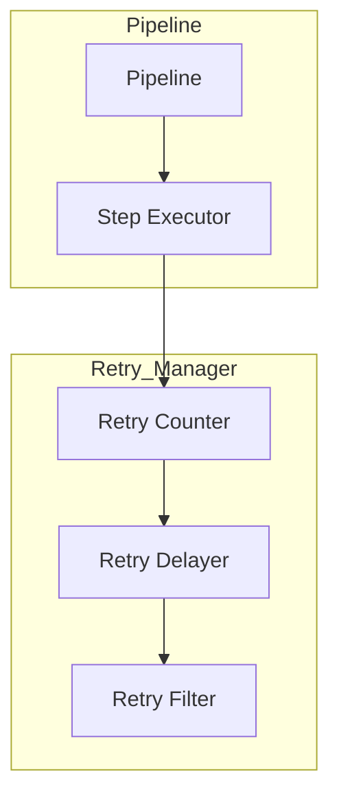
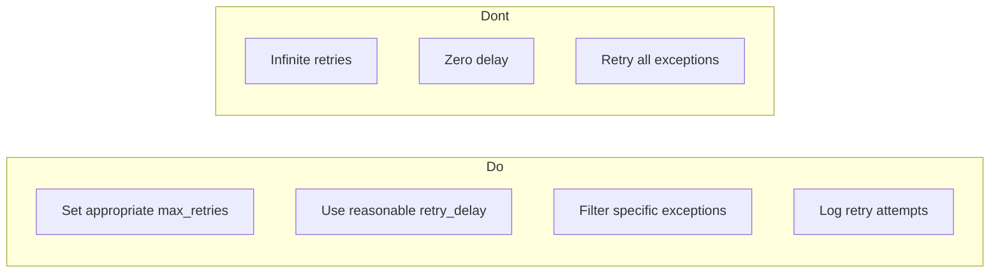

# Retry Mechanisms

This directory contains examples demonstrating retry functionality in pipelines.

## Project Overview

The `retry` module provides automatic retry capabilities for pipeline steps that may fail temporarily. This is essential for handling network issues, temporary service unavailability, and other transient failures.

**Key Capabilities:**
- Configurable maximum retry attempts
- Configurable delay between retries
- Filter which exceptions to retry on
- Custom backoff strategies
- Retry state tracking

---

## 1. 🚶 Diagram Walkthrough

```mermaid
flowchart TD
    A[Start Execution] --> B[Execute Step]
    B --> C{Success?}
    C -->|Yes| D[Continue Pipeline]
    C -->|No| E{Retries Left?}
    E -->|Yes| F[Wait (retry_delay)]
    F --> B
    E -->|No| G[Fail Pipeline]
```

---

## 2. 🗺️ System Workflow (Sequence)



---

## 3. 🏗️ Architecture Components



---

## 4. ⚙️ Container Lifecycle

### Build Process
No build required - retry logic is configured at pipeline creation.

### Runtime Process
1. **Initial Attempt**: Execute step for the first time
2. **Success Check**: Verify if step succeeded
3. **Failure Handling**: On failure, check retry configuration
4. **Delay**: Wait for configured delay (if any)
5. **Retry**: Execute step again (up to max_retries)
6. **Final Result**: Return result or raise error

---

## 5. 📂 File-by-File Guide

| File | Description |
|------|-------------|
| `01_basic_retry_example/` | Basic retry on failure with configurable max_retries |
| `02_success_after_retry_example/` | Function that succeeds after a few failed attempts |
| `03_filter_exceptions_example/` | Retry only specific exception types |
| `04_multiple_steps_example/` | Retry behavior with multiple pipeline steps |
| `05_no_retry_example/` | Pipeline without retry (default behavior) |
| `06_retry_with_backoff_example/` | Exponential backoff retry |
| `07_retry_with_custom_exception_example/` | Custom exception filtering |
| `08_retry_partial_failure_example/` | Handling partial failures |
| `09_retry_counter_example/` | Tracking retry attempts |
| `10_retry_context.py` | Retry context management |
| `10_retry_state.py` | Retry state tracking |

---

## Quick Start

```python
from wpipe import Pipeline

def unreliable_step(data):
    if not hasattr(unreliable_step, 'attempt'):
        unreliable_step.attempt = 0
    unreliable_step.attempt += 1
    if unreliable_step.attempt < 3:
        raise ConnectionError("Network error")
    return {"success": True}

pipeline = Pipeline(
    max_retries=3,
    retry_delay=0.5,
    retry_on_exceptions=(ConnectionError, TimeoutError),
    verbose=True
)
pipeline.set_steps([(unreliable_step, "Unreliable", "v1.0")])
result = pipeline.run({})
```

## Parameters

| Parameter | Type | Default | Description |
|-----------|------|---------|-------------|
| `max_retries` | int | 3 | Maximum retry attempts (0 = no retry) |
| `retry_delay` | float | 1.0 | Delay between retries in seconds |
| `retry_on_exceptions` | tuple | (Exception,) | Tuple of exception types to retry on |

---

## Configuration Options

### Simple Retry

```python
pipeline = Pipeline(max_retries=3, retry_delay=1.0)
```

### Filtered Retry

```python
pipeline = Pipeline(
    max_retries=5,
    retry_delay=2.0,
    retry_on_exceptions=(ConnectionError, TimeoutError)
)
```

### Exponential Backoff

```python
pipeline = Pipeline(
    max_retries=3,
    retry_delay=1.0,  # Base delay
    exponential_backoff=True
)
```

---

## Examples

### Basic Retry

```python
pipeline = Pipeline(max_retries=3, retry_delay=0.5)
pipeline.set_steps([(my_step, "Step", "v1.0")])
```

### With Exception Filtering

```python
pipeline = Pipeline(
    max_retries=3,
    retry_on_exceptions=(ConnectionError, TimeoutError),
    verbose=True
)
```

### Tracking Retries

```python
def counting_step(data):
    retry_count = data.get("_retry_count", 0)
    data["_retry_count"] = retry_count + 1
    if retry_count < 2:
        raise ValueError("Simulated failure")
    return {"attempts": retry_count + 1}

pipeline = Pipeline(max_retries=3)
pipeline.set_steps([(counting_step, "Counting", "v1.0")])
```

---

## Best Practices



1. **Set appropriate max_retries** - Don't retry too many times
2. **Use reasonable delays** - Prevent overwhelming services
3. **Filter specific exceptions** - Only retry transient failures
4. **Log retry attempts** - For debugging and monitoring
5. **Test retry logic** - Ensure both success and failure paths work

---

## See Also

- [Basic Pipeline](../01_basic_pipeline/) - Core pipeline concepts
- [Error Handling](../03_error_handling/) - Error handling patterns
- [API Pipeline](../02_api_pipeline/) - API retry configuration
