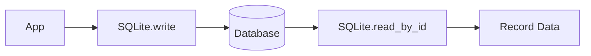
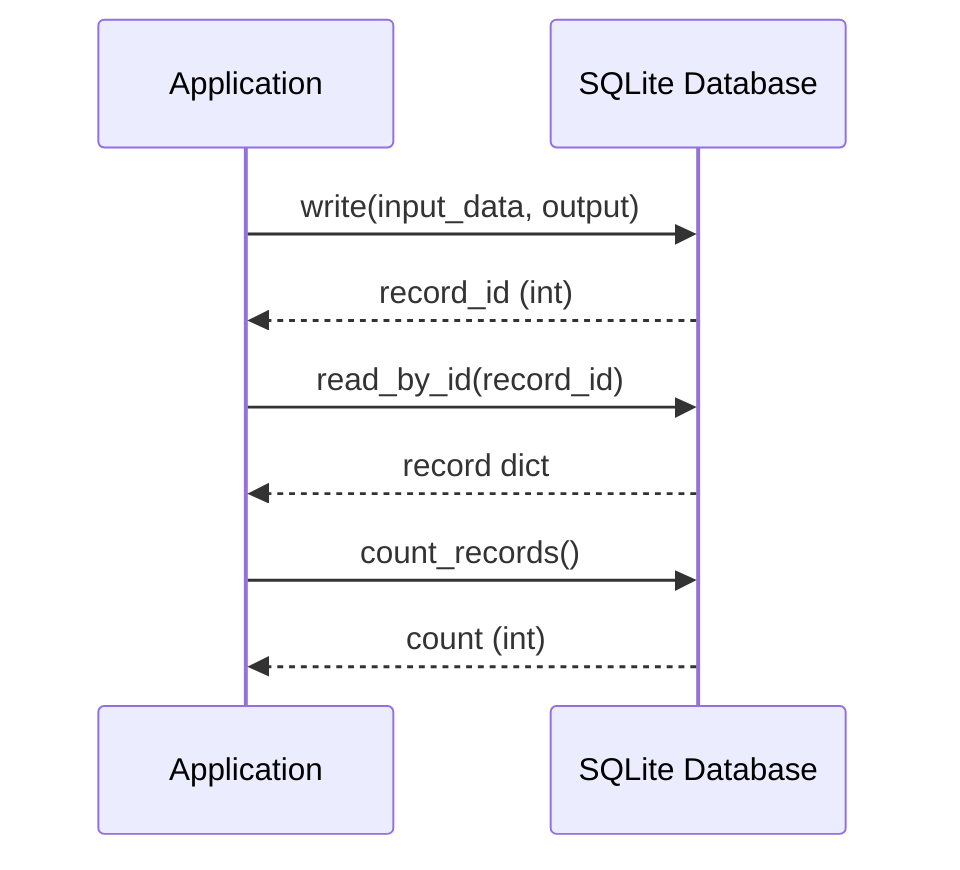
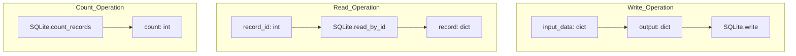
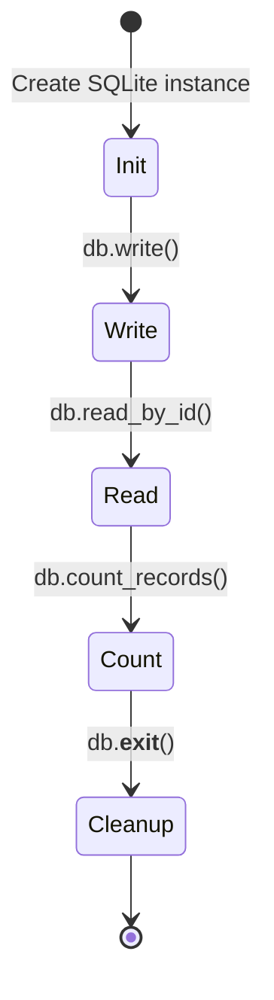
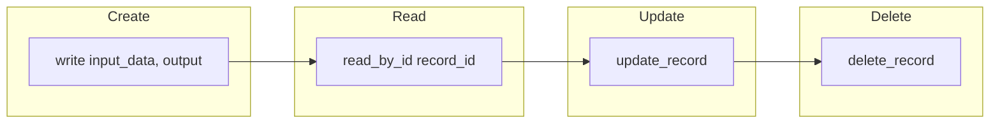

# Basic Write and Read Example

## Overview

Demonstrates the simplest SQLite integration: writing a record to the database and reading it back by ID.

## What It Does

1. Creates a SQLite database file
2. Writes a record with input and output data
3. Reads the record back using its ID
4. Counts total records in the database

## Example

```python
from wpipe.sqlite import SQLite

db = SQLite(db_name="test_basic.db")
record_id = db.write(input_data={"name": "test", "value": 100}, output={"result": "success"})
records = db.read_by_id(record_id)
count = db.count_records()
```

## Data Flow



## Database Operations



## Query Structure



## Operation States



## CRUD Operations


