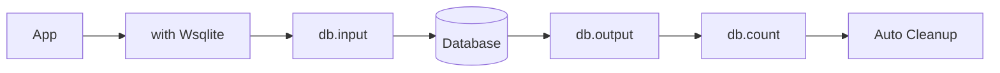
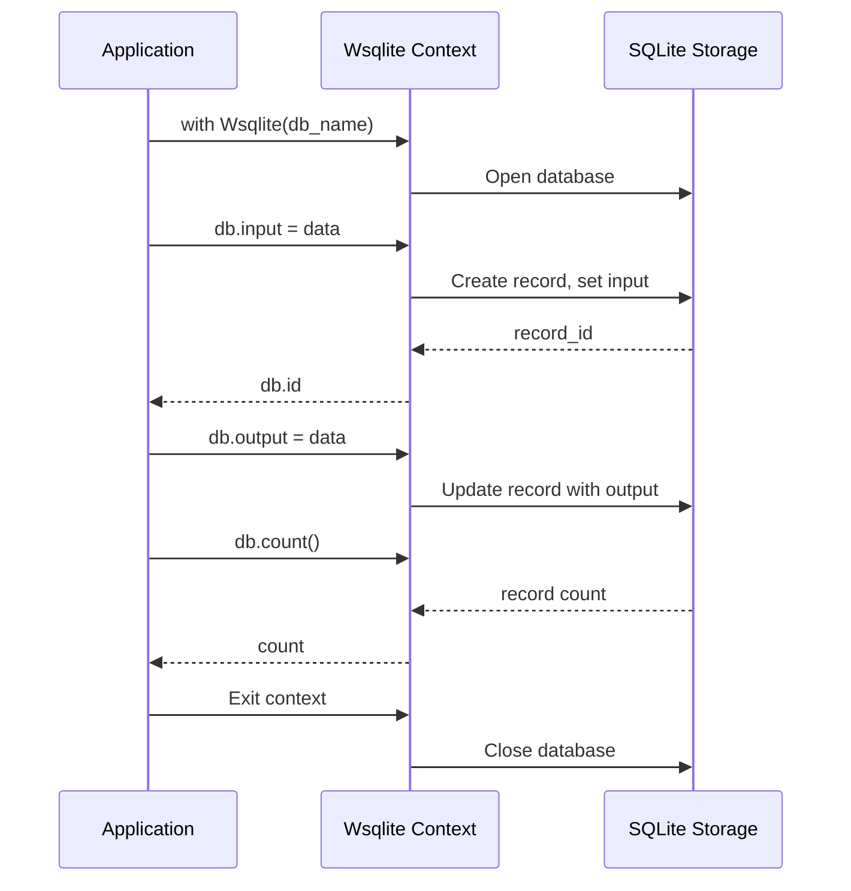
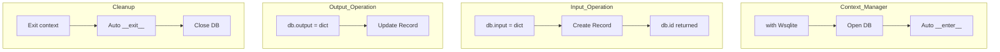
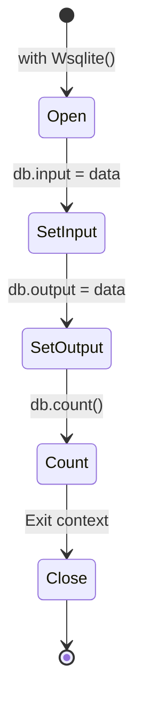
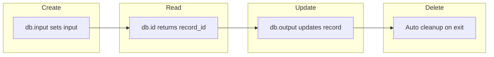

# Wsqlite Context Manager Example

## Overview

Demonstrates using Wsqlite as a context manager for convenient database operations with automatic resource cleanup.

## What It Does

1. Opens a SQLite database using the Wsqlite context manager
2. Sets input data on a new record
3. Sets output data on the same record
4. Counts total records in the database
5. Automatically closes the database on exit

## Example

```python
from wpipe.sqlite import Wsqlite

with Wsqlite(db_name="test.db") as db:
    db.input = {"name": "pipeline_run", "id": 123}
    db.output = {"result": "completed", "value": 42}
    print(f"Total records: {db.count()}")
```

## Data Flow



## Database Operations



## Query Structure



## Operation States



## CRUD Operations


