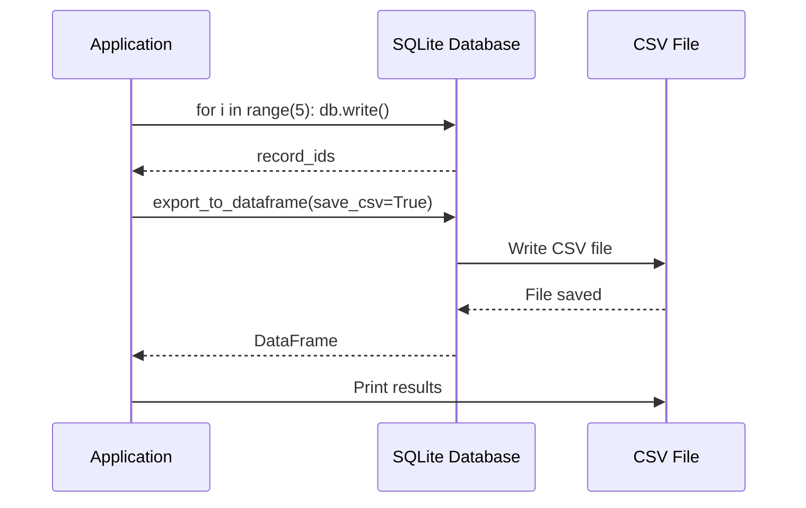
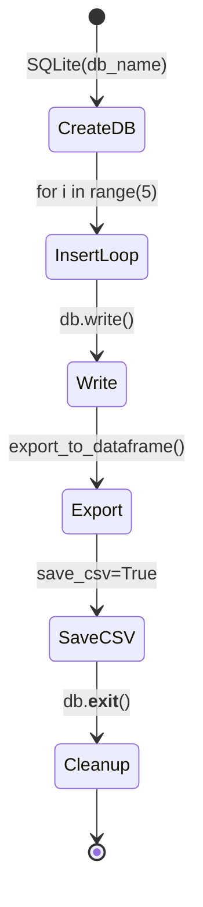
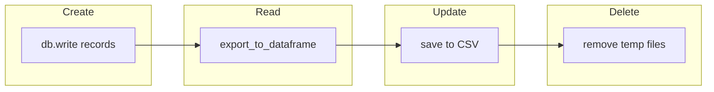

# Export to CSV Example

## Overview

Demonstrates exporting database records to a pandas DataFrame and saving the data as a CSV file.

## What It Does

1. Creates a SQLite database
2. Writes multiple records with index and value data
3. Exports all records to a pandas DataFrame
4. Saves the DataFrame to a CSV file
5. Prints the DataFrame and record count

## Example

```python
from wpipe.sqlite import SQLite

db = SQLite(db_name="test_export.db")
for i in range(5):
    db.write(input={"index": i}, output={"value": i * 10})

df = db.export_to_dataframe(save_csv=True, csv_name="export.csv")
print(df)
```

## Data Flow


## Database Operations



## Query Structure

```mermaid
graph TB
    subgraph Write_Loop
        W1[for i in range(5)] --> W2[db.write input, output]
    end
    subgraph Export
        E1[export_to_dataframe] --> E2[DataFrame]
        E2 --> E3[save_csv=True]
        E3 --> E4[CSV file created]
    end
    subgraph Query
        Q1[count_records] --> Q2[Total count]
    end
```

## Operation States



## CRUD Operations


