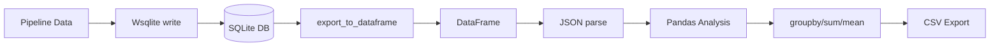
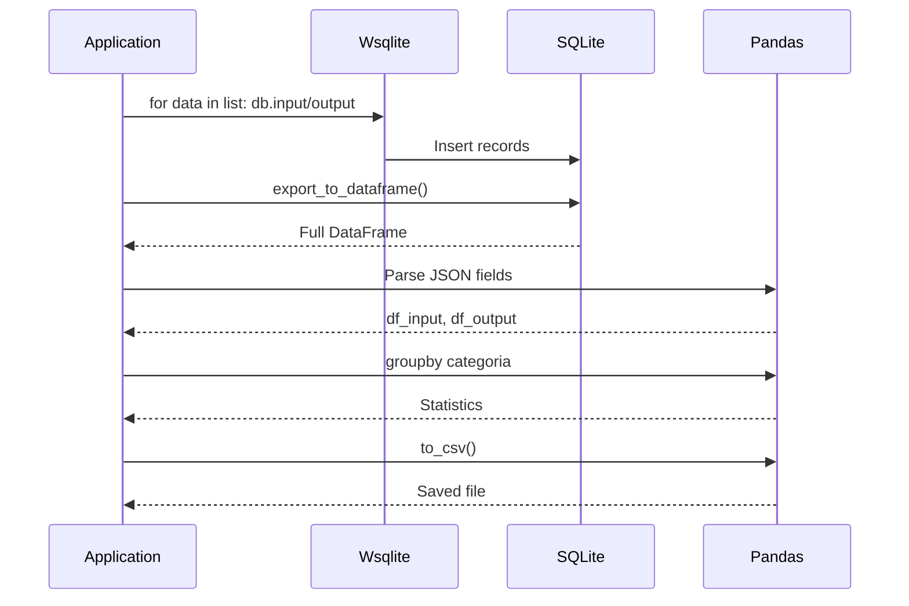
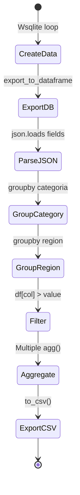
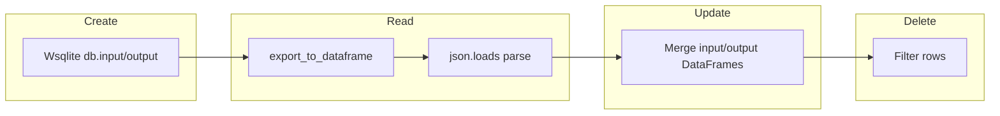

# Advanced Queries Example

## Overview

Demonstrates advanced database queries using SQLite combined with Pandas for data analysis, grouping, filtering, and aggregation.

## What It Does

1. Creates a dataset with multiple records using Pipeline and Wsqlite
2. Exports all records to a pandas DataFrame
3. Parses JSON fields (input, output) into separate DataFrames
4. Performs group-by analysis by category and region
5. Filters records based on conditions
6. Exports analysis summary to CSV
7. Prints general statistics

## Example

```python
from wpipe.sqlite import Wsqlite, SQLite
import pandas as pd
import json

with SQLite("dataset.db") as db:
    df = db.export_to_dataframe()
    df_input = pd.DataFrame()
    for _, row in df.iterrows():
        if row["input"]:
            df_input = pd.concat(
                [df_input, pd.DataFrame([json.loads(row["input"])])],
                ignore_index=True
            )
    stats = df_input.groupby("categoria")["valor"].agg(["count", "sum", "mean"])
```

## Data Flow



## Database Operations



## Query Structure

```mermaid
graph TB
    subgraph Create_Records
        P1[Pipeline.run] --> W1[Wsqlite]
        W1 --> DB1[(Database)]
    end
    subgraph Export_Data
        E1[export_to_dataframe] --> E2[DataFrame]
        E2 --> E3[Parse JSON]
    end
    subgraph Analysis
        A1[groupby categoria] --> A2[count/sum/mean]
        A1[groupby region] --> A3[count/sum/mean]
    end
    subgraph Filter
        F1[df[col] > value] --> F2[Filtered DataFrame]
    end
    subgraph Export
        X1[to_csv] --> X2[CSV file]
    end
```

## Operation States



## CRUD Operations


