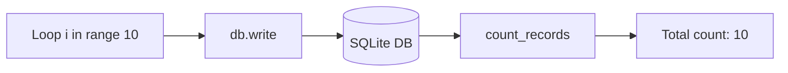
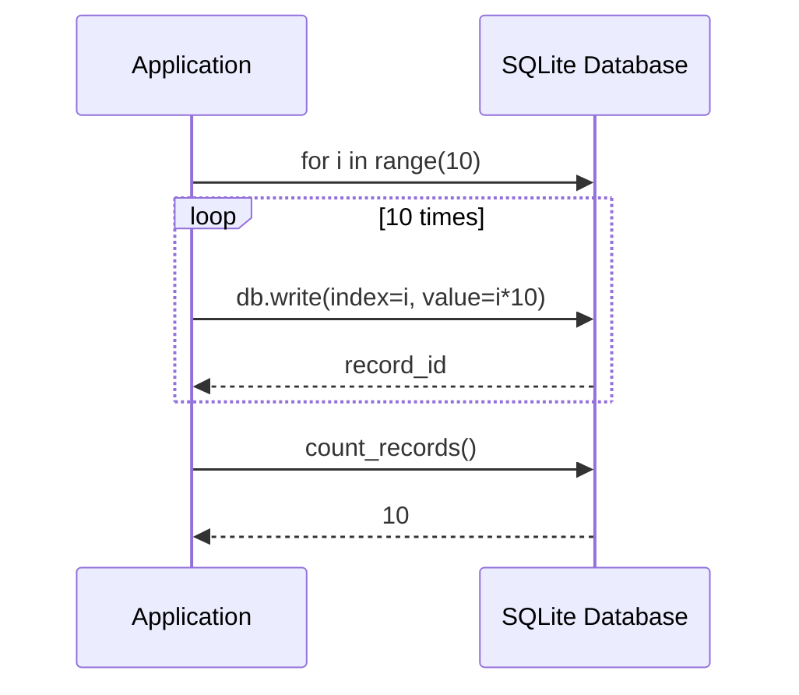

# Batch Insert Example

## Overview

Demonstrates inserting multiple records into a SQLite database in a batch loop operation.

## What It Does

1. Creates a SQLite database
2. Loops 10 times to insert records with incrementing index and value
3. Counts total records to verify batch insertion

## Example

```python
from wpipe.sqlite import SQLite

db = SQLite(db_name="batch_test.db")
for i in range(10):
    db.write(input_data={"index": i}, output={"value": i * 10})

count = db.count_records()
print(f"Total records: {count}")
```

## Data Flow



## Database Operations



## Query Structure

```mermaid
graph TB
    subgraph Batch_Loop
        L1[for i in range(10)] --> L2[Write record]
        L2 --> L3[record_id returned]
    end
    subgraph Input
        I1[index: i] --> I2[input_data dict]
    end
    subgraph Output
        O1[value: i*10] --> O2[output dict]
    end
    subgraph Count
        C1[count_records] --> C2[total: 10]
    end
```

## Operation States

```mermaid
stateDiagram-v2
    [*] --> CreateDB: SQLite()
    CreateDB --> LoopStart: for i in range(10)
    LoopStart --> Write: db.write()
    Write --> LoopCheck{i < 10}
    LoopCheck --> LoopStart: Yes
    LoopCheck --> Count: No
    Count --> Cleanup: db.__exit__()
    Cleanup --> [*]
```

## CRUD Operations

```mermaid
flowchart LR
    subgraph Create
        BATCH[for i in range(10)]
    end
    subgraph Read
        WRITE[db.write records]
    end
    subgraph Update
        VERIFY[count_records]
    end
    subgraph Delete
        CLEANUP[db.__exit__]
    end
    BATCH --> WRITE --> VERIFY --> CLEANUP
```
