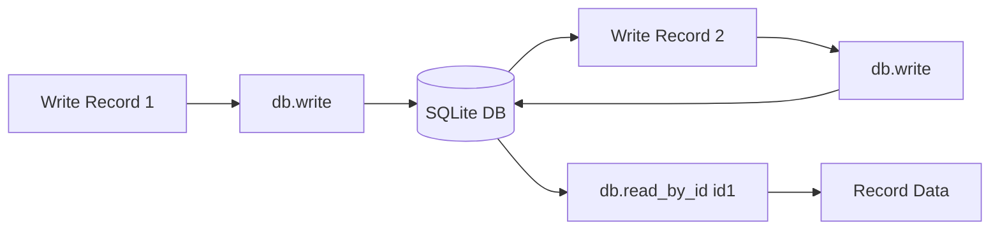
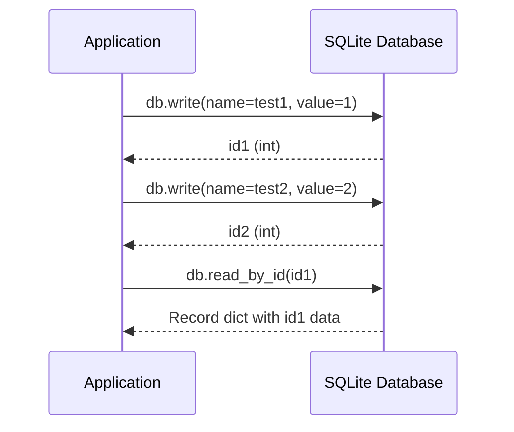
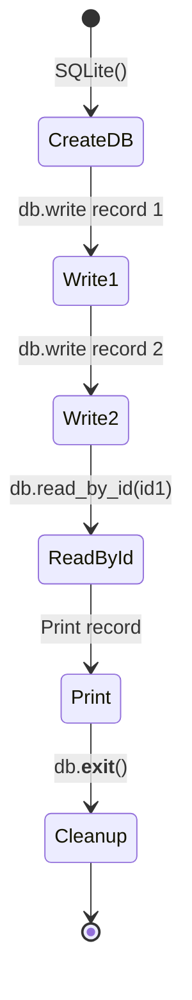
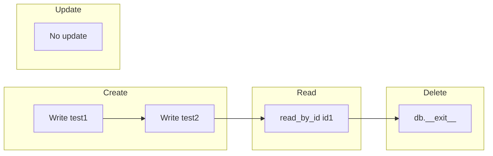

# Query Specific Records Example

## Overview

Demonstrates querying specific database records by their unique record ID.

## What It Does

1. Creates a SQLite database
2. Writes two records with different names and values
3. Retrieves the first record by its ID
4. Prints the queried record data

## Example

```python
from wpipe.sqlite import SQLite

db = SQLite(db_name="query_test.db")
id1 = db.write(input_data={"name": "test1"}, output={"value": 1})
id2 = db.write(input_data={"name": "test2"}, output={"value": 2})

record = db.read_by_id(id1)
print(f"Record 1: {record}")
```

## Data Flow



## Database Operations



## Query Structure

```mermaid
graph TB
    subgraph Write_Records
        W1[Write 1] --> W2[input: {name: test1}]
        W2 --> W3[output: {value: 1}]
        W3 --> W4[id1 returned]
    end
    subgraph Write_Records2
        W5[Write 2] --> W6[input: {name: test2}]
        W6 --> W7[output: {value: 2}]
        W7 --> W8[id2 returned]
    end
    subgraph Read_By_ID
        R1[read_by_id id1] --> R2[SELECT WHERE id=id1]
        R2 --> R3[Record dict]
    end
```

## Operation States



## CRUD Operations


