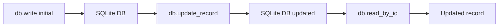
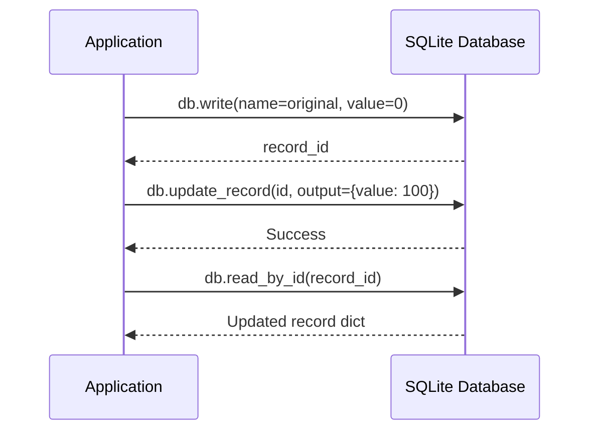
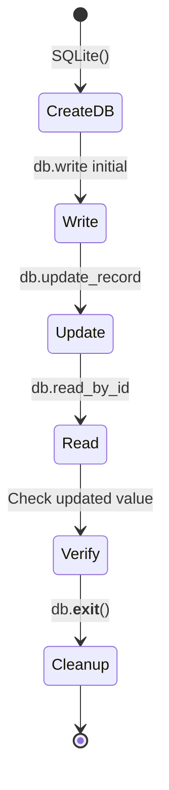
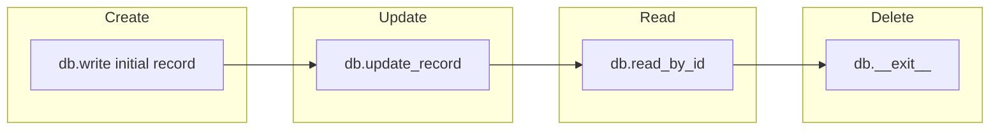

# Update Records Example

## Overview

Demonstrates updating existing records in a SQLite database using the update_record method.

## What It Does

1. Creates a SQLite database
2. Writes a new record with initial value of 0
3. Updates the record's output data with a new value of 100
4. Reads the updated record to verify the change

## Example

```python
from wpipe.sqlite import SQLite

db = SQLite(db_name="update_test.db")
record_id = db.write(input_data={"name": "original"}, output={"value": 0})
db.update_record(record_id, output={"value": 100})
record = db.read_by_id(record_id)
print(f"Updated record: {record}")
```

## Data Flow



## Database Operations



## Query Structure

```mermaid
graph TB
    subgraph Write_Step
        W1[write] --> W2[input: {name: original}]
        W2 --> W3[output: {value: 0}]
        W3 --> W4[record_id]
    end
    subgraph Update_Step
        U1[update_record] --> U2[SET output]
        U2 --> U3[WHERE id=record_id]
        U3 --> U4[New output: {value: 100}]
    end
    subgraph Read_Step
        R1[read_by_id] --> R2[SELECT * WHERE id]
        R2 --> R3[Updated record]
    end
```

## Operation States



## CRUD Operations


