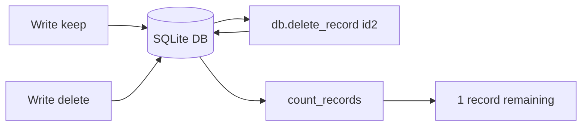
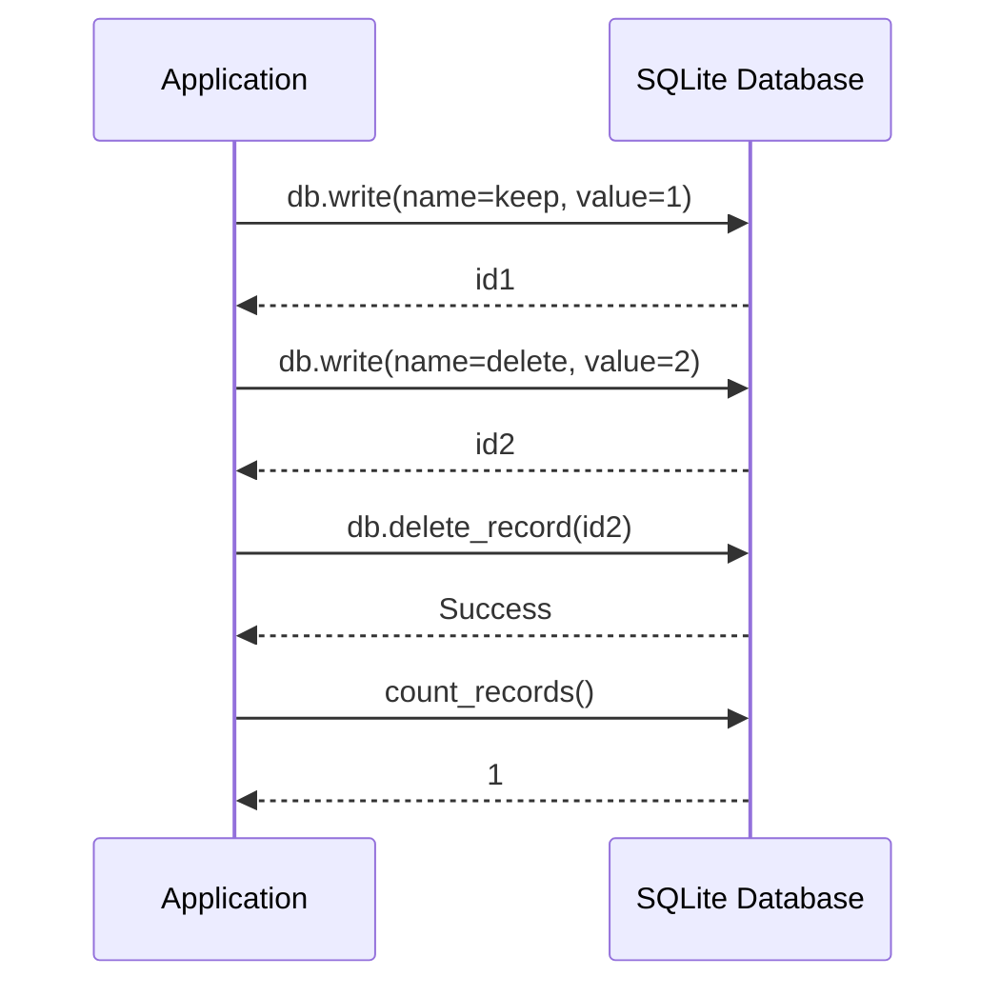
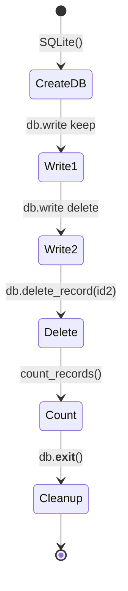
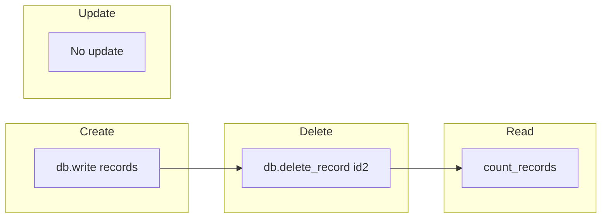

# Delete Records Example

## Overview

Demonstrates deleting specific records from a SQLite database using the delete_record method.

## What It Does

1. Creates a SQLite database
2. Writes two records (one to keep, one to delete)
3. Deletes the second record by its ID
4. Counts remaining records to verify deletion

## Example

```python
from wpipe.sqlite import SQLite

db = SQLite(db_name="delete_test.db")
id1 = db.write(input_data={"name": "keep"}, output={"value": 1})
id2 = db.write(input_data={"name": "delete"}, output={"value": 2})

db.delete_record(id2)

count = db.count_records()
print(f"Remaining records: {count}")
```

## Data Flow



## Database Operations



## Query Structure

```mermaid
graph TB
    subgraph Write_Operations
        W1[Write 1] --> W2[id1: keep]
        W3[Write 2] --> W4[id2: delete]
    end
    subgraph Delete_Operation
        D1[delete_record id2] --> D2[DELETE FROM table]
        D2 --> D3[WHERE id = id2]
    end
    subgraph Count_Operation
        C1[count_records] --> C2[SELECT COUNT(*)]
        C2 --> C3[Result: 1]
    end
```

## Operation States



## CRUD Operations


