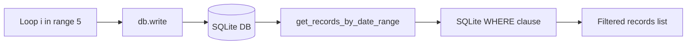
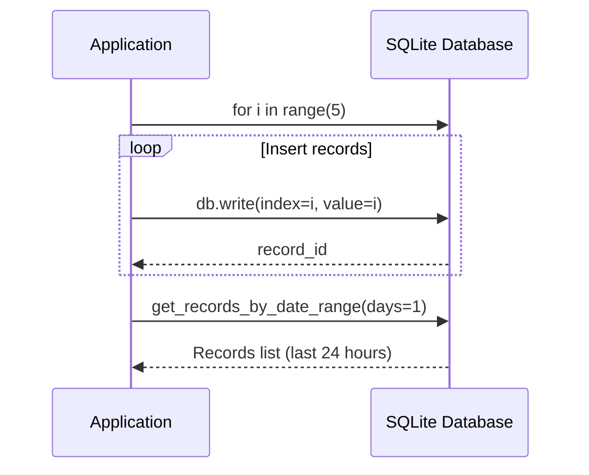

# Complex Query Example

## Overview

Demonstrates performing complex database queries using date range filtering with the get_records_by_date_range method.

## What It Does

1. Creates a SQLite database
2. Writes 5 records with incrementing index and value
3. Queries records created within the last 1 day
4. Prints the count of records in the date range

## Example

```python
from wpipe.sqlite import SQLite

db = SQLite(db_name="complex_test.db")
for i in range(5):
    db.write(input_data={"index": i}, output={"value": i})

records = db.get_records_by_date_range(days=1)
print(f"Records in range: {len(records)}")
```

## Data Flow



## Database Operations



## Query Structure

```mermaid
graph TB
    subgraph Write_Loop
        L1[for i in range(5)] --> L2[db.write records]
        L2 --> L3[5 records inserted]
    end
    subgraph Date_Range_Query
        Q1[get_records_by_date_range] --> Q2[WHERE timestamp >=]
        Q2 --> Q3[NOW - 1 day]
        Q3 --> Q4[SELECT * FROM table]
        Q4 --> Q5[Records list]
    end
    subgraph Count
        C1[len(records)] --> C2[Record count]
    end
```

## Operation States

```mermaid
stateDiagram-v2
    [*] --> CreateDB: SQLite()
    CreateDB --> WriteLoop: for i in range(5)
    WriteLoop --> Write: db.write()
    Write --> LoopCheck{i < 5}
    LoopCheck --> WriteLoop: Yes
    LoopCheck --> Query: No
    Query --> GetRecords: get_records_by_date_range
    GetRecords --> Print: Print record count
    Print --> Cleanup: db.__exit__()
    Cleanup --> [*]
```

## CRUD Operations

```mermaid
flowchart LR
    subgraph Create
        BATCH[for i in range(5)]
    end
    subgraph Read
        QUERY[get_records_by_date_range]
    end
    subgraph Update
        N/A[No update]
    end
    subgraph Delete
        C[db.__exit__]
    end
    BATCH --> QUERY --> C
```
