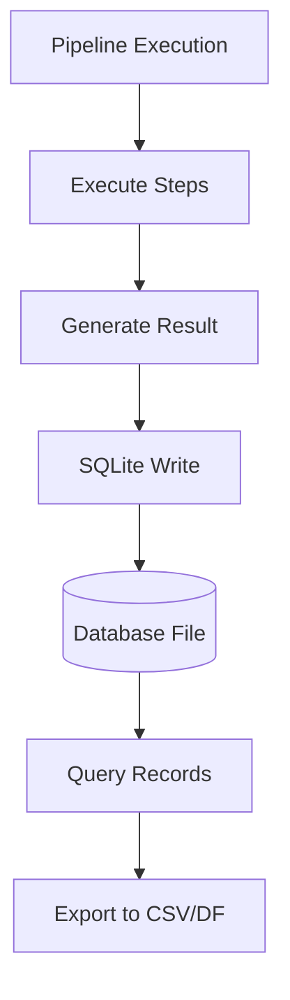
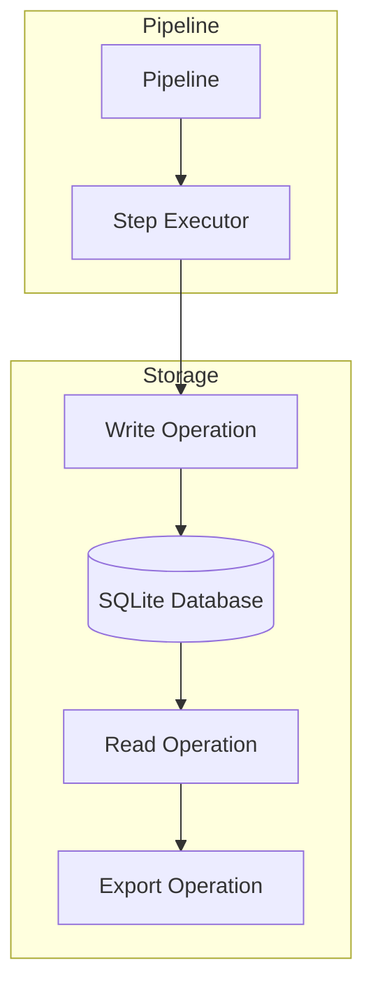
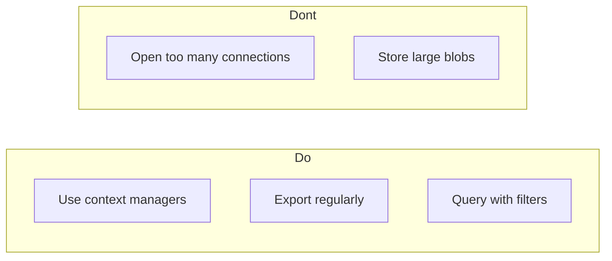

# SQLite Integration

This directory contains examples demonstrating SQLite database integration with pipelines.

## Project Overview

The `sqlite_integration` module provides persistent storage for pipeline execution data. This enables tracking, auditing, and analyzing pipeline runs over time.

**Key Capabilities:**
- Store input/output data from pipeline executions
- Store additional metadata and details
- Query and filter execution records
- Export data to CSV or DataFrames
- Batch operations for high-volume scenarios
- Transaction support for atomic operations

---

## 1. 🚶 Diagram Walkthrough



---

## 2. 🏗️ Architecture Components



---

## 3. 📂 File-by-File Guide

| File | Description |
|------|-------------|
| `01_basic_write_example/` | Basic write operation to SQLite |
| `02_wsqlite_example/` | Using Wsqlite context manager |
| `03_export_csv_example/` | Export data to CSV files |
| `04_advanced_queries_example/` | Advanced query operations |
| `05_batch_insert_example/` | Batch insert operations |
| `06_query_specific_example/` | Query specific records |
| `07_update_record_example/` | Update existing records |
| `08_delete_record_example/` | Delete records |
| `09_complex_query_example/` | Complex queries with date range |
| `10_json_storage.py` | JSON data storage |
| `10_transaction.py` | Transaction support |
| `database.py` | Database utility functions |

---

## Database Schema

| Field | Type | Description |
|-------|------|-------------|
| `id` | INTEGER | Unique identifier (auto-increment) |
| `input` | TEXT | JSON with input data |
| `output` | TEXT | JSON with output results |
| `details` | TEXT | Additional metadata |
| `datetime` | TEXT | Creation timestamp |

---

## Quick Start

### Using Wsqlite (Context Manager)

```python
from wpipe import Pipeline
from wpipe.sqlite import Wsqlite

def process_data(data):
    return {"result": data.get("value", 0) * 2}

pipeline = Pipeline()
pipeline.set_steps([(process_data, "Process", "v1.0")])

with Wsqlite(db_name="results.db") as db:
    db.input = {"value": 10}
    result = pipeline.run({"value": 10})
    db.output = result
    print(f"Record ID: {db.id}")
```

### Using SQLite (Direct)

```python
from wpipe.sqlite import SQLite

db = SQLite(db_name="results.db")
record_id = db.write(
    input_data={"input": "value"},
    output={"result": "success"}
)
print(f"Record ID: {record_id}")
```

---

## Classes

### Wsqlite

Wrapper with context manager for simple usage:

```python
from wpipe.sqlite import Wsqlite

with Wsqlite(db_name="resultados.db") as db:
    db.input = {"datos": "entrada"}
    resultado = pipeline.run({"datos": "entrada"})
    db.output = resultado
```

### SQLite

Class with advanced operations:

```python
from wpipe.sqlite import SQLite

with SQLite(db_name="resultados.db") as db:
    df = db.export_to_dataframe()
    db.export_to_dataframe(save_csv=True, csv_name="resultados.csv")
```

---

## Common Operations

### Write Record

```python
record_id = db.write(
    input_data={"key": "value"},
    output={"result": "success"}
)
```

### Read Record

```python
record = db.read_by_id(record_id)
```

### Query Records

```python
records = db.get_records_by_date_range(days=1)
```

### Export to CSV

```python
df = db.export_to_dataframe(save_csv=True, csv_name="results.csv")
```

### Update Record

```python
db.update_record(record_id, output={"new_value": "updated"})
```

### Delete Record

```python
db.delete_by_id(record_id)
```

### Count Records

```python
count = db.count_records()
```

---

## Configuration

| Parameter | Type | Default | Description |
|-----------|------|---------|-------------|
| `db_name` | str | "register.db" | Path to SQLite database file |

---

## Best Practices



1. **Use context managers** - Ensures proper cleanup
2. **Export regularly** - Backup important data
3. **Query with filters** - Reduce memory usage
4. **Close connections** - Prevent database locks

---

## See Also

- [Basic Pipeline](../01_basic_pipeline/) - Core pipeline concepts
- [YAML Config](../08_yaml_config/) - Configuration management
