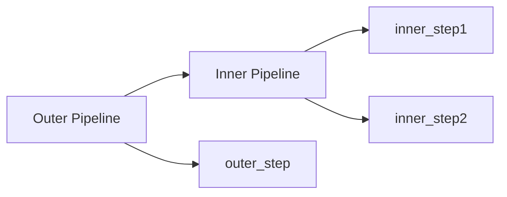
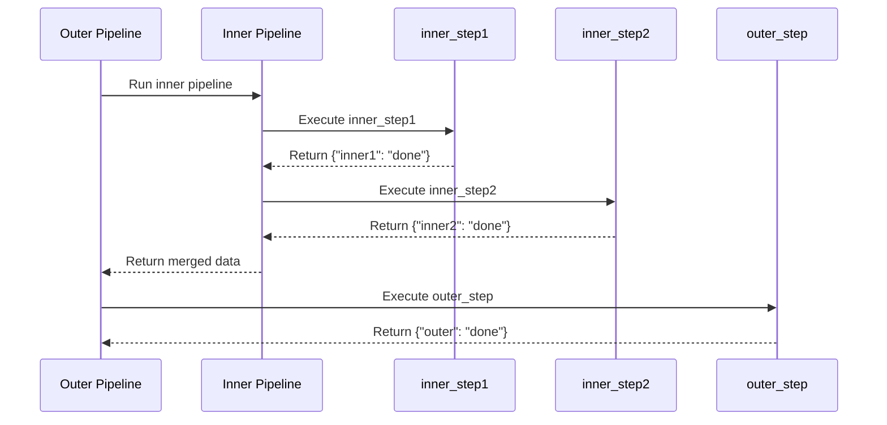
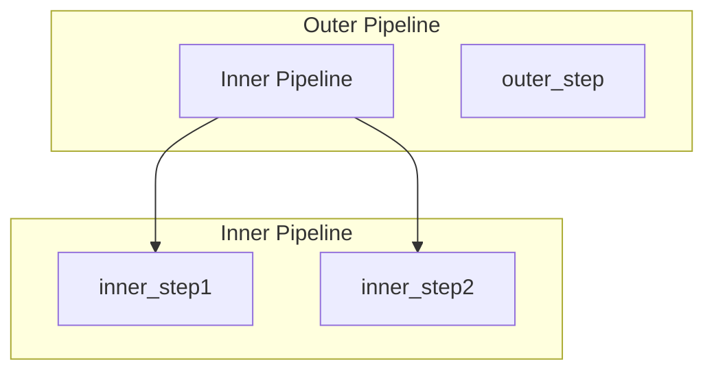
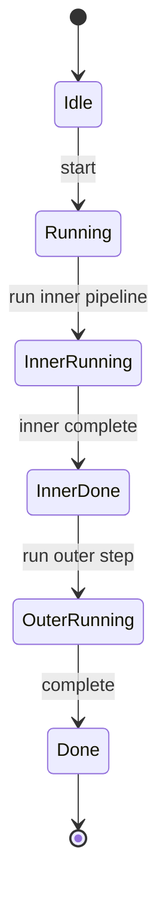

# Basic Nested Pipeline

Demonstrates the simplest nested pipeline: one pipeline running inside another.

## What It Does

- Creates an inner pipeline with two steps
- Embeds the inner pipeline as a single step in an outer pipeline
- Executes the outer pipeline, which runs all inner steps first

## Nested Flow



## Sequence Diagram



## Pipeline Hierarchy



## Execution States



## Data Flow

```mermaid
flowchart LR
    A[{}] --> B[Inner Pipeline]
    B --> C[{"inner1": "done",<br/>"inner2": "done"}]
    C --> D[outer_step]
    D --> E[Final Result]
```
