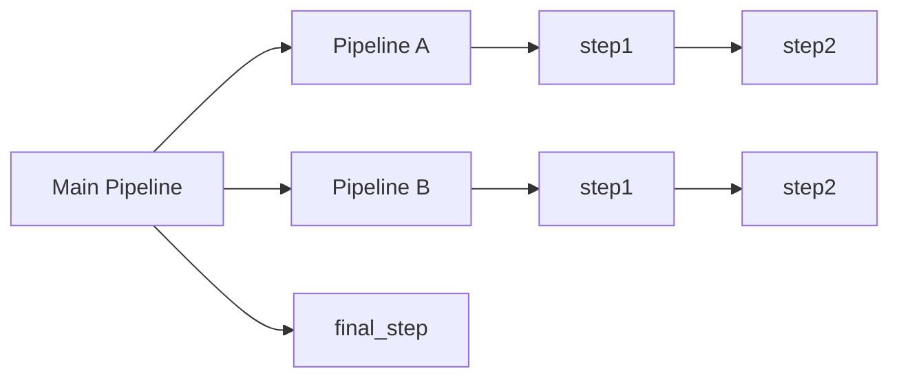
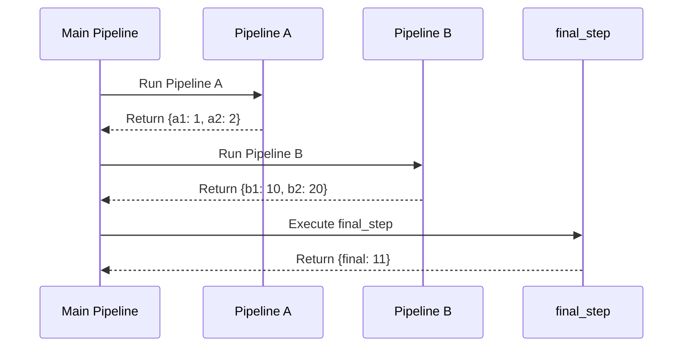
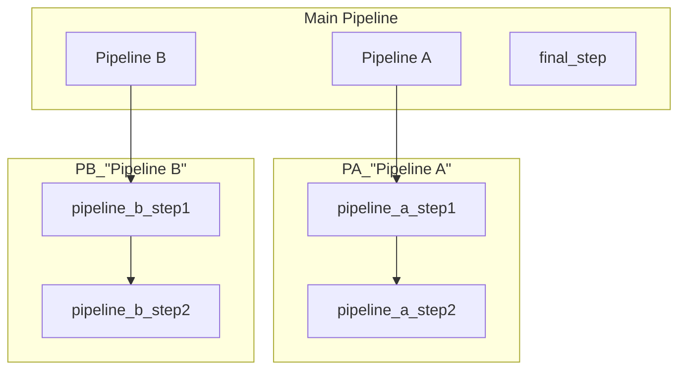
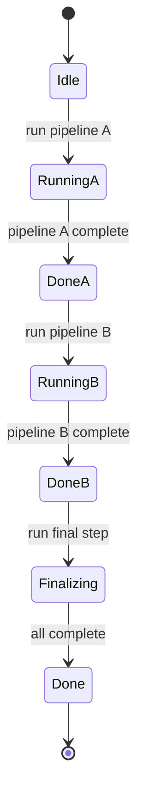

# Multiple Nested Pipelines

Demonstrates running multiple nested pipelines in sequence within a main pipeline.

## What It Does

- Creates two separate pipelines (A and B), each with two steps
- Embeds both pipelines as steps in a main pipeline
- Executes pipelines in sequence, merging results from each

## Nested Flow



## Sequence Diagram



## Pipeline Hierarchy



## Execution States



## Data Flow

```mermaid
flowchart LR
    A[{}] --> B[Pipeline A]
    B --> C[{a1: 1, a2: 2}]
    C --> D[Pipeline B]
    D --> E[{a1: 1, a2: 2, b1: 10, b2: 20}]
    E --> F[final_step]
    F --> G[{final: 11}]
```
