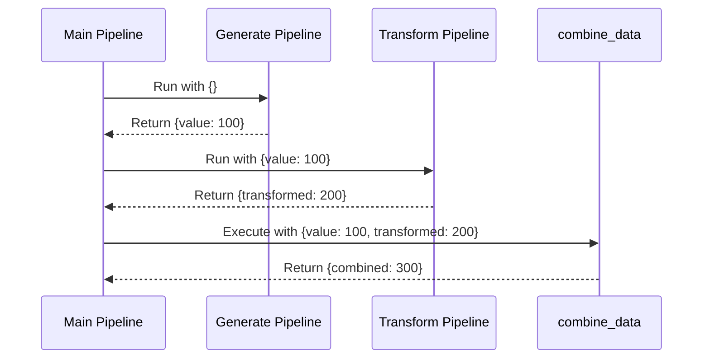
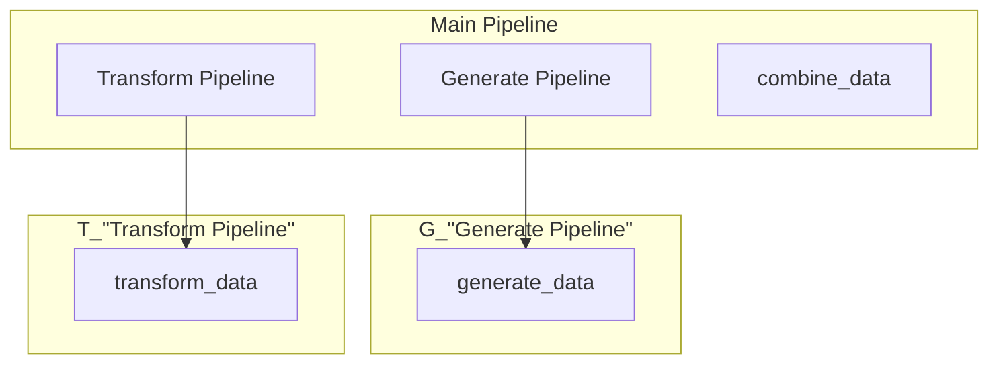
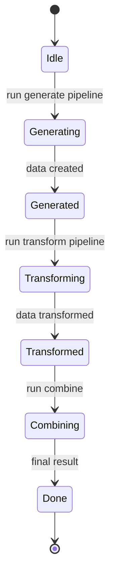

# Data Passing Between Nested Pipelines

Demonstrates how data flows and is accumulated between nested pipelines.

## What It Does

- Creates a generate pipeline that produces an initial value
- Creates a transform pipeline that processes the generated value
- Combines data from both pipelines in a final step

## Nested Flow

```mermaid
graph LR
    A[Main] --> B[Generate Pipeline]
    B --> C[{value: 100}]
    A --> D[Transform Pipeline]
    D --> E[{value: 100,<br/>transformed: 200}]
    A --> F[combine_data]
    F --> G[{combined: 300}]
```

## Sequence Diagram



## Pipeline Hierarchy



## Execution States



## Data Flow

```mermaid
flowchart LR
    A[{}] --> B[generate_data]
    B --> C[{value: 100}]
    C --> D[transform_data]
    D --> E[{value: 100,<br/>transformed: 200}]
    E --> F[combine_data]
    F --> G[{combined: 300}]
```
