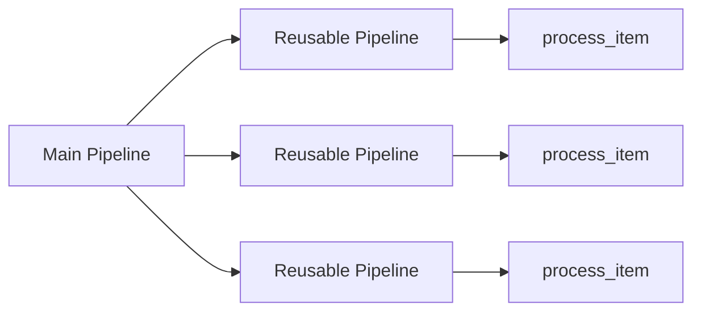
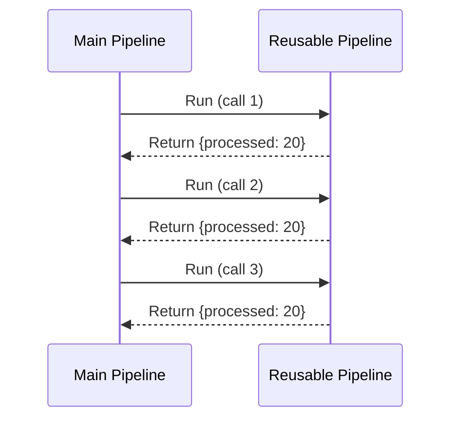
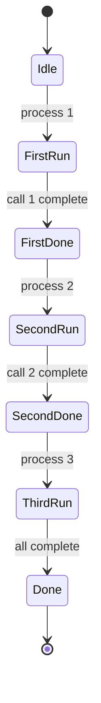

# Reusing Pipeline Objects

Demonstrates how to reuse the same pipeline object multiple times in a parent pipeline.

## What It Does

- Creates a reusable pipeline with a single processing step
- Embeds the same pipeline instance three times in a main pipeline
- Each call processes data independently

## Nested Flow



## Sequence Diagram



## Pipeline Hierarchy

```mermaid
graph TB
    subgraph Main["Main Pipeline"]
        R1[Reusable Pipeline]
        R2[Reusable Pipeline]
        R3[Reusable Pipeline]
    end
    subgraph R_"Reusable Pipeline (shared instance)"
        P[process_item]
    end
    R1 --> P
    R2 --> P
    R3 --> P
```

## Execution States



## Data Flow

```mermaid
flowchart LR
    A[{item: 10}] --> B[process_item]
    B --> C[{processed: 20}]
    C --> D[process_item]
    D --> E[{processed: 20}]
    E --> F[process_item]
    F --> G[{processed: 20}]
```
