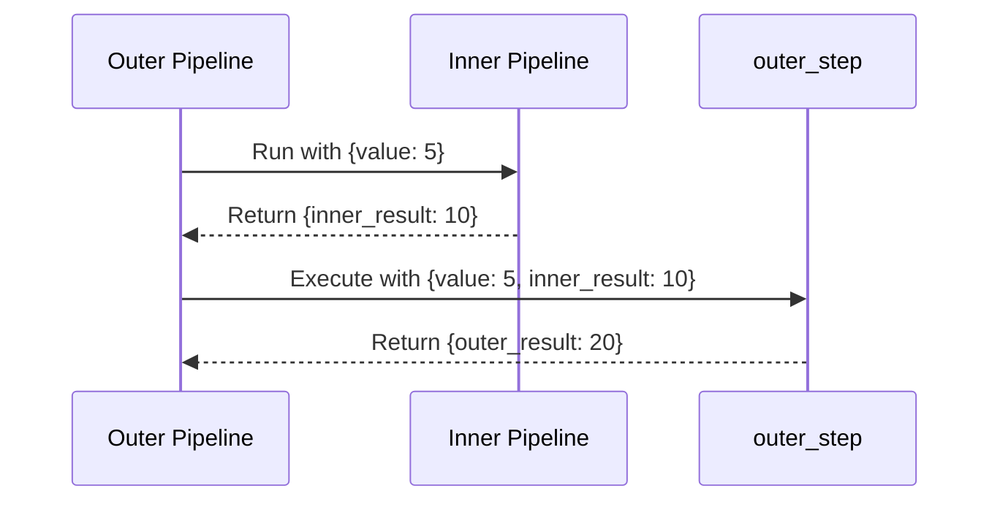
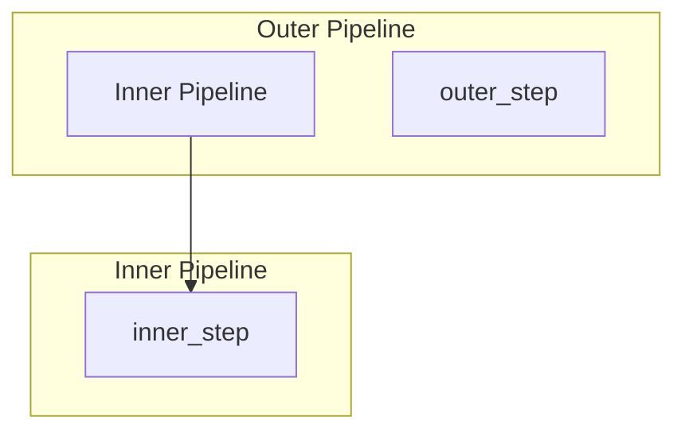
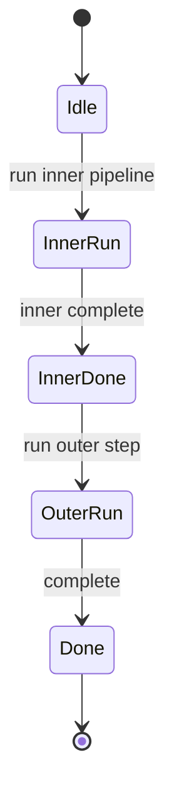

# Passing Custom Data to Nested Pipelines

Demonstrates passing custom input data to nested pipelines and using the results in outer steps.

## What It Does

- Passes custom data (value: 5) to an outer pipeline
- Inner pipeline processes the value and returns inner_result
- Outer pipeline uses inner_result to compute outer_result

## Nested Flow

```mermaid
graph LR
    A[{value: 5}] --> B[Inner Pipeline]
    B --> C[{inner_result: 10}]
    C --> D[outer_step]
    D --> E[{outer_result: 20}]
```

## Sequence Diagram



## Pipeline Hierarchy



## Execution States



## Data Flow

```mermaid
flowchart LR
    A[{value: 5}] --> B[inner_step]
    B --> C[{inner_result: 10}]
    C --> D[outer_step]
    D --> E[{outer_result: 20}]
```
