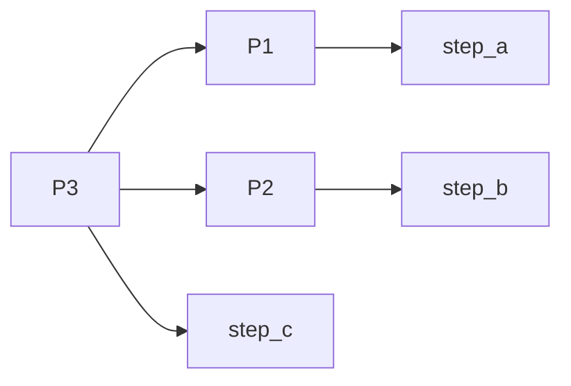
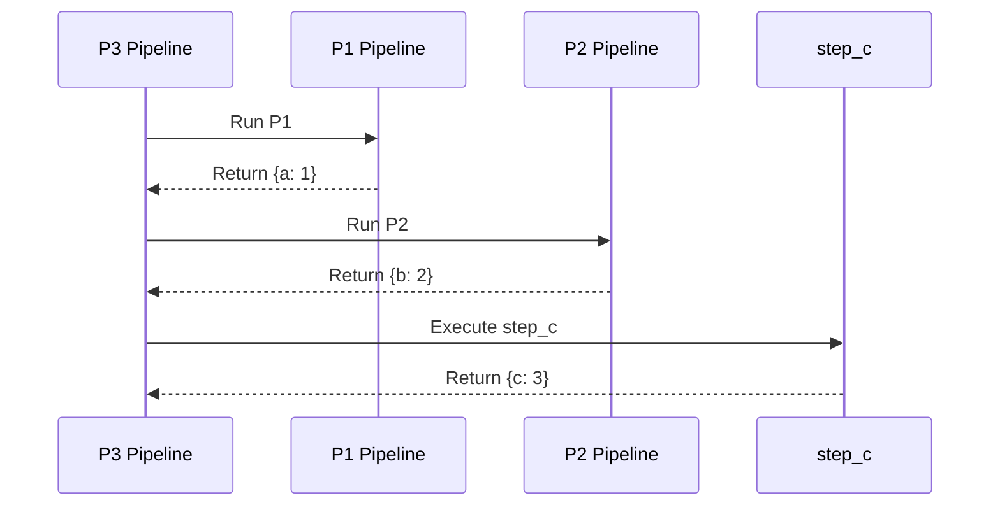
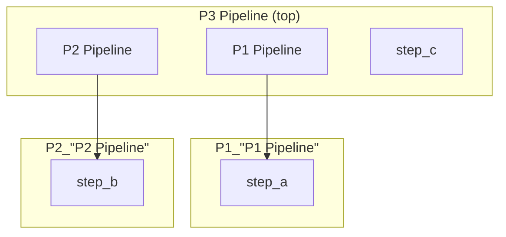
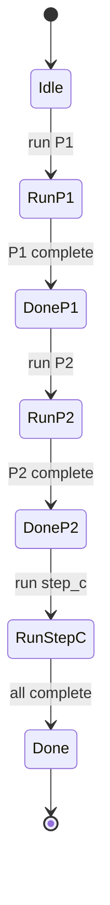

# Deep Nesting

Demonstrates deeply nested pipeline structure with multiple levels of nesting.

## What It Does

- Creates two simple pipelines (P1 and P2) with single steps
- Creates a parent pipeline (P3) that embeds both P1 and P2
- Executes all nested steps in sequence

## Nested Flow



## Sequence Diagram



## Pipeline Hierarchy



## Execution States



## Data Flow

```mermaid
flowchart LR
    A[{}] --> B[P1: step_a]
    B --> C[{a: 1}]
    C --> D[P2: step_b]
    D --> E[{a: 1, b: 2}]
    E --> F[step_c]
    F --> G[{a: 1, b: 2, c: 3}]
```
