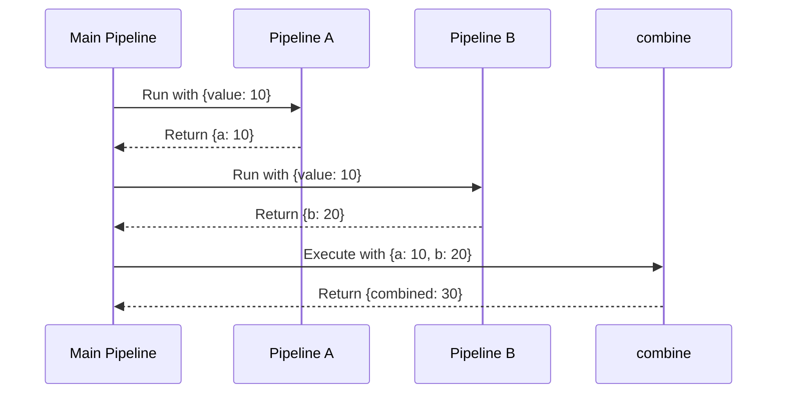
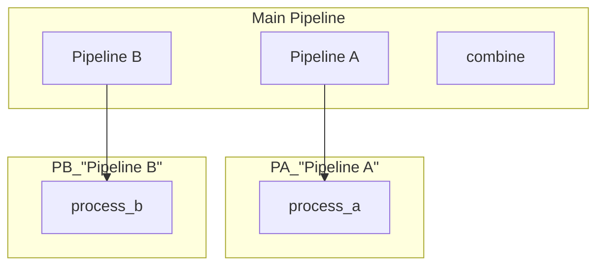
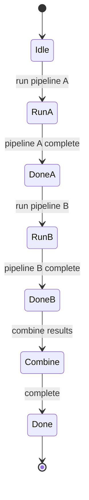

# Parallel Nested Pipelines

Demonstrates multiple nested pipelines executed in sequence within a main pipeline.

## What It Does

- Creates two pipelines that process the same input differently
- Pipeline A passes through the value unchanged
- Pipeline B doubles the value
- Final step combines results from both pipelines

## Nested Flow

```mermaid
graph LR
    A[{value: 10}] --> B[Pipeline A]
    A --> C[Pipeline B]
    B --> D[{a: 10}]
    C --> E[{b: 20}]
    D --> F[combine]
    E --> F
    F --> G[{combined: 30}]
```

## Sequence Diagram



## Pipeline Hierarchy



## Execution States



## Data Flow

```mermaid
flowchart LR
    A[{value: 10}] --> B[process_a]
    A --> C[process_b]
    B --> D[{a: 10}]
    C --> E[{b: 20}]
    D --> F[combine]
    E --> F
    F --> G[{combined: 30}]
```
