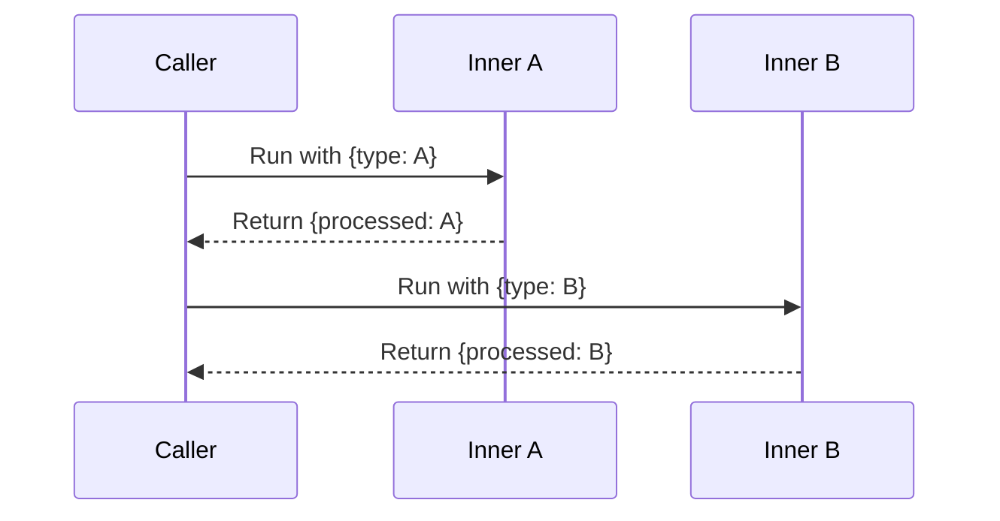
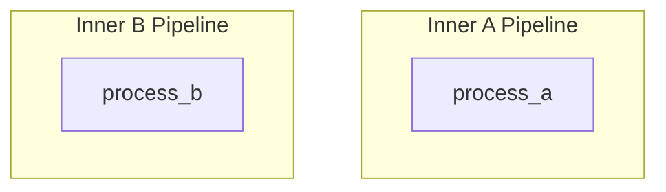
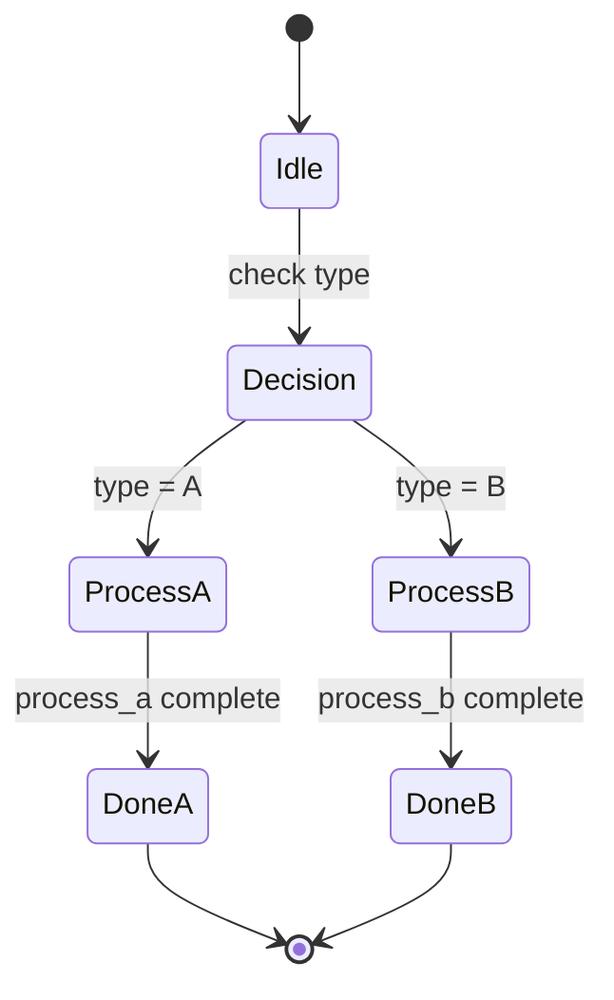

# Conditional Nested Pipelines

Demonstrates selecting different nested pipelines based on conditions.

## What It Does

- Creates two inner pipelines for different types (A and B)
- Runs inner_a pipeline for type A processing
- Runs inner_b pipeline for type B processing
- Shows how to choose the appropriate pipeline based on input

## Nested Flow

```mermaid
graph LR
    A[{type: A}] --> B[Inner A Pipeline]
    B --> C[{processed: A}]
    A'[{type: B}] --> D[Inner B Pipeline]
    D --> E[{processed: B}]
```

## Sequence Diagram



## Pipeline Hierarchy



## Execution States



## Data Flow

```mermaid
flowchart LR
    A[{type: A}] --> B[process_a]
    B --> C[{processed: A}]

    A2[{type: B}] --> D[process_b]
    D --> E[{processed: B}]
```
