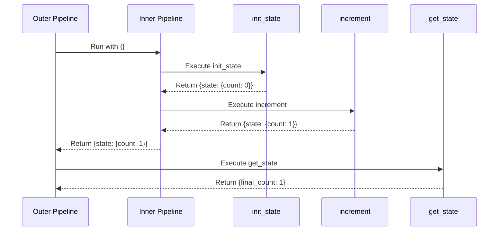
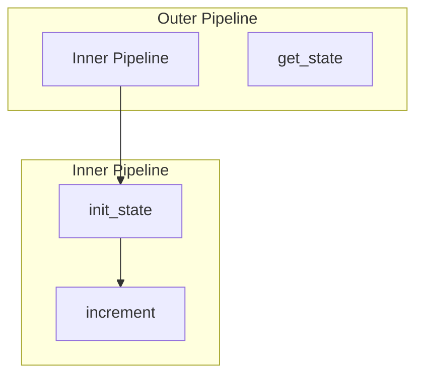
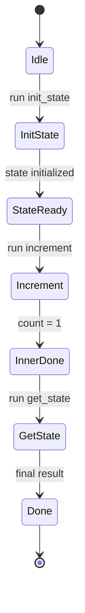

# State Preservation

Demonstrates state preservation and mutation between nested pipelines.

## What It Does

- Inner pipeline initializes state and increments counter
- State persists across steps within the inner pipeline
- Outer pipeline can access the final state after inner pipeline completes

## Nested Flow

```mermaid
graph LR
    A[{}] --> B[Inner Pipeline]
    B --> C[init_state]
    C --> D[{state: {count: 0}}]
    D --> E[increment]
    E --> F[{state: {count: 1}}]
    F --> G[get_state]
    G --> H[{final_count: 1}]
```

## Sequence Diagram



## Pipeline Hierarchy



## Execution States



## Data Flow

```mermaid
flowchart LR
    A[{}] --> B[init_state]
    B --> C[{state: {count: 0}}]
    C --> D[increment]
    D --> E[{state: {count: 1}}]
    E --> F[get_state]
    F --> G[{final_count: 1}]
```
