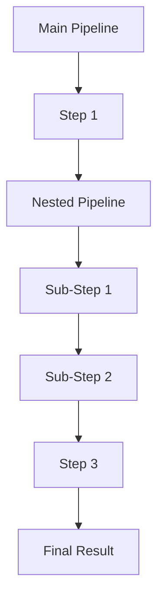
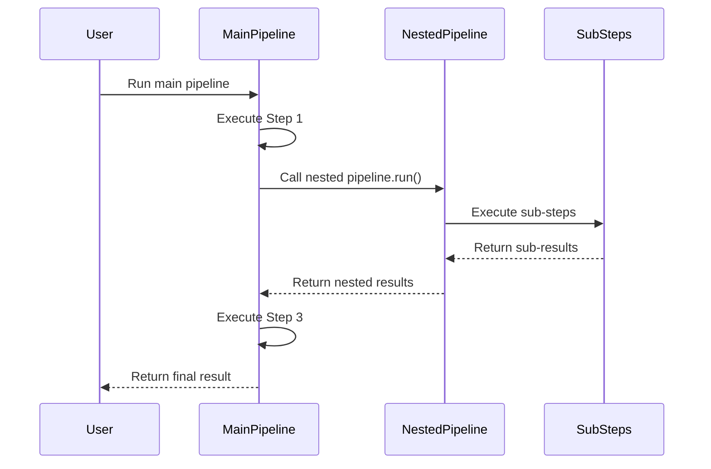
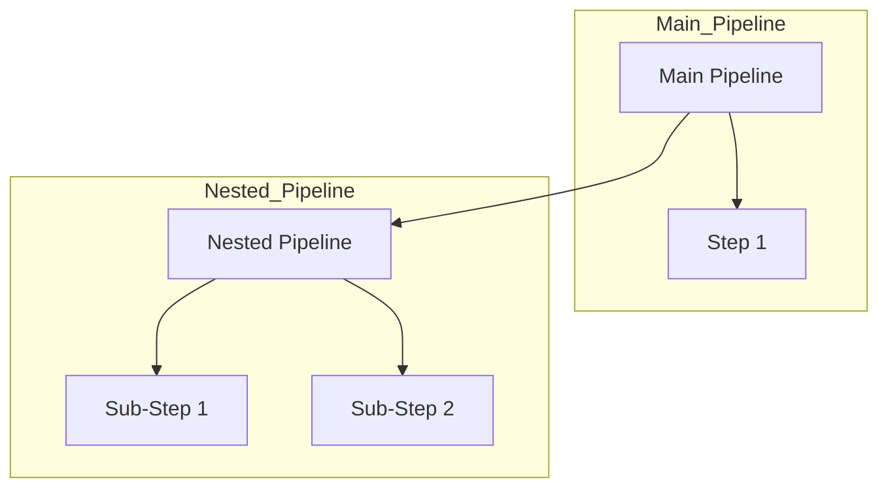
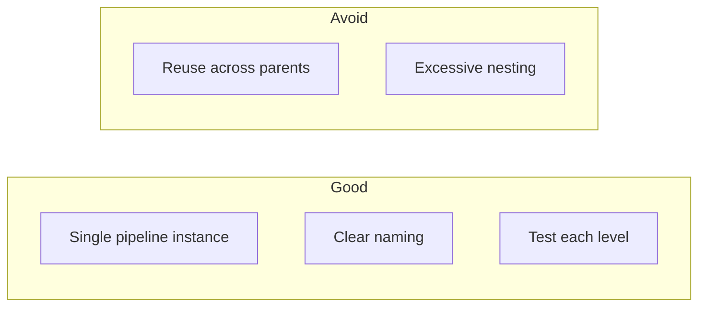

# Nested Pipelines

This directory contains examples demonstrating nested pipeline execution.

## Project Overview

The `nested_pipelines` module enables hierarchical pipeline composition. A pipeline can execute other pipelines as steps, allowing for complex workflow construction from reusable components.

**Key Capabilities:**
- Pipeline composition (pipeline within pipeline)
- Reusable pipeline components
- Data passing between nested pipelines
- Deep nesting support (pipeline within pipeline within pipeline)
- Conditional nested execution

---

## 1. 🚶 Diagram Walkthrough



---

## 2. 🗺️ System Workflow (Sequence)



---

## 3. 🏗️ Architecture Components



---

## 4. 📂 File-by-File Guide

| File | Description |
|------|-------------|
| `01_basic_nested_example/` | Basic nested pipeline execution |
| `02_multiple_nested_example/` | Multiple nested pipelines |
| `03_data_passing_example/` | Data passing between nested pipelines |
| `04_reuse_pipeline_example/` | Reusing pipelines |
| `05_nested_with_data_example/` | Nested pipelines with input data |
| `06_deep_nesting_example/` | Deep nesting (pipeline within pipeline) |
| `07_parallel_nested_example/` | Parallel nested execution |
| `08_conditional_nested_example/` | Conditional nested execution |
| `09_nested_state_example/` | State sharing between nested pipelines |
| `10_nested_error_handling.py` | Error handling in nested pipelines |
| `10_recursive_nesting.py` | Recursive nesting |
| `nested.py` | Nested pipeline utilities |

---

## Quick Start

```python
from wpipe import Pipeline

# Create a sub-pipeline
pipeline1 = Pipeline(verbose=True)
pipeline1.set_steps([(step1, "Step1", "v1.0")])

# Create main pipeline with nested pipeline
pipeline2 = Pipeline(verbose=True)
pipeline2.set_steps([
    (pipeline1.run, "Nested Pipeline", "v1.0"),  # Nest using .run
    (step2, "Step2", "v1.0"),
])

result = pipeline2.run({"data": "value"})
```

---

## Data Flow

Data flows automatically between nested pipelines:
- Results from one step are passed to the next
- Nested pipelines receive data from the parent pipeline
- Results accumulate in shared state

```python
# Parent pipeline data
parent_pipeline.run({"value": 10})

# Nested pipeline receives parent's data
sub_pipeline.run({"value": 10, "parent_key": "parent_value"})

# Results are merged
{"value": 10, "parent_key": "parent_value", "sub_result": 20}
```

---

## Use Cases

1. **Modularity**: Create reusable pipelines for common tasks
2. **Composition**: Build complex pipelines from simple components
3. **Abstraction**: Hide implementation details behind simple interfaces
4. **Reusability**: Use same pipeline in multiple parent pipelines

---

## Important Notes

- Each sub-pipeline should be created once and used in a single parent pipeline
- Avoid reusing the same pipeline instance in multiple parents
- Nested pipelines execute synchronously (not in parallel)
- State is shared across all nesting levels

---

## Examples

### Basic Nested

```python
inner_pipeline = Pipeline(verbose=True)
inner_pipeline.set_steps([(process_inner, "Inner", "v1.0")])

outer_pipeline = Pipeline(verbose=True)
outer_pipeline.set_steps([
    (inner_pipeline.run, "Nested", "v1.0"),
])
```

### With Data Passing

```python
inner = Pipeline()
inner.set_steps([(transform, "Transform", "v1.0")])

outer = Pipeline()
outer.set_steps([
    (generate_data, "Generate", "v1.0"),
    (inner.run, "Process", "v1.0"),
])
```

### Deep Nesting

```python
level1 = Pipeline()
level1.set_steps([(step1, "L1", "v1.0")])

level2 = Pipeline()
level2.set_steps([(level1.run, "L2", "v1.0")])

level3 = Pipeline()
level3.set_steps([(level2.run, "L3", "v1.0")])
```

---

## Best Practices



1. **Use single pipeline instances** - Don't reuse the same pipeline
2. **Use clear naming** - Make nested structure obvious
3. **Test each level** - Ensure each pipeline works independently
4. **Limit nesting depth** - Keep it readable

---

## See Also

- [Basic Pipeline](../01_basic_pipeline/) - Core pipeline concepts
- [Conditions](../04_condition/) - Conditional branching
- [Retry](../05_retry/) - Retry mechanisms
