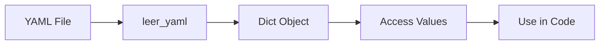
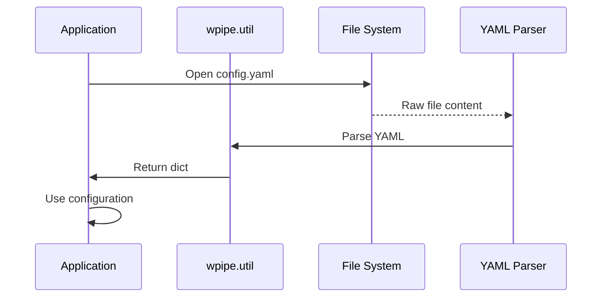
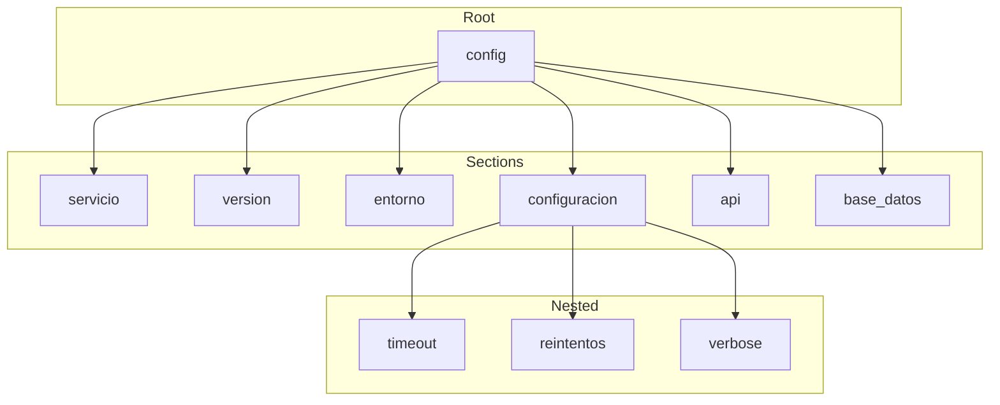
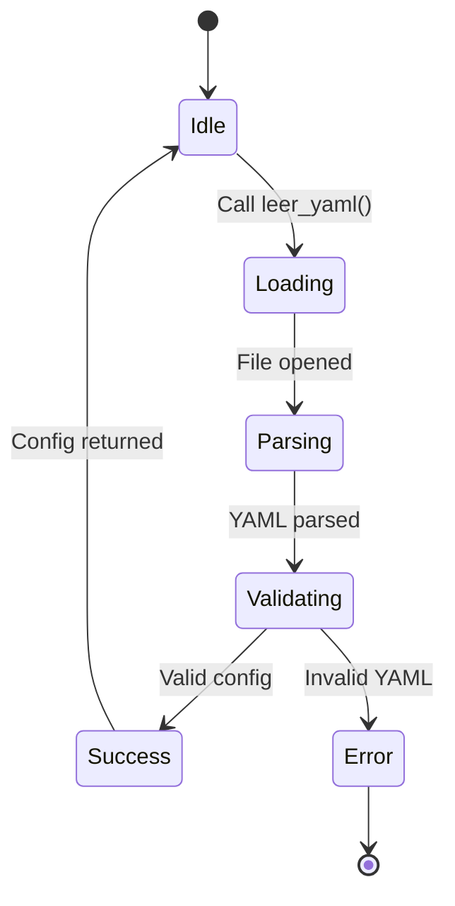
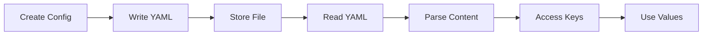

# Reading YAML Configuration Files

Demonstrates how to read YAML configuration files using the `wpipe.util` module.

## What It Does

This example shows how to:
- Create a YAML configuration file
- Read configuration values using `leer_yaml()`
- Access nested configuration sections
- Use default values for missing keys

## Example

```python
from wpipe.util import leer_yaml, escribir_yaml

config = leer_yaml("config.yaml")
timeout = config.get("configuracion", {}).get("timeout", 30)
```

## Config Flow



## Loading Sequence



## Config Structure



## Loading States



## Process Flow


