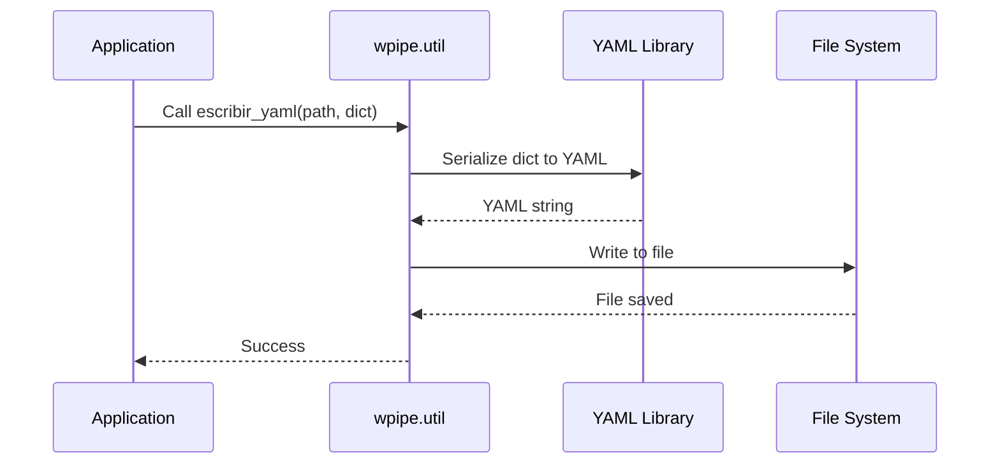
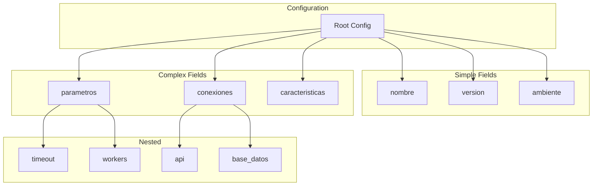
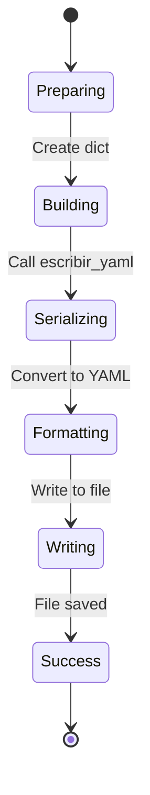
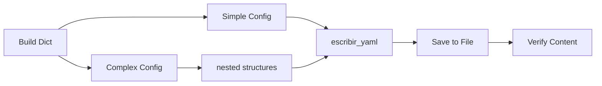

# Writing YAML Configuration Files

Demonstrates how to write configuration data to YAML files using `wpipe.util`.

## What It Does

This example shows how to:
- Create simple and complex YAML configurations
- Write dictionaries to YAML files with `escribir_yaml()`
- Update existing configurations
- Build nested structures for pipelines

## Example

```python
from wpipe.util import leer_yaml, escribir_yaml

config = {"nombre": "mi_pipeline", "version": "1.0.0"}
escribir_yaml("config.yaml", config)
```

## Config Flow


## Writing Sequence



## Config Structure



## Write States



## Process Flow


