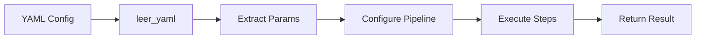
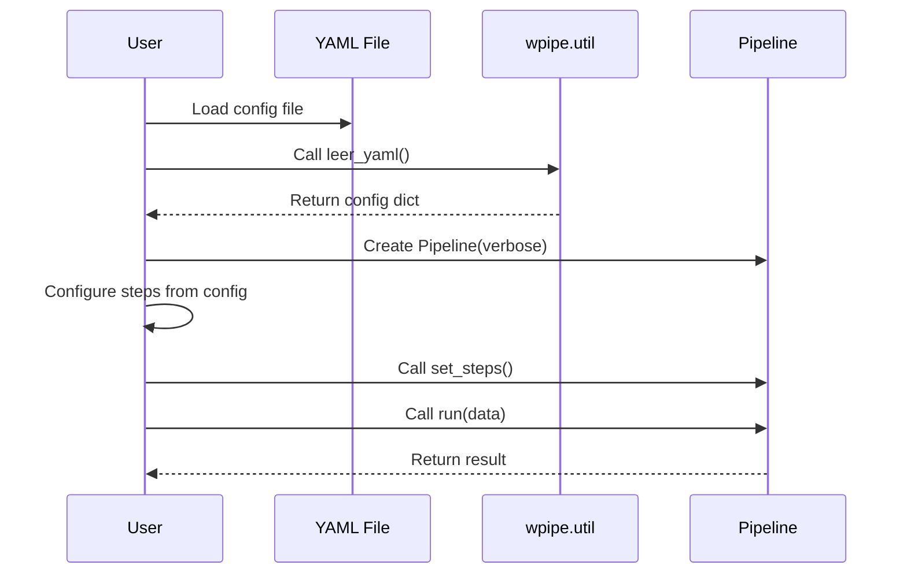
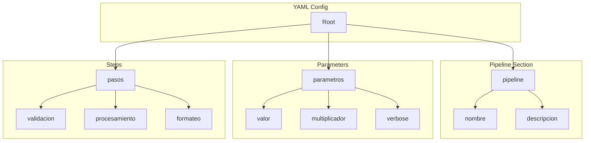
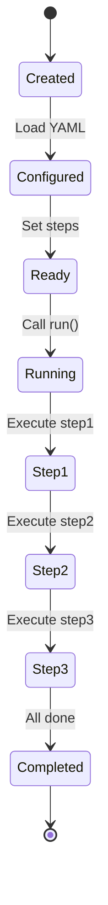
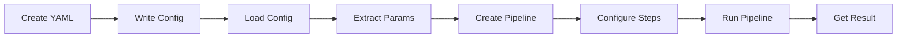

# Pipeline with YAML Configuration

Shows how to configure and execute a Pipeline using YAML configuration files.

## What It Does

This example demonstrates:
- Creating YAML configuration for pipelines
- Loading configuration with `leer_yaml()`
- Dynamically configuring pipeline steps based on config
- Executing a configured pipeline

## Example

```python
from wpipe import Pipeline
from wpipe.util import leer_yaml, escribir_yaml

config = leer_yaml("pipeline_config.yaml")
pipeline = Pipeline(verbose=config["parametros"]["verbose"])
pipeline.set_steps([(step_func, "Name", "v1.0")])
result = pipeline.run(data)
```

## Config Flow



## Loading Sequence



## Config Structure



## Pipeline States



## Process Flow


