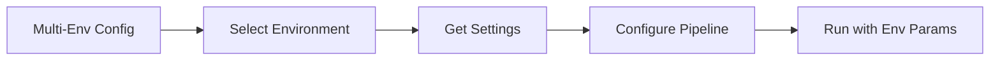
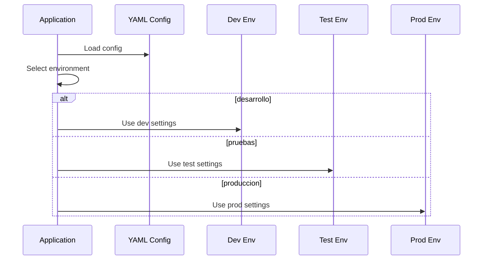
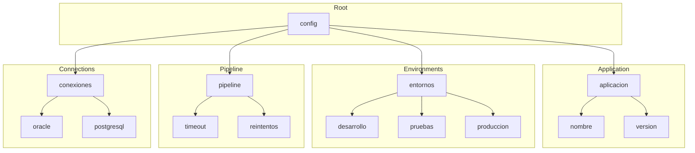
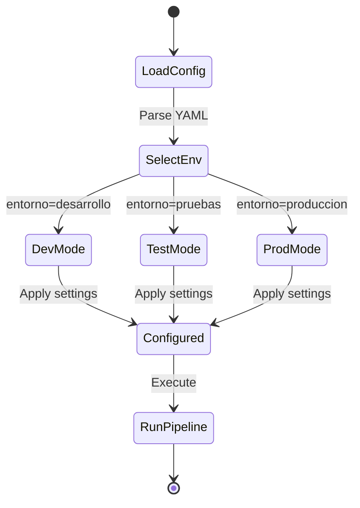
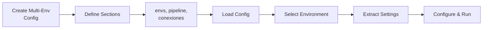

# Complex Multi-Environment Configuration

Demonstrates complex YAML configurations with multiple sections and environment profiles.

## What It Does

This example shows:
- Multi-environment configuration structures
- Switching between development, testing, and production
- Organizing configuration by sections (app, pipeline, connections)
- Configuring pipelines based on environment

## Example

```python
from wpipe.util import leer_yaml

config = leer_yaml("multienv.yaml")
entorno = "produccion"
env_config = config["entornos"][entorno]
```

## Config Flow



## Environment Selection



## Config Structure



## Environment States



## Process Flow


