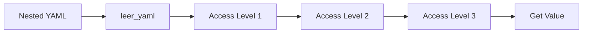
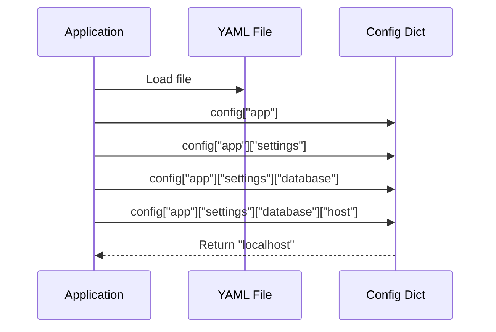
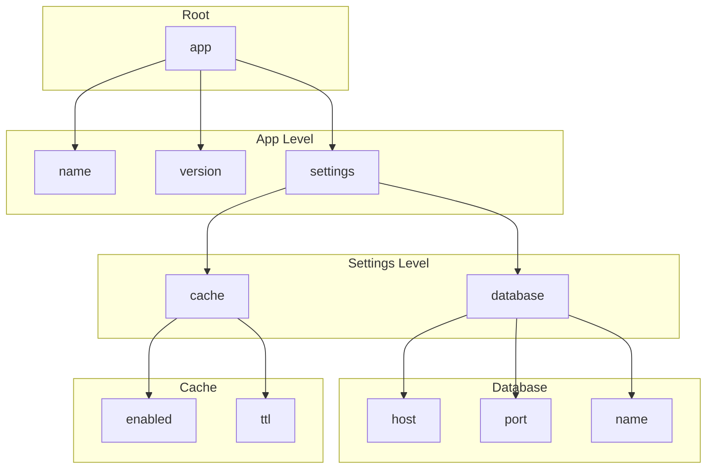
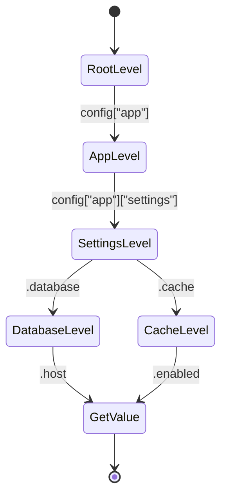
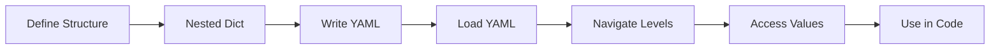

# Nested YAML Configuration

Shows how to work with deeply nested YAML configurations.

## What It Does

This example demonstrates:
- Creating deeply nested YAML structures
- Accessing values at multiple nesting levels
- Reading nested settings for app configuration

## Example

```python
from wpipe.util import leer_yaml

config = leer_yaml("nested.yaml")
db_host = config["app"]["settings"]["database"]["host"]
```

## Config Flow



## Nested Access Sequence



## Config Structure



## Nesting States



## Process Flow


