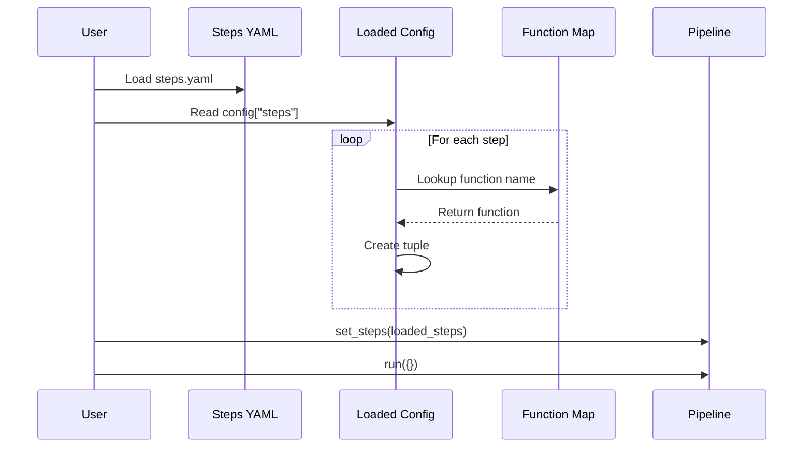
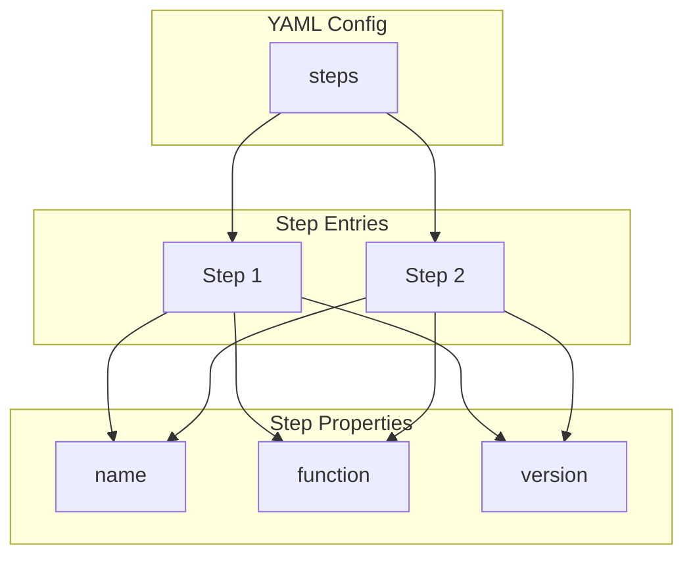
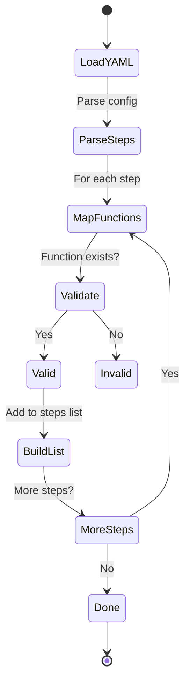
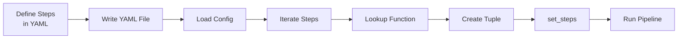

# Loading Pipeline Steps from YAML

Shows how to load pipeline step definitions from a YAML configuration file.

## What It Does

This example demonstrates:
- Defining pipeline steps in YAML
- Loading step configurations dynamically
- Mapping function names to actual functions
- Building pipelines from loaded configurations

## Example

```python
from wpipe import Pipeline
from wpipe.util import leer_yaml

config = leer_yaml("steps.yaml")
for step_config in config["steps"]:
    func = functions[step_config["function"]]
    steps.append((func, step_config["name"], step_config["version"]))
```

## Config Flow


## Step Loading Sequence



## Config Structure



## Loading States



## Process Flow


