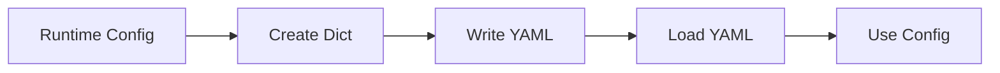
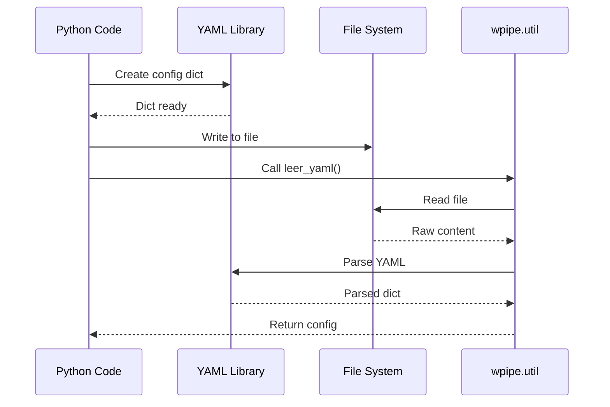
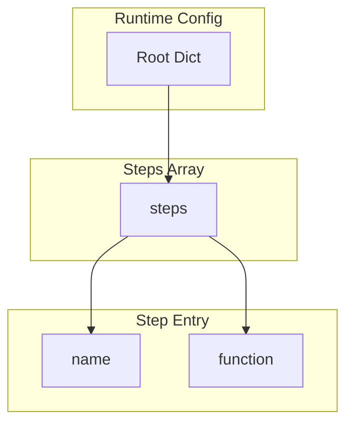
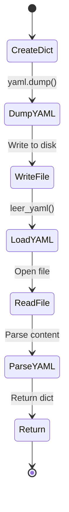
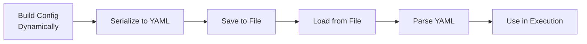

# Dynamic YAML Loading

Shows dynamically loading and executing pipeline configurations from YAML files.

## What It Does

This example demonstrates:
- Creating YAML files with dynamic content
- Loading configurations at runtime
- Using loaded configurations in execution flow

## Example

```python
from wpipe.util import leer_yaml
import yaml

with open("config.yaml", "w") as f:
    yaml.dump({"steps": [...]}, f)

config = leer_yaml("config.yaml")
```

## Config Flow



## Dynamic Loading Sequence



## Config Structure



## Loading States



## Process Flow


